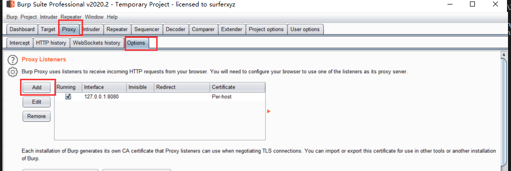
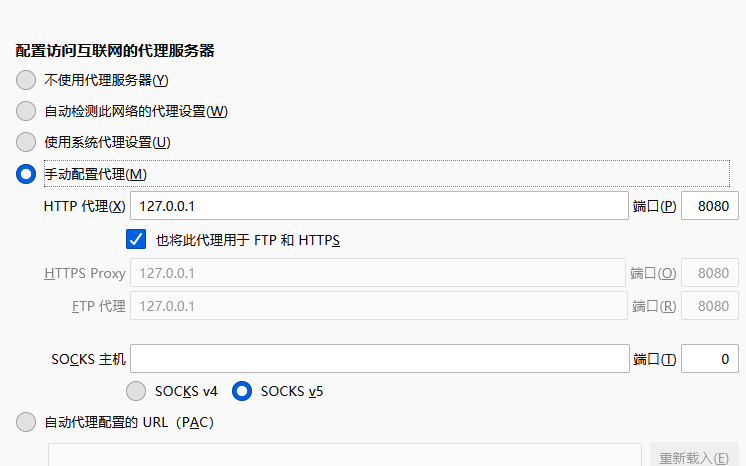
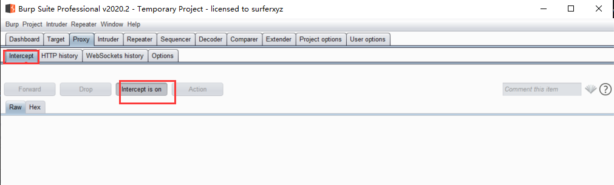
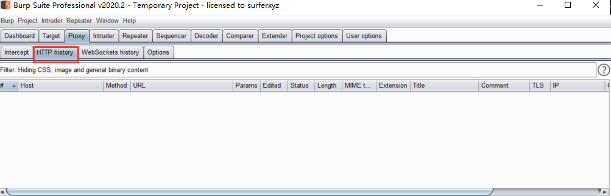

# BurpSuite
**BurpSuite是一个集成化的渗透测试工具，集合了多种渗透测试逐渐，使我们自动化的或手工的能更好的完成对于web应用的渗透测试和攻击 推荐配合插件SwtchyOmega使用**
## Proxy代理模块
__代理模块是burp的核心模块，主要用来接货并修改浏览器，手机app等客户端的HTTP/HTTPS数据包 __
### 设置代理端口 
- __1.依次选择 Proxy--->Options--->Proxy Listeners--->Add增加代理__
- __2.在浏览器中添加代理(以火狐为例)__
</figure>
     <figure class="thumbnails">
        
        
</figure>

- __3.接下来在 Proxy-->Intercept选项卡下设置 Intercept is on,这样就能截获浏览器的数据包并进行修改等操作了  Intercept is off 则不会拦截数据包，而是会在 HTTP history记录下来__
</figure>
     <figure class="thumbnails">
        
        
</figure>