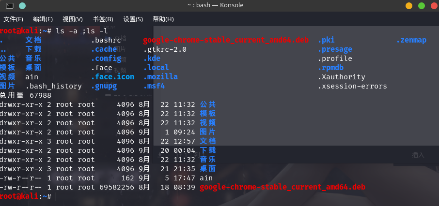
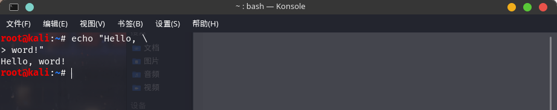
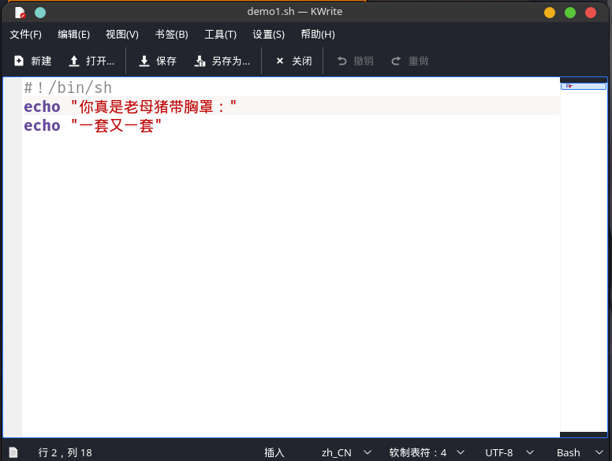
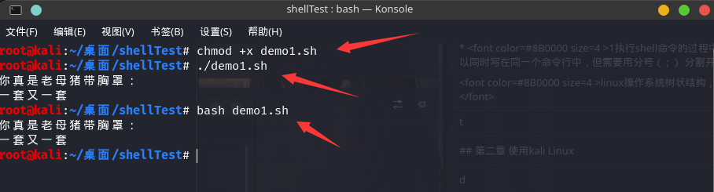
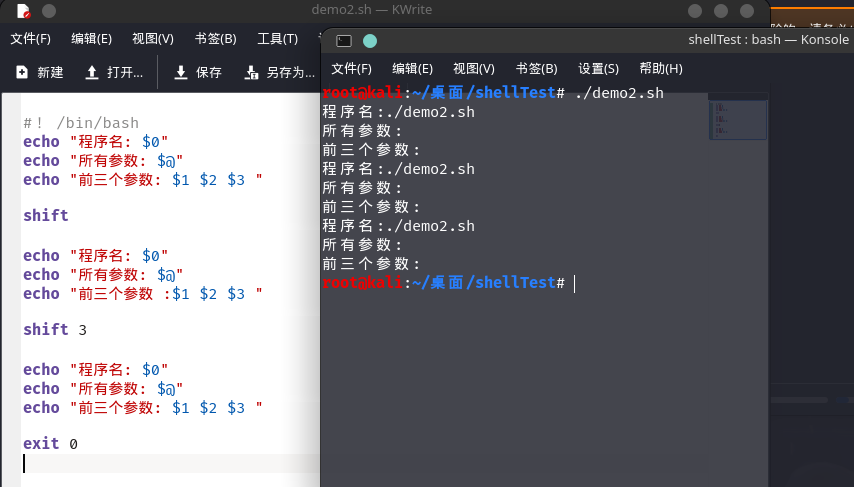
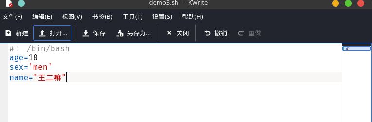

# Linux基础

[](https://www.npmjs.com/package/docsify-themeable)
[](https://www.codacy.com/app/jhildenbiddle/docsify-themeable?utm_source=github.com&amp;utm_medium=referral&amp;utm_content=jhildenbiddle/docsify-themeable&amp;utm_campaign=Badge_Grade)
[](https://github.com/jhildenbiddle/docsify-themeable/blob/master/LICENSE)
[](https://www.jsdelivr.com/package/npm/docsify-themeable)
[](https://twitter.com/intent/tweet?url=https%3A%2F%2Fgithub.com%2Fjhildenbiddle%2Fdocsify-themeable&hashtags=css,docsify,developers,frontend)
<a class="github-button" href="https://github.com/jhildenbiddle/docsify-themeable" data-icon="octicon-star" data-show-count="true" aria-label="Star jhildenbiddle/docsify-themeable on GitHub">Star</a>

## Kali更新源


       #中科大
      deb http://mirrors.ustc.edu.cn/kali kali-rolling main non-free contrib
      deb-src http://mirrors.ustc.edu.cn/kali kali-rolling main non-free contrib

      #阿里云
      deb http://mirrors.aliyun.com/kali kali-rolling main non-free contrib
      deb-src http://mirrors.aliyun.com/kali kali-rolling main non-free contrib

      #清华大学
      deb http://mirrors.tuna.tsinghua.edu.cn/kali kali-rolling main contrib non-free
      deb-src https://mirrors.tuna.tsinghua.edu.cn/kali kali-rolling main contrib non-free

      #浙大
      deb http://mirrors.zju.edu.cn/kali kali-rolling main contrib non-free
      deb-src http://mirrors.zju.edu.cn/kali kali-rolling main contrib non-free

      #东软大学
      deb http://mirrors.neusoft.edu.cn/kali kali-rolling/main non-free contrib
      deb-src http://mirrors.neusoft.edu.cn/kali kali-rolling/main non-free contrib


## CentOS基本命令

      
   * <font color=#8B0000 size=4 >linux操作系统树状结构，目录==文件夹</font>
   * <font color=#B22222 size=4 >linux操作系统中一切皆文件,（文件名） sd(硬盘类型)   a(第一块)</font>


         fdisk -l	   # 硬盘大小
         /dev/sda	   # 操作系统中第一块硬盘名称及所在路径   
         cat/proc/meminfo	   # 内存大小
         cat/proc/cpuinfo	   # cpu型号
         reboot	   # 重启
         poweroff	   # 关机
         /root	      # 管理员的加目录
         /media	#光驱的挂载目录
         /mnt	   # 临时设备的挂载目录
         /proc	   #里面的数据都在内存中，进程所在目录
         /tmp	   #临时文件存放目录
         /usr	   #软件的安装目录
         cd..	返回上一级目录
         pwd	列出当前所在目录路径
         ls	列出当前目录内容
         /	操作系统的起始路径和根路径
         /bin	普通用户和管理员都可以执行的命令
         /sbin	只有管理员才能执行的命令
         /boot	主引导目录 独立的分区，启动菜单。。
         /dev	device设备 设备文件存放目录
         /etc	配置文件存放的目录
         /home	普通用户的家目录
         /var	常变文件存放目录 日志文件，右键文件

   * 快捷功能

         ctrl+l	清屏
         ctrl+c	终止

## Shell基础
* <font color=#FF0000 size=4 >1.执行shell命令的过程中，几个命令可以同时写在同一个命令行中，但需要用分号（ ; ） 分割开</font>
      ls -l;ls -a

  <figure class="thumbnails">
    
    
</figure>

* <font color=#FF0000 size=4 >2.长Shell命令行中可以使用反斜杠符(\)在命令行中扩充</font>
      echo "Hello, \"
      > word! "               # > 符号是系统生成的。。。

  <figure class="thumbnails">
    
    
</figure>

### Bash脚本的建立
* <font color=#FF0000 size=4 >1.可以使用 vi, nano,kwrite,vim,反正你开心就好。。我使用kwrite</font>

*  <font color=#FF0000 size=4 >1.打开kwite,输入命令</font>
*  <font color=#FF0000 size=4 >2.保存/另存为</font>
*  <font color=#FF0000 size=4 >3.打开命令行窗口，cd到文件所在补录，输入chmod+x 文件，赋予可执行权限</font>
*  <font color=#FF0000 size=4 >4.输入  ./文件  执行 ，或者 Bash 文件</font>


```shell 
#脚本内容
#！/bin/sh           #通知采用BASH解释
echo "你真是老母猪带胸罩："   #echo 输出
echo "一套又一套"
```
```shell 
chmod +x demo1.sh       #赋予权限

./demo1.sh        #执行方式1

bash demo1.sh     #执行方式2
```
<figure class="thumbnails">
    
    
    
</figure>

### Shell程序的位置参数
* <font color=#FF0000 size=4 >由系统提供的参数，<mark>值由 $N得到, N 是一个数字<mark>N 是一个数字</font>
* <font color=#FF0000 size=4 >内部参数</font>
```shell 
$0          #命令所在的路径及名字
$?          #shell程序在Shell中推出的情况， 正常返回1 ，不正常返回 0 
```


* 1.<font color=#FF0000 size=4 >Shift [N]   # 把命令行参数向左移动N个位置</font>

```shell 
#！ /bin/bash
echo "程序名:$0"
echo "所有参数:$@"
echo "前三个参数:$1 $2 $3 "

shift                   #妈的，报错了。。。懒得改

echo "程序名:$0"
echo "所有参数:$@"
echo "前三个参数:$1 $2 $3 "

shift 3

echo "程序名:$0"
echo "所有参数:$@"
echo "前三个参数:$1 $2 $3 "

exit 0
```
<figure class="thumbnails">
    
    
</figure>

* 2.<font color=#FF0000 size=4 >位置参数的设置 : Set</font>
      set [-可选参数] [-o 选项]

      set -x
      #会在执行每一行 shell 脚本时，把执行的内容输出来。它可以让你看到当前执行的情况，里面涉及的变量也会被替换成实际的值。
      set -e 
      #会在执行出错时结束程序，就像其他语言中的“抛出异常”一样。
* 3.<font color=#FF0000 size=4 >变量声明和赋值</font>
<font color=#FF0000 size=4 > 注意，赋值号=的周围不能有空格，这可能和你熟悉的大部分编程语言都不一样。  </font>
     
```shell 
variable=value
variable='value'
variable="value"
```
<figure class="thumbnails">
    
    
</figure>
<!-- GitHub Buttons -->
<script async defer src="https://buttons.github.io/buttons.js"></script>

