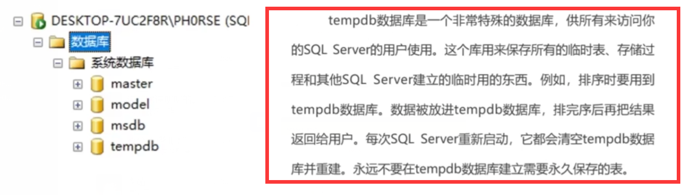
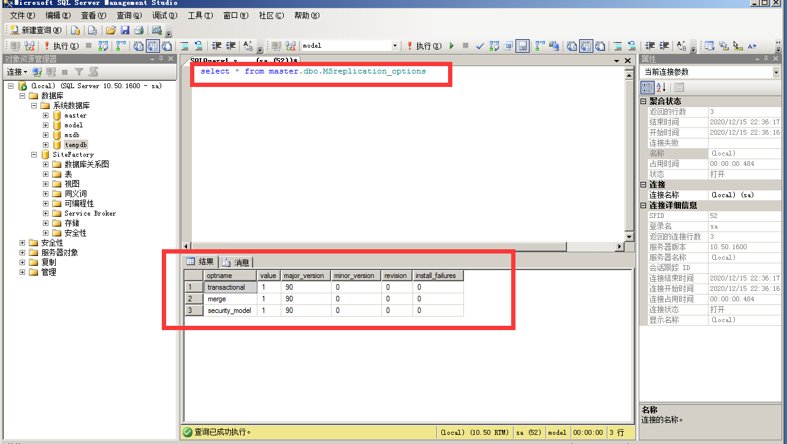

# MySQLSQL注入
## <font color = #1E90FF>MssQL简介</font>
**MSSQL注入与普通的MYSQL注入类似，但在数据结构特定函数名称上有些差异。而使用经过语法扩展的T-SQL语句，在实现更为复杂的业务的同时，也带来了安全上的危险。因此MSSQL在后续提权部分，与MYSQL有着较大的差异。<BR>由于该数据库与Windows平台的高契合度,使其可以使用Windows身份验证(或SA管理员账号) ,这就导致其运行权限较高。因此，若后续权限没有限制准确，WEB代码又存在SQL注入时，就会给整个服务器的安全带来严重威胁，其后果一般比Mysq|被攻破要严重**
### <font color = #FF0000>MSSQL特点</font>
**与MSQL中的information_schema，mysql库类似，MSSQL自带了四个系统库，对于前期注入而言，尤其要掌握<mark>tempdb<maark>**
</figure>
     <figure class="thumbnails">
        
</figure>

### <font color = #FF0000>简单的注入页面</font>
</figure>
     <figure class="thumbnails">
        
</figure>

- **Dbo=表的使用用户**
    - **视图包含行和列，就像一个真实的表，视图中的字段就是来自一个或多个数据库中的真实的表中的字段**
    ```mssql
    select * from master.dbo.MSreplication_options  #查询
    ```
    </figure>
    <figure class="thumbnails">
    
    </figure> 

## <font color = #1E90FF>MssQL详解</font>
### <font color = #FF0000>存储过程</font>
**存储过程是在大型数据库系统中，一组为了完成特定功能的SQL语句集，存储在数据库中，<font color = #FF0000>经过第一次编译后再次调用不需要再次编译</font>，用户通过指定存储过程的名字并给出参数（如果该存储过程带有参数）来执行他<BR>存储过程大大的减少了业务系统与数据库的交互，降低了业务系统和数据库的耦合<BR>在MSSQL中，存在大量的存储过程，在带来便利的同时，也带来了安全上的隐患，比如<BR>XP_cmdshell等存储过程中可以被恶意攻击者用来执行系统命令，提权<BR>其创建语法如下:**
```mssql
create procedure Procedure_Name     --Procedure_Name 为存储过程名
    @Param1 Datatyle,@Param2 Datatype   --@Param1,@Param2为存储过程参数

AS      --存储过程要执行的操作

BEGIN   -- BEGIN和END组成一个代码块，可以写也可以不写，如果存过程中执行的SQL语句比较复杂，写可以让代码更加整齐

END
```

### <font color = #FF0000>注入流程</font>
**MSSQL自带大量的存储过程，因此，针对MSSQL的注入可利用存储过程，来进行提权等操作，MSSQL注入的技巧和趣味要高于MYSQL**
</figure>
     <figure class="thumbnails">
        
</figure>

- **数据库信息收集**
    - **渗透测试，就是信息收集的过程，可利用一下语法收集数据库相关信息**
    ```mssql
    @@version       #查看当前数据库的版本

    select * FROM Users WHERE id = '1' and @@version Like '%14%'        #

    select name,loginame from master..syslogins,master..sysprocesses

    user,system_user,suser_sname(),is_srvrolemember( 'sysadmin' )

    @@SERVERNAME

    select name from master..sysdatabases

    select DB_NAME(i)
    ```


