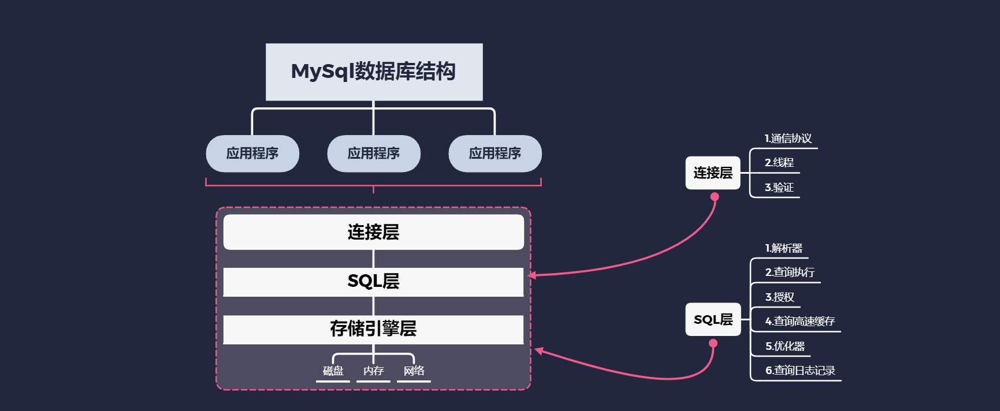
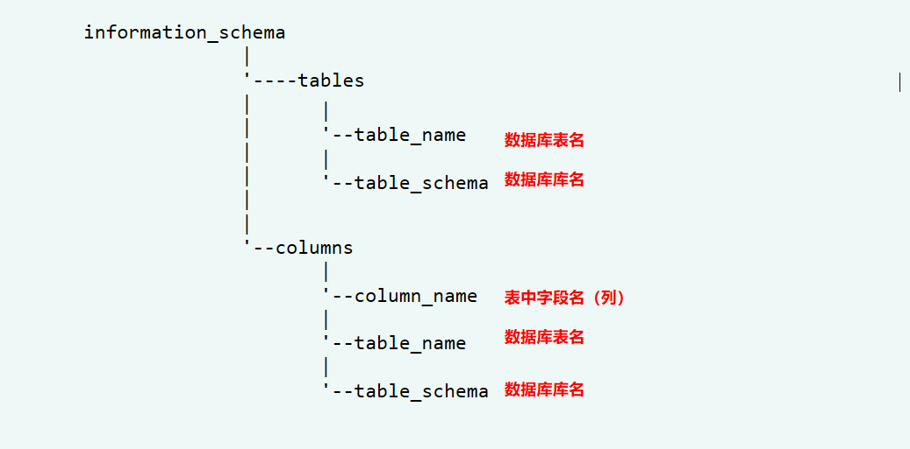
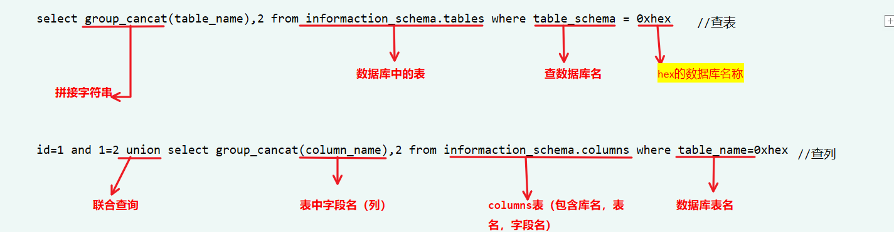

# MYSQL基础

## <font color = #1E90FF>MYSQL数据结构</font>
</figure>
     <figure class="thumbnails">
        
</figure>


## <font color = #1E90FF>MySQL元数据库</font>
### information_schema（5.7版本以后才有）


  <figure class="thumbnails">
    

</figure>

## <font color = #1E90FF>MySQL语句解析</font>


  <figure class="thumbnails">
    

</figure>


## <font color = #1E90FF>MySQL常用内置函数</font>

| 函数名称 | 函数功能 |
| :------ | :------ |
| system.user() |  系统用户名 |
| user() |  用户名 |
| current_user()  | 当前用户名 |
| session_user() |连接数据库的用户名    |
|    database()  |数据库名       |
|version()  |数据库版本   |
|@@datadir   |数据库路径   |
|@@basedir  |数据库安装路径  |
|@@version_compile_OS   |操作系统 |
|count()  |返回执行结果数量   |
| concat()  |没有分隔符的连接字符串  |
|concat_ws()  |含有分割符的连接字符串   |
| group_concat()  |连接一个组的所有字符串，并以逗号分割每一条数据   |
|load_file()  |读取本地文件    |
| into outfile  | 写文件  |
|ascii()  |字符串的ASCII码值 |
| ord()  | 返回字符串第一个字符的ASCII码值  |
| mid() | 返回一个字符串的一部分   |
| substr()  | 返回一个字符串的一部分 |
| length() | 返回支付串的长度   |


## <font color = #1E90FF>MYSQL常用函数</font>

| 函数名称 | 函数功能 |
| :------ | :------ |
|left()  |返回字符串最左边的几个字符   |
|floor()  |返回小于或等于x的最大整数   |
|rand()  |返回0和1之间的一个随机数   |
|extractvalue()  |从目标XML中返回包含所查询值的字符串   |
|updatexml()  |改变文档中符合提哦啊见的节点的值   |
|sleep()  |让此语句运行N秒钟   |
|if()  |判断   |
| char() |返回整数ASCII代码字符组成的字符串   |
| STRCMP() | 比较字符串内容  |
| IFNULL()|例如参数1不为NULL,则返回值为参数1，否则返回参数2   |
| exp() |返回e的x次方   |


## <font color = #1E90FF>MYSQL常用函数讲解</font>
- substr()函数

```
substr(string, start,<length>)          #从string的start位置开始提取字符串 

length:要提取字符串的长度，若length为以下任意条件之一时，返回start位置到串尾的所有字符:
length不指定 
length为空 
length为负数
length大于start到串尾的长度
```


```
ascii(substr((select user)),1,1))=114     

ascii(
    substr(     (select user)),1,1)   )
)=114
#查看用户名从一个字符开始截取一个，判断ASCII码是否是114
```
- if(ascii(substr((select user)),1,1))=114,0,sleep(5))
```
if(
    ascii(substr((select user)),1,1))=114
    ,0
    ,sleep(5)
    
    )     
#查看用户名从一个字符开始截取一个，ASCII码不是114，返回0，是睡眠5s
```

- limit(a,b)
```
从a开始，查b个
```
