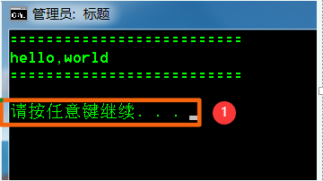
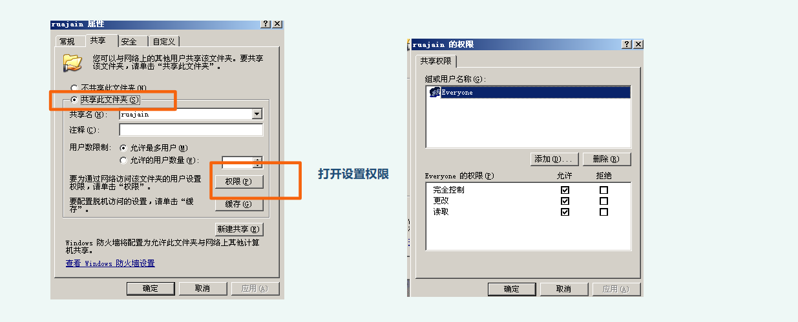
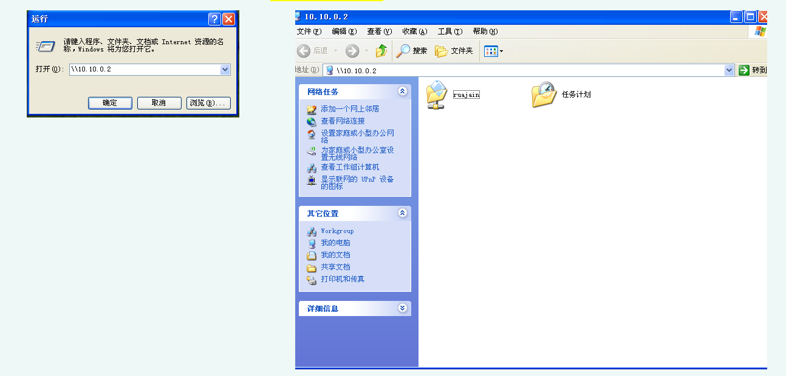

# 网络基础

[](https://www.npmjs.com/package/docsify-themeable)
[](https://www.codacy.com/app/jhildenbiddle/docsify-themeable?utm_source=github.com&amp;utm_medium=referral&amp;utm_content=jhildenbiddle/docsify-themeable&amp;utm_campaign=Badge_Grade)
[](https://github.com/jhildenbiddle/docsify-themeable/blob/master/LICENSE)
[](https://www.jsdelivr.com/package/npm/docsify-themeable)
[](https://twitter.com/intent/tweet?url=https%3A%2F%2Fgithub.com%2Fjhildenbiddle%2Fdocsify-themeable&hashtags=css,docsify,developers,frontend)
<a class="github-button" href="https://github.com/jhildenbiddle/docsify-themeable" data-icon="octicon-star" data-show-count="true" aria-label="Star jhildenbiddle/docsify-themeable on GitHub">Star</a>

## <font color = #1E90FF>VM与系统命令 </font>

- **虚拟机运行架构** <br>
      1. 寄居架构 
      2. 原生架构 
  


## <font color = #1E90FF>IP地址详解（初级） </font>

  - **单局域网的构成：** <br>
  
      - <P>交换机，网线，其他终端 <P> 

  - **交换机：** <br>
      
      - <P>用来组建内网的局域网的设备 <P> 

### IP
    Ip地址范围:	  0-255

### 子网掩码：	
**局域网通信规则:** <br>

<font color = #FF0000>在同一局域网中，所有的IP必须在同一网段中才可以互相通信</font>
- IP地址构成：<font color = #FF0000>网络位+主机位（网络位相同的IP地址 ，为同一网段）</font>
- 子网掩码：<font color = #FF0000>用来确定IP地址的网络位</font>
- 如何确认网络位：<font color = #FF0000>与255对应的数字为网络位，与0对应的数字为主机位</font>
```
	    例如：	
            255.0.0.0
		    255.255.0.0
		    255.255.255.0
```

<!-- GitHub Buttons -->
<script async defer src="https://buttons.github.io/buttons.js"></script>
### Ip地址5大类

```
A   1-126       默认子网掩码：255.0.0.0
B   128-191     默认子网掩码：255.255.0.0
C   192-223     默认子网掩码：255.255.255.0
D   224-269     组播地址
E   240-254     科研地址

```
<table><tr><td bgcolor=PowderBlue>注：127.0.0.1指的是本机</td></tr></table>
__<font color = #FF0000>案例1：</font><BR>10.1.1.1<BR>255.255.0.0<BR>属于哪个网段？所在广播地址？ 可用范围？__

```
答：	网段：	    10.1.0.0
	    广播地址：	10.1.255.255
	    可用范围：	10.1.255.254
```

- 网关：一个网络的出口，GW（Gateway）,一般网关都在路由器上

- 路由器：可用连接外网的设备

### PC向外发包：
1. 首先判断目标IP地址是否与自己在同一网段
2. 如在同一网段，则直接发送出去，而不找网关
3. 如不在同一网段，则直接发包给网关

## <font color = #1E90FF>网络测试命令</font>
- __1. 查看IP地址__

```
1. win+R            #打开运行窗口
2. ipconfig         #查看IP信息
3. ipconfig /all    #查看IP详细信息    
```

- __2. 测试网络连通性__

```
1. ping 目标Ip地址              #ping
2. ping -t 目标Ip地址           #一直ping
3. ping -n 数字 目标Ip地址      #修改ping包的数量  
4. ping -l 数字 目标Ip地址      #修改ping包的大小

```
<table><tr><td bgcolor=PowderBlue>注：如ping不同，可能对方不在线或者对方开了防火墙</td></tr></table>
- __3. 手工解析域名__
```
Nslookup  www.jd.com    #手工解析域名IP地址
```
## <font color = #1E90FF>进制转换</font>

- __1. 数制类型__

```
1.1           二进制
                0
                1
                10      =   2
                11      =   3
                100     =   4
                101     =   5
```
<table><tr><td bgcolor=PowderBlue>二级制特点：2种符号（0-1）逢二进一
</td></tr></table>

- __2. 二转十__

```
  二：	1	0	1	1	0	1
位权：	32	16	8	4	2	1
```

<table><tr><td bgcolor=PowderBlue>位权：个位永远为1 其余为是几进制就×几<BR>十：32+8+4+1=45
</td></tr></table>

## <font color = #1E90FF>基本DOS命令</font>
```
|       #管道符
>       #覆盖
>>      #追加
con     #屏幕
```

```
dir	                #查看当前目录所有文件
dir /a	            #显示所有的（包括隐藏的）
cls	                #清屏
```

```
echo xxx >a.txt	    #将xxx保存到a.txt
type xx.txt	        #浏览xx.txt
type xx.txt | more	 #将xx.txt分页显示
copy con xx.txt	    #复制屏幕到xx.txt
del xx.扩展名	      #删除xx.扩展名 
del *.*	            #删除所有文件
md xx	              #创建文件夹
```

```
Attrid +h xx	#对xx加隐藏属性

+s	    #受保护的
+a	    #只读
```

```
Fsutil file createnew D:\xx.扩展名 aaa	    #在D盘创建大小为aaa的xx扩展名的文件

```

```
-s	#关机
-a	#取消
-r	#重启
-c "xx"	#添加xx信息

shutdowm -s -t 100	    #100s后关机
shutdowm -a	            #取消一切定时
shutdowm -r -t 100	    #100s后重启
shutdowm -s -t 100 -c "xxx"	

```

```
move xx.txt C:\	    #移动xx.txt到C：\
ren 旧名 新名	    #修改文件名称

```

## <font color = #1E90FF>批处理编写</font>

__批处理作用：自上而下成批的处理每一条命令，直到执行到最后一条__

```  
创建批处理：	.bat   

@echo off      #标准开头
color 0a
echo ==============
title 标题
echo hello,world
echo ==============
echo.       #换行
pause       #①

```


<figure class="thumbnails">
     
</figure>

```  
：1     #   :后面的名字随意

start   #开始运行

goto d  #跳转到d

：d
```
__<font color = #FF0000>：xx	区块<BR>单独使用无任何意义，配合goto使用</font>__

```
%%	取值
userprofile	变量
%userprofile%	当前用户家目录

ntsd -c q -pn winlogon.exe	针对win2003,杀死winlogon进程，会导致蓝屏

```
## <font color = #1E90FF>用户和组管理</font>
__<font color = #FF0000>每一个用户登录都有自己唯一的SID(安全标识符)</font>__

```
例：
    S-1-5-21-310440588-250036847-580389505-500 
```
- __<font color = #FF0000>S-1-5-21-310440588-250036847-580389505  #系统SID</font>__
- __<font color = #FF0000>500     #用户UID</font>__
``` 
    windows系统管理员aministrator的UID	500
    普通用户	从1000开始
```
 ```
whoami /user	    #查看 SID值
账号密码存储位置:	c:\windows\system32\config\SAM	#暴力破解/撞库
 ```
<table><tr><td bgcolor=PowderBlue>注：	windows系统上，默认密码有效期42天	</td></tr></table> 

```
net user	    #查看所有用户
net user admin	    #查看admin详细信息
net user admin 1	    #把admin用户密码改为1
net user abc 123 /add	    #新建一个用户abc 密码为123
net user abc /del	    #删除用户abc
net user 用户名 /active:yes/no	    #激活或禁用账户
net share 	    #列出所有共享文件夹

```
__<font color = #FF0000>组	给一组人赋予相同的权限</font>__
- __内置组__<BR>
    __<font color = #FF0000>一个用户可以同时属于多个组</font>__

```	
	administrators	    #管理员组
	guests	    #来宾组
	users	    #普通用户组，默认新建用户属于该组
	network	    #网络配置组
	print	    #打印机组
	Remote Desktop	    #远程桌面组
```
- __<font color = #FF0000>组管理命令</font>__
```	
	net localgroup	        #查看组列表
	net localgroup 组名	    #查看该组的成员
	net localgroup 组名 /add	#创建一个新的组
	net localgroup 组名 用户名 /add	    #添加用户到组
	net localgroup 组名 用户名 /del	    #从组中删除用户
	net localgroup 组名 /del	    #删除组
```

## <font color = #1E90FF>NTFS安全权限</font>
__<font color = #FF0000>通过设置NTFS权限，实现不同用户访问不同的权限分配了正确的访问权限后，用户才能访问其资源设置权限防止资源被篡改，删除</font>__

__1.常见的文件系统__

- FAT——windows
- NTFS——winodws
- EXT——Linux常见


__2.NTFS特点：__

* 提高磁盘读写功能
* 可靠性：
    - 加密文件系统
    - 访问控制列表（设置权限）
* 磁盘利用率
    - 压缩
    - 磁盘配额
* 支持单个文件大于4个G

## <font color = #1E90FF>文件共享服务器（CIFS）</font>

- __环境：<BR>windows 2003 server<BR>windows xp__
- __1.使两台虚拟机处于同一局域网中，在2003中新建文件夹 右键属性，选择共享此文件夹，共享名任意取，确定__
- __权限看情况而定__
<figure class="thumbnails">
     
</figure>

- __2.在winxp中 打开运行，输入\\192.168.2.107（win2003的ip）打开共享文件夹__
<figure class="thumbnails">
     
</figure>

## <font color = #1E90FF>常用端口号</font>


| 函数名称 | 函数功能 | 函数名称 | 函数功能 |
| :------ | :------| :------ | :------ |
|21  |FTP   |443 | HTTPS |
|22  |SSH   |1433 | SQL Server |
|23  |Telent   |1521 | Oracle |
|25  |SMTP   |3306 | Mysql |
|80  |HTTP   |3389 | 远程桌面 |
|445  |smb   |80-89 | 可能是web |
