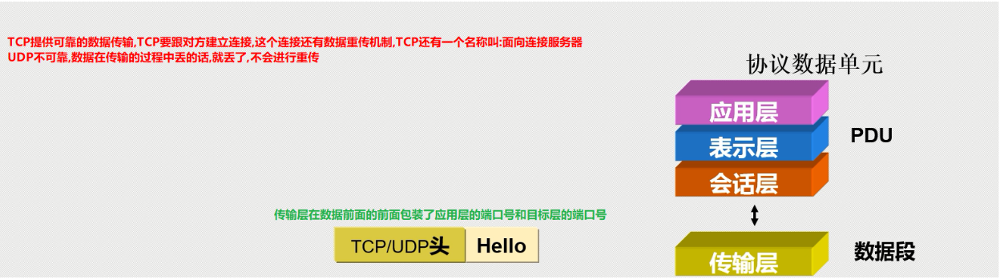

# 网络协议

[](https://www.npmjs.com/package/docsify-themeable)
[](https://www.codacy.com/app/jhildenbiddle/docsify-themeable?utm_source=github.com&amp;utm_medium=referral&amp;utm_content=jhildenbiddle/docsify-themeable&amp;utm_campaign=Badge_Grade)
[](https://github.com/jhildenbiddle/docsify-themeable/blob/master/LICENSE)
[](https://www.jsdelivr.com/package/npm/docsify-themeable)
[](https://twitter.com/intent/tweet?url=https%3A%2F%2Fgithub.com%2Fjhildenbiddle%2Fdocsify-themeable&hashtags=css,docsify,developers,frontend)
<a class="github-button" href="https://github.com/jhildenbiddle/docsify-themeable" data-icon="octicon-star" data-show-count="true" aria-label="Star jhildenbiddle/docsify-themeable on GitHub">Star</a>

## <font color = #1E90FF>Http请求与响应 </font>

### __<font color = #FF0000>1.HTTP请求</font><BR>__
__HTTP请求由三部分组成，分别是:请求行、消息报头、请求正文;HTTP响应也是由三个部分组成，分别是∶状态行、消息报头、响应正文，它们之间以CRLF即\rn分割，且报头与正文之间有一个空行。在客户机和服务器之间进行请求-响应时，两种最常被用到的方法是:GET和POST。__

### __<font color = #FF0000>2.GET和POSTD区别</font><BR>__
- __GET__
    * GET请求查询的字符串（名称/值对）是在URL中发送的
    * GET请求可以被返回
- __POST__
    * 查询的字符串（名称/值对） 是在POST请求的HTTP消息主体中发送的
    * POST请求不会被缓存

数据链路层
### __<font color = #FF0000>1.网络参考模型</font><BR>__
<figure class="thumbnails">
     
</figure>

### __<font color = #FF0000>2.OSI七层模型</font><BR>__
<figure class="thumbnails">
     
</figure>
<table><tr><td bgcolor=PowderBlue>注：同层使用相同的协议，下层为上层提供服务</td></tr></table>  

### __<font color = #FF0000>3.OSI七层模型优点</font><BR>__
- 将复杂的流程分解为几个功能相对单一的子过程
- 整个流程更加清晰，复杂问题简单化
- 更容易发现问题并 针对性的解决问题

### __<font color = #FF0000>4.过程</font><BR>__
- TCP会携带许多信息,导致臃肿,传输较慢
- UDP携带的信息少,传输快
<figure class="thumbnails">
     
     

</figure>

<figure class="thumbnails">
     
     

</figure>

- pc端接收到信息之后,解析帧

<figure class="thumbnails">
     
</figure>

### __<font color = #FF0000>5.TCP/IP5层协议簇/协议栈</font><BR>__

| ... | ... | ... |
| :-----| ----: | :----: |
| 数据/PDU  | 应用层 | PC/防火墙 |
| 数据段/段 | 传输层 | 防火墙 |
| 报文/包/IP包 | 网络层 | 路由器 |
| 帧Fame | 数据链路层 | 交换机 网卡 |
| 比特bit | 物理层 | 网线 |
<table><tr><td bgcolor=PowderBlue>注：8bit = 1Byte字节   100Mb/s</td></tr></table>  

<figure class="thumbnails">
     
</figure>

### __<font color = #FF0000>6.物理层</font><BR>__

- 1.网线/光纤/空气
- 2.比特bit
```
    8bit = 1Byte
    1024B = 1KB
    1024KB = 1MB
    1024MB = 1GB
    1024GB = 1TB
    1024TB = 1PB
```
- 3.信号：模拟信号、数字信号
    * 放大器
    * 中继器
    * 光信号
    * 光线类型:
        * 1)单模光纤 一般是黄色
        * 2)多模光纤 一般是橙色/蓝色
- 4.网线/双绞线：
    * 5类双绞线
    * 超5类双绞线
    * 6类 7类 chegn
```
T568A：绿白、绿、橙白、蓝、蓝白、橙、棕白、棕
T568B：橙白、橙、绿白、蓝、蓝白、绿、棕白、棕
```

### __<font color = #FF0000>7.网线的用途分类</font><BR>__

- 1、交叉线：一端为A，一段为B。同种设备间使用！（三层及以上的设备）
- 2、直通线：两端都是A或都是B。异种设备间使用！（一般是B）
- 3、全反线：一端为A，另一端为反A，也称console线

```
    Ethernet    	        10Mb/s
    FastEthernet      	  100Mb/s
    GigabitEtherrnet        1000Mb/s
    TenGigabitEtherrnet     10000Mb/s

```
## <font color = #1E90FF>数据链路层 </font>
<figure class="thumbnails">
     
</figure>

### __<font color = #FF0000>数据链路层</font><BR>__
- 1.属于两层0.
- 2.传输单元：帧
- 3.帧头：6+6+2=14字节
    * MTU值：1500
    * 帧尾：4字节
    * 帧头内容：目标MAC , 源MAC ， 类型
- 类型的作用：识别上层协议 ，为上层协议服务
    * 0x0800:上层协议为IP协议
    * 0x0806:上层协议为arp协议

<table><tr><td bgcolor=PowderBlue>注：0x:16进制</td></tr></table>

## <font color = #1E90FF>PT </font>
- S开头的字母一般是华为的交换机
- C开头的字母一般是思科的交换机
- 建议买2960型号的交换机
- 中间米字型为核心交换机,也是三层交换机
- 中间双箭头的为二层交换机
- 中间为十字箭头形状的为路由器(28111,2901)

<figure class="thumbnails">
     
    
</figure>

__console端口是用来管理交换机的,通过命令控制交换机的__<BR>
```
FastEthernet0/1

0代表第一个模块
1代表第一个端口
有些交换机是可以分模块的,就像抽屉一样,可以替换交换机,一个箱子里面可以有百兆交换机,可以有千兆交换机
```
<table><tr><td bgcolor=PowderBlue>注：连线是,会出现一段时间的橘黄色,因为在适应,一旦适应成功那么就都是绿色的</td></tr></table>

## <font color = #1E90FF>交换机的工作原理</font>

### __<font color = #FF0000>1.收到一个数据帧后：</font><BR>__
- 1、首先学习帧中的源MAC地址来形成MAC地址表
- 2、然后检查帧中的目标MAC地址，并匹配MAC地址：
    * 如表中有匹配项，则单播转发
	* 如表中无匹配项，则除接收端口外广播转发
- 3、MAc地址表的老化时间默认是300秒(可修改)

#### __<font color = #FF0000>1.1交换机的端口：</font><BR>__
- E 10Mb
- F 100Mb
- G 1000Mb
- Te 10000Mb

#### __<font color = #FF0000>1.2F0/1</font><BR>__
- 0模块号
- 1接口号
- 接口速率自适应：1000/100/10自适应
- 速率工作模式可以为10/100/1000任何一种状态

#### __<font color = #FF0000>1.3端口状态：up/down</font><BR>__

__own的3种可能：__<BR>
- 1）人工down掉
- 2）速率不匹配
- 3）双工模式不匹配（双工duplex）

__<table><tr><td bgcolor=PowderBlue>双工模式：单工、半双工、全双工</td></tr></table>__

### __<font color = #FF0000>2.交换机5大基本工作模式：</font><BR>__

__第一次配置网络设备，需使用console线<BR>在PC上需要使用”超级终端“或其他软件。__


- 1）用户模式：
            switch> 4
            可以查看交换机的基本简单信息，且不能做任何修改配置！

- 2）特权模式
            switch> enable
            switch#>
            可以查看所有配置，且不能修改配置，但可以做测试、保存、初始化等操作
- 3)全局配置模式
            switch# congigure terminal
            switch(config)#
            默认不能查看配置！
            可以修改配置，且全局生效！
- 4）接口配置模式：
            switch(config)#interface f0/1
            switch(config-if)#
            默认不能查看配置！
            可以修改配置，且对该接口生效！
- 5）console口/线/控制台配置模式：
            switch(config)#line console 0
            默认不能查看配置！
            可以修改配置，且对console口生效！

#### __<font color = #FF0000>2.1命令</font><BR>__

    6、
        exit 退出一级
        end 直接退到特权模式
    7、支持命令缩写
    8、？的用法
    9、历史命令
    10、tab补全键
- 11、配置主机名：
        conf t
        hostname 折设备名
- 12、设置用户密码：
        line co 0
        password 密码
        login
        exit
- 13、快捷键：
        ctrl+u : 快速删除光标前所有字符
        ctrl+a : 快速定位光标到行首
        ctrl+e : 快速定位光标到行尾
- 14、
        在内存中存在一个文件：
        running-config
        第一次开机，系统会在内存中自动创建一个新的干净的running-config
- 15、配置
        en
        copy running-config startup-config
        或
        write
- 16、交换机开机动作：
        先去硬盘中查找startup-config是否存在：
        如果不存在，内存中创建新的running-config
        如果存在，则复制到内存中并改名为running-config
- 17、查看running-config配置
        en
        show running-config
- 18、查看startup-config配置
        en
        show startup-config
- 19、重启设备：
        en
        reload

- 20、配置特权密码：
        conf t
        enable password 密码（明文）
        enable secret 密码 （密文）
- 21、查看MAC地址表
        show mac-address-table
- 22、查看接口状态列表：
        show ip int brief
        show ip int b
- 23、手工关闭接口
        int f0/x
        shutdown
        exit
- 23、手工开启接口
        int f0/x
        no shutdown
        exit
- 24、do的用法
        其他模式加do空格可以强制使用特权模式的命令	
        如：
            do sh run
            do sh ip int b
            do wr
- 25、删除配置
        1)在哪配置的，就在哪删！
        2)命令前加no 空格
        3)原命令中有参数，并且参数具有唯一性，则删除时不需要加参数
        如：
            conf t 
            hostname sw1
     
            conf t
            no hostname
- 26、清空/擦除/初始化配置
        en
        erase start-config
- 27、为3层端口 配置IP：
        int f0/0
        ip add 10.1.1.254 255.255.255.0
        no shutdown
- 28、开启远程控制：
        conf t
        line vty 0 4
        transport input telnet/ssh/none/all
        password 密码
        login
        exit
     
        conf t
        hostname r1
        ip domain-name r1.qf.com
        crypto key generate rsa   //生产密钥对
        line vty 0 4
        transport input telnet/ssh/none/all
        login local
        exit
        username xx password 123.com
- 29、为交换机配置管理IP：
        conf t
        int vlan 1
        ip add 10.1.1.253 255.255.255.0
        no shut
- 30、为交换机配置默认网关
        目的：可跨网段管理
        conf t
        ip defaut-gateway 10.1.1.254
- 31、关闭自动解析功能：
        conf t
        no ip domain-lookup


