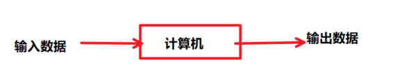
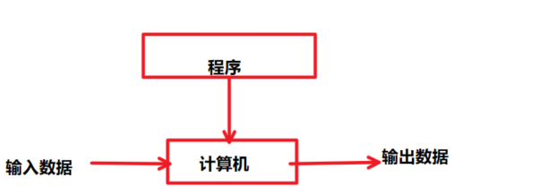
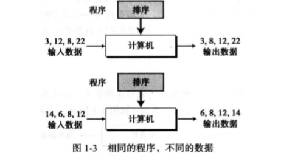
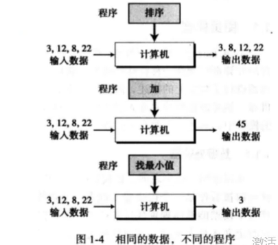

# 计算机科学导论
## 图灵模型
**Alan Turing (阿兰图灵) 1937年首次提出通用计算机设想:所有的计算都可能在- 种特殊的机器上执行。**
- **是一种数学上的描述**
- **不是一台真实的机器**

## 数据处理器
**首先暂且把计算机可以被看作一种接收数据输入、处理数据并产生数据输出的黑盒。**
</figure>
     <figure class="thumbnails">
        
</figure>

### 问题: 没有确定计算机能处理的数据是什么 

## 可编程数据处理器
- **图灵模型:可编程计算机**
- **程序:告诉计算机对数据处理的的指令集合**
</figure>
     <figure class="thumbnails">
        
</figure>

### 可编程数据处理器-输出数据 
**输出数据:根据输入数据+程序，得到输出数据**
- **相同程序，不同输入数据:输出数据不同**
- **相同输入数据，不同程序:输出数据不同**
- **相同输入数据，相同程序:输出数据相同**
</figure>
     <figure class="thumbnails">
        
        
</figure>

### 通用图灵机 
__通用图灵机是对现代计算机的首次描述，该机器只要提供合适的程序就能做任何运算__

## 冯-诺依曼模型

- **由科学家冯诺依曼提出的模型理论**
- **基于通用图灵机建造的计算机都是在存储器上存储数据**
- **鉴于程序和数据在逻辑上是相同的，因此程序也能存储在计算机的存储器中**
