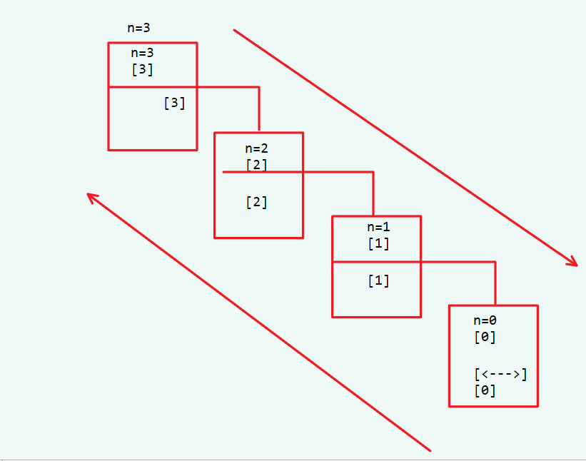

# PHP

[](https://www.npmjs.com/package/docsify-themeable)
[](https://www.codacy.com/app/jhildenbiddle/docsify-themeable?utm_source=github.com&amp;utm_medium=referral&amp;utm_content=jhildenbiddle/docsify-themeable&amp;utm_campaign=Badge_Grade)
[](https://github.com/jhildenbiddle/docsify-themeable/blob/master/LICENSE)
[](https://www.jsdelivr.com/package/npm/docsify-themeable)
[](https://twitter.com/intent/tweet?url=https%3A%2F%2Fgithub.com%2Fjhildenbiddle%2Fdocsify-themeable&hashtags=css,docsify,developers,frontend)
<a class="github-button" href="https://github.com/jhildenbiddle/docsify-themeable" data-icon="octicon-star" data-show-count="true" aria-label="Star jhildenbiddle/docsify-themeable on GitHub">Star</a>

## <font color = #1E90FF>基本语法 </font>

###  __<font color=#FF0000>PHP语言标记</font>__
```php
<?php	#开始标记
?>   	#结束标志
;     #指令分割符 PHP必须（建议）要用分号结束	
```
- 1. `<?php?>`这之间就表示进入PHP模式，在开始和结束之外的内容都会被PHP解析器忽略
- 2. 可以直接嵌入到HTML代码中，并可以嵌入到html代码中的任何地方
- 3. 在一个html代码中，可以嵌入任意多个php标志
- 4. 文件末尾的PHP代码段结束标志可以不要，在一些情况下省略更好

###  __<font color=#FF0000>简单的PHP语句</font>__
```php
phpinfo();	#显示出PHP 所有相关信息
echo	    #用于输出简单的变量
var_dump	#用于输出变量值及其变量类型
```

###  __<font color=#FF0000>PHP语法错误</font>__
```php
error	#结束脚本执行
warr~	#只提示，不影响执行
```

## <font color = #1E90FF>数据类型 </font>
###  __<font color=#FF0000>变量</font>__
- **变量声明**
    * 不需要声明变量
- **初始化**
    * 就是给变量初次赋值，或者变量的默认值。如果一个变量没有初始化，内存中就没有这个变量。
- **赋值**
    * =
- **引用赋值**
    * $c = &$a;	相当于给$a起了一个别名
- **释放变量**
 ```php
unset();
```
- **变量的命名**
```php
$a = 5;
```
- __<font color=#FF0000>整型</font>__
```php
	1
	185151
```	

- __<font color=#FF0000>float</font>__

```php
3.14    //储存小数	
```

- __<font color=#FF0000>字符串</font>__	

```php
string
字符串的定义
	'  '
	"    "
```

 __<font color=#FF0000>注意：</font>__<BR>
- 1.单引号定义的字符串中的单引号需要转义 \'
- 2.单引号定义的字符串中  $符号原样输出
- 3.双引号定义的字符串中  $是变量的开始变量整体用{}括起来、
- 4.单引号定义的字符串中输入特殊字符包括['"$...]需要转义
- 5.定界符开始和结束后面不能有任何字符包括空白字符和注释

```php
<?php
$str=<<<HTML
<span style="color:red;">hello.world$[wea#$]</span>；
HTML;
echo $str;
?>
```

###  __<font color=#FF0000>常量</font>__

| 常量名 | 常量值 |
| :-----| :-----: | 
|`__FILE__` | 当前的文件名 | 
|`__LINE__` | 当前行数 | 
|`__FUNCTION__` | 当前的函数名 | 
|`__CLASS__` | 当前的类名 | 
|`__METHOD__` | 当前对象的方法名 | 
|`PHP_OS` | UNIX或WIINNT等 | 
|`PHP_VERSION` | 当前PHP服务器的版本 | 
|DIRECTORY_SWPARATOR\或/ | 根据操作系统觉决定目录的分隔符| 

- **define（）	定义常量**

```php
<?php
define("NAME","JACK");
echo "NAME";
var_dump(NAME);
echo __FILE__;
?>
```

## <font color = #1E90FF>运算符 </font>
- **优先级：**
	- 与>或

- __<font color=#FF0000>算数运算符</font>__
    - 整型，浮点型  
- __<font color=#FF0000>逻辑运算符</font>__
    - 布尔类型
    ```php
	非	！
	与	and &&
	或	or ||
	异或	xor
    //不同为真，相同为假
    ```
- __<font color=#FF0000>比较运算符</font>__
    - 比较参与运算的单元是否相同，相同为真，不同为假

- __<font color=#FF0000>其他运算符</font>__
    - 三元运算符
    ```
     ?：
    $C=10>20?10:20
    ```
    - <mark>' '<mark><BR>

    将字符串当做命令执行
    - <mark>'@ <mark><BR>

    屏蔽提示警告

## <font color = #1E90FF>流程控制 </font>
- __<font color=#FF0000>顺序执行</font>__
```
php代码执行的时候，一次顺序执行
```

- __<font color=#FF0000>分支执行</font>__
    - 单向分支
    ```
    if(判断条件){执行语句块}
    ```

    - 双向分支
    ```
    if(判断语句){执行语句块1}else{语句块2}
    ```

    - 多项分支
    ```
	100-90	A
	89-80	B
	....
	59-0	sorry
	elseif	
		
    switch
    ```
#### __<font color=#FF0000>例：</font>__
```php
$num=$_GET["num"];
witch($num){
    case $num>=90 && $num<=100:
	    cho "你的成绩等级为A"; 
	    break; 
    case $num>=80 && $num<90: 
		default: 
	echo "你输入的成绩有误，请重新输入.";
		break;
```

### __<font color=#FF0000>循环语句</font>__

#### __<font color=#FF0000>while</font>__
```php
while(表达式){          //当满足条件时，执行；
	//各种语句。。      //计算器，变量；
}                      //判断条件

```

#### __<font color=#FF0000>do…while</font>__
```
先执行后判断
```

#### __<font color=#FF0000>for</font>__

#### __<font color=#FF0000>特殊流程控制语句</font>__

```php
break;
break2；    //跳出两层循环
continue;   //跳出本次循环
die()       //结束脚本
exit()      //退出
```
**<table><tr><td bgcolor=PowderBlue>当表达式为true时，执行下面的语句块，当语句块执行结束之后，再返回上面来判断表达式的值是true还是false,为true继续执行，为false，那么停止执行</td></tr></table>**


## <font color = #1E90FF>函数 </font>

### __<font color=#FF0000>自定义函数</font>__
- **函数定义语法**
```php
function 函数名（形式参数1，形式参数…，形式参数n）{
	//各种PHP代码。。。
	//。。。
}
```
- **函数的调用**
    * 函数的调用需遵循定义函数的时候写的规则，一一对应，将具体的实际参数传给定义函数时候写的* 形式参数；
	* 调用函数之后的执行过程是相对独立的，互不干扰，默认没有联系；
    * <MARK>执行完毕返回调用的位置继续向下执行。<MARK>
- **函数的返回值**
```
返回给调用者，默认返回null
```

-  __<font color=#FF0000>注意：</font>__
    - **函数调用时，实参要按照顺序给形参；**
    - **函数调用时，互相独立，默认没有联系**

### __<font color=#FF0000>函数</font>__
#### __<font color=#FF0000>例:</font>__
```php
	//代码块
	//有输入，有输出
	-------------------------
	function 函数名(形参){
		//代码块
		return ；
	}
	-----------------
```

```php
<?php
function add($a,$b){
return $a+$b;
}
?>
```

### __<font color=#FF0000>变量的范围</font>__

- __<font color=#FF0000>局部变量</font>__
    - **在函数内部定义的变量**
    - **变量的作用范围就是这个函数。**
- __<font color=#FF0000>全局变量</font>__
    - **在php脚本中，函数外部定义的变量**
    - **变量的作用域为整个PHP脚本**
- __<font color=#FF0000>在函数中使用函数全局变量？</font>__
    - **1.传参**
    - **2.声明方式**
    ```php
    global
    ```
    - **3.常用的作用域，是超全局**
- __<font color=#FF0000>静态变量</font>__
    - **在函数内部定义**
    - **用static修饰符修饰**
    - **仅在函数初次执行时被初始化**


### __<font color=#FF0000>参数的传递</font>__
    
- __<font color=#FF0000>按值传递的参数（默认方式）</font>__
    - **对形参的操作，不会对实参产生影响。**
- __<font color=#FF0000>引用传参</font>__
    - **相对于跟实参起了一个别名，对形参的操作会对实参产生影响。**
- __<font color=#FF0000>默认参数</font>__
    - **如果没有个函数传递参数，取默认值。<BR>建议：<BR>全给默认参数**
  		
### __<font color=#FF0000>可变函数参数列表</font>__
```php
func_get_args();	//返回传入所在自定义函数的参数的个数
func_get_arg();	    //根据函数偏移量，从0开始计数，获取参数
func_num_args();	//传参个数
```

```php
<?php
function test(){
	echo func_num_args();               //传参个数
	echo func_get_arg(1);               //根据函数偏移量，从0开始计数，获取参数
	
	for($i=0;$i<fun_get_args();$i++){  //返回传入所在自定义函数的参数的个数
	echo func_get_arg($i)."|"	
}

?>
```
### __<font color=#FF0000>可变函数（变量函数）</font>__
- **直接把函数赋值给变量**
- **不能用于 echo,print,print()等类似的语言结构**
```php
$a($b)；   //也是最简单的后门
```
```php
function test(){
	echo "The func's name is :".__FUNCTION__;
	echo "<br />";
	echo func_get_arg(0);
}
$a = 'test';     //把函数名字加上引号，赋值给变量既可
$a("AJEST");  //test();  函数名是$a   test("AJEST")
$b = 'echo';
```
### __<font color=#FF0000>递归函数</font>__
- **递归函数即在函数内部自己调用自己**
#### __<font color=#FF0000>如：</font>__
```
function test($n){
	echo n.'&nbsp;'
	if($n>0){
		test($n-1);   //自己内部调用自己，即递归函数
	}else{
		echo '<--->';
	}
	echo $n.'&nbsp;';
}
test(3);
```
#### __<font color=#FF0000>图解：</font>__
<figure class="thumbnails">
     
</figure>

## <font color = #1E90FF>数组 </font>
-  __变量类型__
-  __复合数据类型__
-  __键值对__
    ```
    键名 键值
    ```
-  __数组中的元素__
    * 除了对象，可以存放任意类型的数据


### __<font color=#FF0000>数组的创建</font>__
- __<font color=#FF0000>第一种创建数组的方式：</font>__
```php
$stu[]
```
    - 1.在未指定键名的情况下，给数组赋值，键名从最大的开始计数，依次增大。
    - 2.可以手动给键名

    ```php
    stu[] = 24;
    $stu[] = true;

    $stu['name'] = "tom";

    $stu[10] = "tom";
    $stu[20] = 24;
    $stu[] = 78;
    ```


- __<font color=#FF0000>第二种方法：</font>__
```php
array()
```

    ```php
    $stu2 = array(
        'name' => "Tom",
        'age' => "23",
        'sex' => false"
        );

    ```

- __<font color=#FF0000>方法一</font>__

```php
变量名称[索引值]=数据；
变量名称[]=数据；  //不写索引值默认是数值数组，从0开始
```

```php
$student[0] = 10;
$student[1] = 'JUME';
$student[2] = true
$student[3] = 60.5;
$student[4] = '80';
					
var_dump($student);
					
$student1['num']=10;
$student1['name']='JUME';
					
var_dump($student1);
					
echo $student[1];
					
key  value
```

### __<font color=#FF0000>数组元素的访问</font>__
    1. 读取
    2. 添加
    3. 修改

### __<font color=#FF0000>数组的遍历</font>__
- for循环
    * 只适用于有规律的索引数组
- foreach
    * 语言结构

### __<font color=#FF0000>二维数组</font>__
### __<font color=#FF0000>多维数组</font>__
### __<font color=#FF0000>预定义超全局数组的变量</font>__
- **PHP定义好的，可以直接使用**
- **函数内部或者外部都能使用**

| 名称 | 作用 |
| :-----| :----- | 
|$GLOBALS | 引用全局作用域中可用的全局变量 | 
|$_SERVER | 一个包含了诸如头信息(header)，路径(path)，脚本位置(script locations)等信息的数组 | 
|$_SERVER | 一个包含了诸如头信息(header)，路径(path)，脚本位置(script locations)等信息的数组 | 
|$_GET | 通过URL参数传递给当前脚本的变量的数组 | 
|$_POST| 当HTTP POST请求的Content-Type是application/x-www-form-urllencodedmultipart/form-data时，会将变量以关联数组形式传入当前脚本
 | 
|$_FILES | 通过HTTP POST 方式上传到当前脚本的项目的数组 | 
|$_SESSION| 当前脚本可用的 SESSION 变量的数组 | 
|$_REQUEST | 默认情况下包含了 $_GET，$_POST，$_COOKIE 的数组 | 
|$_ENV | 通过环境方式传递给当前脚本的变量的数组 | 


### <font color=#FF0000>$_GET</font>
- 接收来自于URL传递的参数
```
http://localhost/PHP/array/get.php?name=TOM&&passwd=123456
				                参数的名     键名
                                参数的值     键值
```

### <font color=#FF0000>$_POST</font>
- 当HTTP POST请求的Content-Type是application/x-www-form-urllencodedmultipart/form-data默认时，会将变量以关联数组形式传入当前脚本
- HTTP请求报文的请求正文中

### <font color=#FF0000>$_FILES</font>
- 通过HTTP POST 方式上传到当前脚本的项目的数组

### <font color=#FF0000>会话控制</font>
- 浏览网页的时候，使用的是HTTP协议。
- 客户端发出的请求
- 服务端给出响应

### <font color=#FF0000>COOKIE</font>
- COOKIE是存储在客户端的一段文本，文件|字符串
- 服务器发给客户端的
- 每次客户端浏览器在发出请求的时候，都会携带cookie信息

#### <font color=#FF0000>cookie的性质</font>
| 名称 | 作用 |
| :-----| :----- | 
|name | Cookie的名称 | 
|value | Cookie的值 | 
|expire |过期时间 | 
|path | Cookie的有效路径 | 
|domain | Cookie的域名 | 
|secure | https | 
|httponly | 仅仅通过http协议访问，不能通过js访问 | 

#### <font color=#FF0000>设置cookie的语句</font>
    setcookie();
#### <font color=#FF0000>接受cookie信息</font>   
    $_COOKIE
#### <font color=#FF0000>窃取和欺骗</font>   
#### <font color=#FF0000>浏览器cookie信息</font>   	
    F12

### <font color=#FF0000>seesion机制</font>
- 依赖Cookie实现
```
session id 
sesion_start()   //开启session
```

## <font color = #1E90FF>PHP与MYSQL </font>
```php
<?php
$dbHost = "127.0.0.1";
$dbUser = "root";
$dbPass = "root"
$dbName = "xnfn";
$link = mysqli_connect($dbHost,$dbUser ,$dbPass ,$dbName);
?>
```

### <font color=#FF0000>mysql插入语句</font>
    insert into 表名 （字段1，字段2，字段3）value (值1，值2，值3)；
#### <font color=#FF0000>交互步骤：</font>
- 1.建立连接
	* 用户名
	* 密码
	* 地址
		* 数据库名
- 2.执行sql语句
- 3.断开连接

#### <font color=#FF0000>相关函数</font>
- **连接指定的mysql服务器**
```
    $mysqli_concent=@mysqli_concent($host,$user,$password,$dabasbase,$port);
```

- **连接错误时的提示**
```
	int mysqli_concent_errno();     //返回最后一次连接调用的错误代码
	string mysqli_concent_error();     //返回一个字符窜描述的最后一次连接调用的错误代码
```

- **设置默认字符编码**
```
    bool msyqli_set_charset(mysqli $link,string $charset)
```

- **选择特定的数据库**
```
    bool mysqli_select_db(mysqli $link,string $dbname);
```

- **关闭与mysql服务器的连接**
```
    bool mysqli_close (mysqli $link);
```

### <font color=#FF0000>操作结果集对象的函数</font>

| 函数 | 说明 |
| :-----| :----- | 
|mysqli_fetch_row() | 以索引数组的方式获取一条记录的数据 | 
|mysqli_fetch_assoc() | 以关联数组的方式获取一条记录的数据 | 
|mysqli_fetch_array() |以索引数组或关联数组的方式获取一条记录的数据 | 
|mysqli_fetch_all() | 以索引数组或关联数组的方式获取全部记录的数据 | 
|mysqli_fetch_rows() | 获取结果中行的数量 | 
|mysqli_fetch_result() | 释放与一个结果集合相关的内存 | 