# 皮卡丘靶场
    


[](https://www.npmjs.com/package/docsify-themeable)
[](https://www.codacy.com/app/jhildenbiddle/docsify-themeable?utm_source=github.com&amp;utm_medium=referral&amp;utm_content=jhildenbiddle/docsify-themeable&amp;utm_campaign=Badge_Grade)
[](https://github.com/jhildenbiddle/docsify-themeable/blob/master/LICENSE)
[](https://www.jsdelivr.com/package/npm/docsify-themeable)
[](https://twitter.com/intent/tweet?url=https%3A%2F%2Fgithub.com%2Fjhildenbiddle%2Fdocsify-themeable&hashtags=css,docsify,developers,frontend)
<a class="github-button" href="https://github.com/jhildenbiddle/docsify-themeable" data-icon="octicon-star" data-show-count="true" aria-label="Star jhildenbiddle/docsify-themeable on GitHub">Star</a>

## <font color = #1E90FF>暴力破解（基于表单）</font>
### **<font color=#FF0000>什么是暴力破解？？</font>**
**连续性尝试+字典+自动化**

### **<font color=#FF0000>暴力破解概述</font>**
- **是否要求用户设置了复杂的密码;**
- **是否每次认证都使用安全的验证码;**
- **是否对尝试登录的行为进行判断和限制;**
- **是否在必要的情况下采用了双因素认证;**

### **<font color=#FF0000>暴力破解漏洞测试流程</font>**
- **确认登录接口的脆弱性**
    - 确认目标是否存在暴力破解的漏洞。( 确认被暴力破解的"可能性”)
比如:尝试登录一抓包-- 观察 验证元素和response信息 ,判断否存在被暴力破解的可能。
- **对字典进行优化**
    - 根据实际的情况对字典进行优化,提高爆破过程的效率。
- **工具自动化操作**
    - 配置自动化工具(比如线程、超时时间、重试次数等)， 进行自动化操作。

### **<font color=#FF0000>暴力破解实验演示</font>**

#### 环境：
- burpsuite
- pkq

#### 目标：
- 基于表单的暴力破解

### **<font color=#FF0000>BurpSuite</font>**

<figure class="thumbnails">
    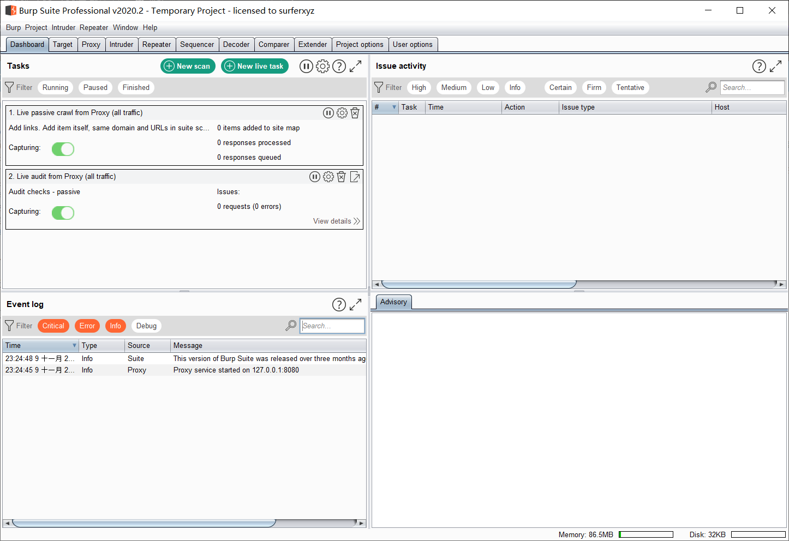
</figure>

- **target选项卡**
        设置攻击目标，可以通过proxy发送
- **Pasitions选项卡**
        指定需要暴力破解的参数，并设置成变量，同时选择攻击模式
    - Sniper: 狙击手
            设置一个payload,先将第一个变量使用字典进行测试，然后再将第二个变量使用字典进行测试。
    - Battering ram: 冲撞车
            设置一个payload,所有的变量一起用字典内容被替换，然后一起尝试。
    - Ptichfork:草叉性
            每个变量设置一个payload，分别使用对应的字典对变量进行同时替换。
    - Cluster bomb:焦束炸弹
            需要为每个变量是在一个payload，分别使用字典内容祝贺对变量进行替换

#### **<font color=#FF0000>1.开启burp,并设置好浏览器代理</font>**
#### **<font color=#FF0000>2.打开靶场窗口，输入任意的账号密码</font>**
- **2.1可以看出bp已经抓到了你提交的post请求**
<figure class="thumbnails">
    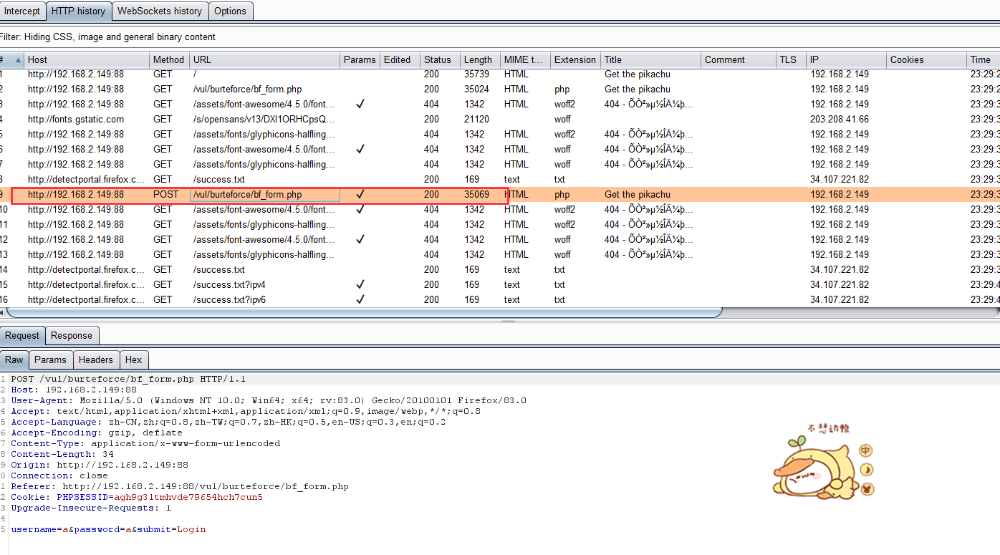
</figure>

- **2.2右键发送到intruder模块**
<figure class="thumbnails">
    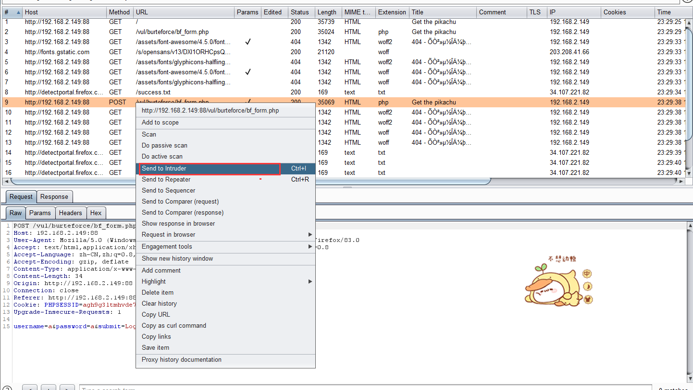
</figure>

- **2.3在上面的attacktype中可以下拉选择类型，一般选取最后一个，交叉型居多**
- **2.4可以看到箭头所指的两个，就是你输入的账号密码，这时选中账号密码，然后点击右方的add按钮，使它变成可变变量**
<figure class="thumbnails">
    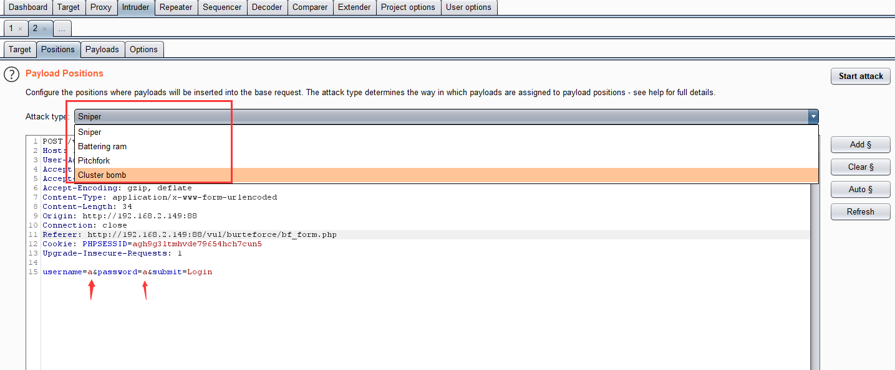
    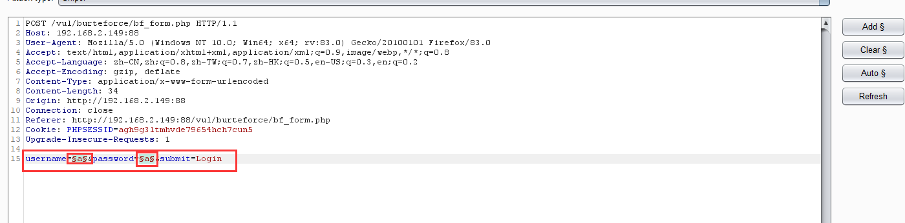
</figure>

- **2.5这时候切换到payloads选项，可以看到<BR>①的位置就是你所add变量的个数，<BR>②的位置就是你添加密码的类型，这些选择runtime file(从文件导入密码)，<BR>③的位置就是导入密码文件的路径**
<figure class="thumbnails">
    
</figure>

- **2.3下面是Options选项，<BR>①代表线程数，<BR>②代表失败重试的次数，<BR>③代表每次重试间隔的时间**
- **2.3.1 Grep Match选项，添加条件**
<figure class="thumbnails">
    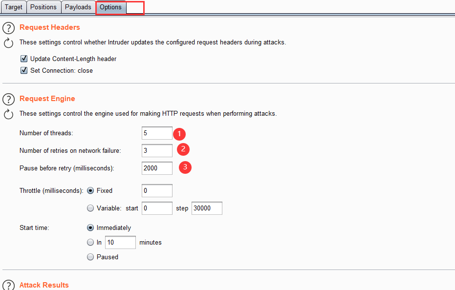
     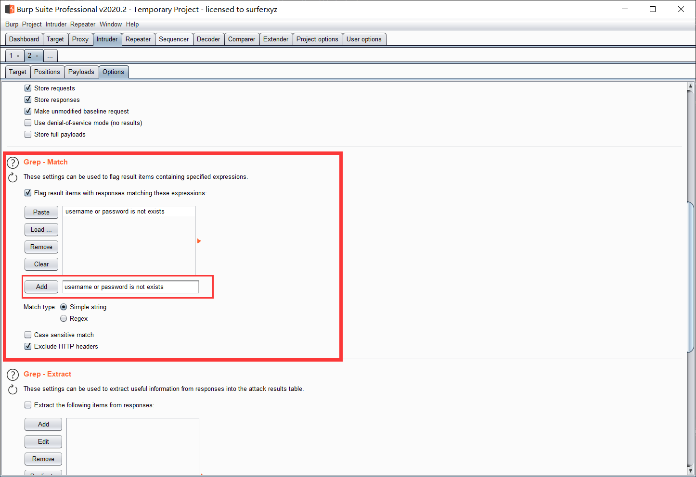
</figure>

- **2.4下面点击 start attack开始暴力破解，可以看出密码被跑出来了<BR><mark>也可以根据数据包的长度区别来判断哪个为正确的密码,或者根据Grep Match选项，添加的条件来判断<mark>**
<figure class="thumbnails">
    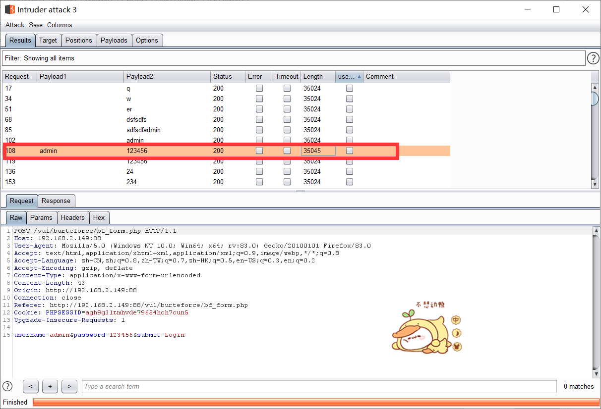
    
</figure>

## <font color = #1E90FF>暴力破解（验证码绕过&&Token）</font>

### <font color=#FF0000>暴力破解之不安全的验证码分析</font>
<figure class="thumbnails">
    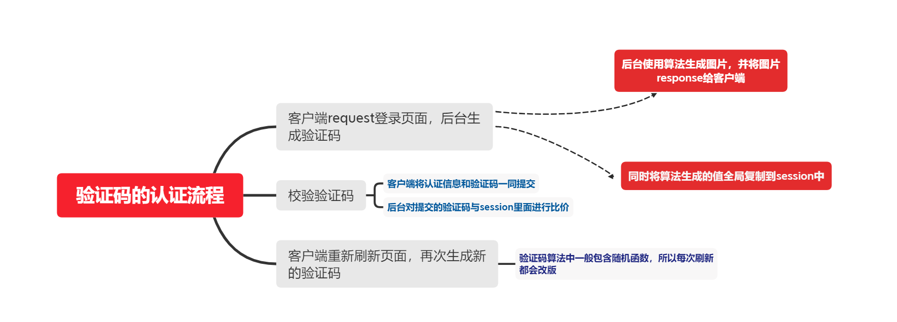
</figure>

- **on client**
- **on server**

### <font color=#FF0000>on client演示</font>
- **1.开启burp,并设置好浏览器代理**
- **2.打开靶场窗口，输入任意的账号密码**
- **3.把抓到的包发送到Repeater模块**
    - **修改验证码，并点击send，发现报错的还是账号密码错误，说明验证码在这里无效**
- **4.在intruder模块中爆破即可**
<figure class="thumbnails">
    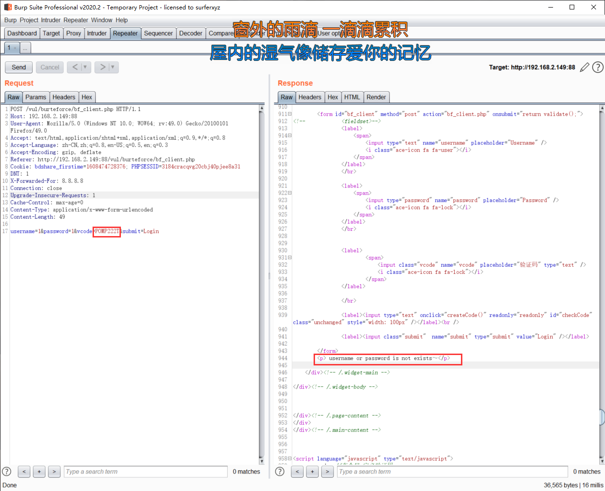
    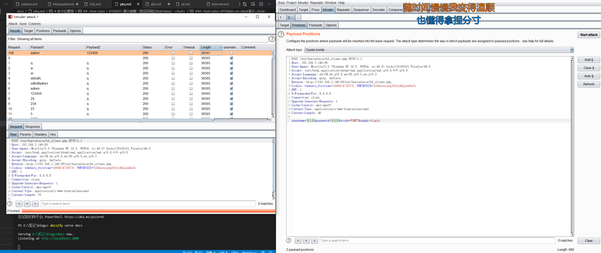
</figure>

- **5.成功爆破出账号密码**

### <font color=#FF0000>不安全的验证码-on client常见问题</font>
- **●使用前端js实现验证码(纸老虎) ;**
- **●将验证码在cookie中泄露,容易被获取;**
- **●将验证码在前端源代码中泄露,容易被获取;**

### <font color=#FF0000>on server演示</font>
### <font color=#FF0000>on client演示</font>
- **1.开启burp,并设置好浏览器代理**
- **2.打开靶场窗口，输入任意的账号密码**
- **3.把抓到的包发送到Repeater模块**
    - **修改验证码，并点击send，发现报错验证码错误**
- **4.在页面上获取一个新的验证码，并把Repeater模块的验证码填成刚刚获取的验证码**
    - **发现提示账号密码错误了，重新修改账号密码然后send，发现还是显示账号密码错误，如此发现验证码可以重复利用**
- **5.在intruder模块把验证码填成刚刚获取到的新的验证码，然后爆破即可**
<figure class="thumbnails">
    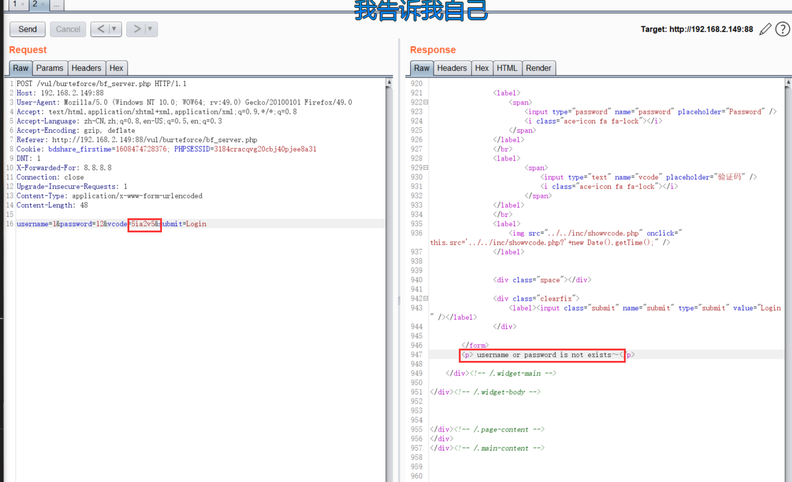
    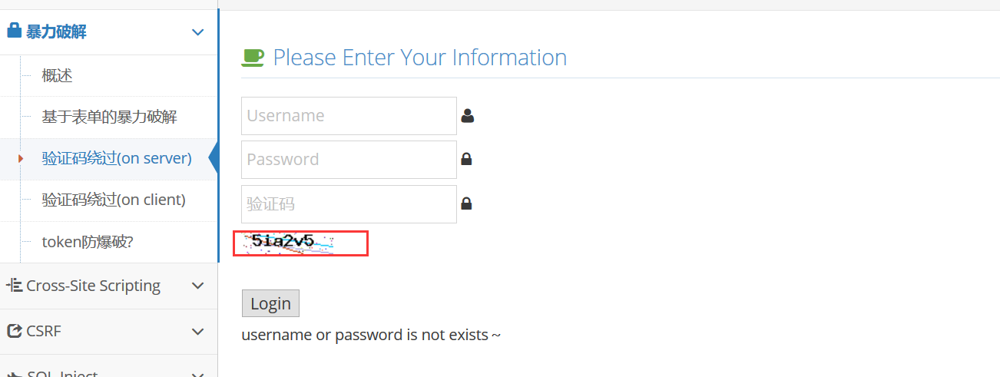
</figure>

### <font color=#FF0000>不安全的验证码-on server常见问题</font>
- **●验证码在后台不过期，导致可以长期被使用;**
- **●验证码校验不严格,逻辑出现问题;**
- **●验证码设计的太过简单和有规律,容易被猜解**

### <font color=#FF0000>Toker对防暴力破解的意义</font>

### <font color=#FF0000>一般的做法 </font>

- **1.将token以"type= 'hidden' ”的形式输出在表单中;**
- **2.在提交的认证的时候一起提交,并在后台对其进行校验;**

**但，由于其token值输出在了前端源码中,容易被获取，因此也就失去了防暴力破解的意义。一般Token在防止CSRF上会有比较好的功效**


## <font color = #1E90FF>跨站脚本漏洞XSS概念</font>
- **●XSS漏洞一直被评估为web漏洞中危害较大的漏洞，在OWASP TOP10的排名中一直属于前三的江湖地位。**
- **●XSS是一种发生在Web前端的漏洞,所以其危害的对象也主要是前端用户。**
- **XSS漏洞可以用来进行钓鱼攻击、钓鱼攻击、前端js挖矿、 用户cookie获取。甚至可以结合浏览器自身的漏洞对用户主机进行远程控制等**
## <font color = #1E90FF>XSS之get&&post</font>
### <font color=#FF0000>GET和POST典型区别:</font>
- **GET是以url方式提交数据;**
- **POST是以表单方式在请求体里面提交;**

**GET方式的XSS漏洞更加容易被利用,一般利用的方式是将带有跨站脚本的URL伪装后发送给目标**

### <font color=#FF0000>跨站脚本漏洞概述XSS(窃取cokie攻击流程 </font>
<figure class="thumbnails">
    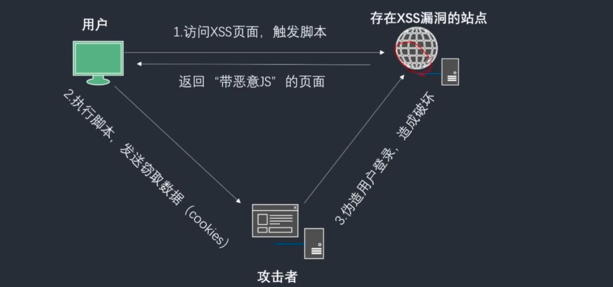
</figure>

### <font color=#FF0000>跨站脚本漏洞常见类型</font>
**<font color=#FF0000>危害:存储型>反射型> DOM型</font>**

- **反射型**
    - **交互的数据一般不会被存在在数据库里面 ,一次性,所见即所得, -般出现在查询类页面等。**
- **存储型**
    - **交互的数据会被存在在数据库里面,永久性存储，- -般出现在留言板,注册等页面。**
- **●DOM型**
    - **不与后台服务器产生数据交互,是- -种通过DOM操作前端代码输出的时候产生的问题,一次性也属于反射型。**

### <font color=#FF0000>XSS漏洞形成原因</font>
__形成XSS漏洞的主要原因是程序对输入和输出的控制不够严格,导致“精心构造”的脚本输入后,在输到前端时被浏览器当作有效代码解析执行从而产生危害。__

### <font color=#FF0000>跨站脚本漏洞测试流程</font>
- **①在目标站点上找到输入点，比如查询接口,留言板等;**
- **②输入- -组"特殊字符+唯一 识别字符" ,点击提交后,查看返回的源码，是否有做对应的处理;**
- **③通过搜索定位到唯一字符，结合唯一字符前后语法确认是否可以构造执行js的条件 (构造闭合) ;**
- **④提交构造的脚本代码(以及各种绕过姿势) ,看是否可以成功执行，如果成功执行则说明存在XSS漏洞;**

### <font color=#FF0000>TIPS :</font>
- **1.-般查询接口容易出现反射型XSS ,留言板容易出现存储型XSS ;**
- **2.由于后台可能存在过滤措施，构造的script可能会被过滤掉,而无法生效或者环境限制了执行(浏览器) ;**
- **3.通过变化不同的script ,尝试绕过后台过滤机制;**

## <font color = #1E90FF>反射型XSS</font>
### <font color=#FF0000>实验演示</font>
#### <font color=#FF4500>环境：</font>
- firefox
- pkq

- **1.首先在输入框输入一些特殊字符来判断一些（如 <> = ' ）等**
- **2.f12查看源代码发现输入的特殊字符被带入执行，判断出有xss**
- **3.输入\<script>alert(（)1)\</script>发现可以弹窗**
    - **如果发现长度不够，F12修改长度**

<figure class="thumbnails">
    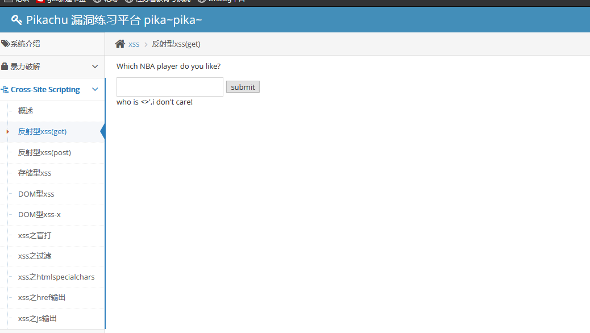
    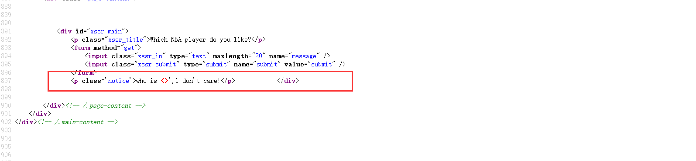
    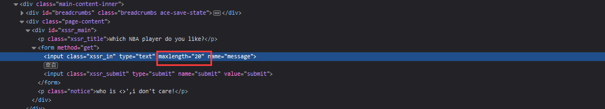
</figure>

## <font color = #1E90FF>存储型XSS</font>
**存储型XSS漏洞跟反射型形成的原因一样,不同的是存储型XSS下攻击者可以将脚本注入到后台存储起来,构成更加持久的危害,因此存储型XSS也称"永久型”XSS。**

### <font color=#FF0000>存储型XSS实验演示</font>
- **1.在输入框输入\<script>alert(1)\</script>**
- **发现弹窗被插入进去，刷新页面发现弹窗还在**
<figure class="thumbnails">
    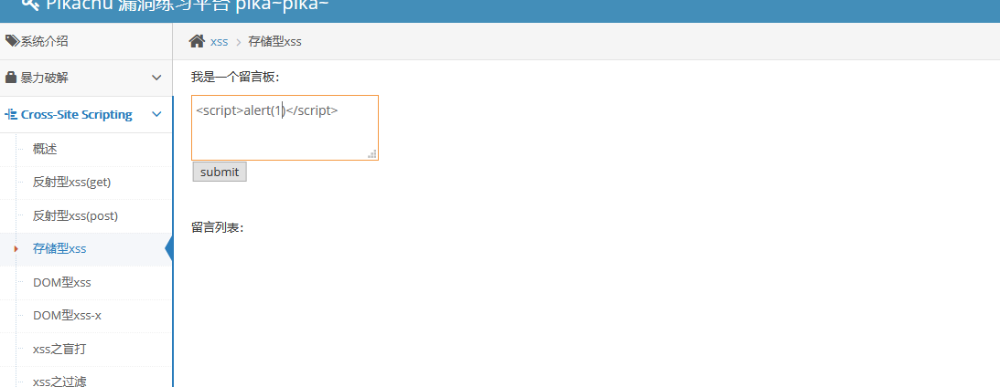

</figure>

## <font color = #1E90FF>DOM型XSS</font>

**通过JavaScript ,可以重构整个HTML文档。您可以添加、移除、改变或重排页面上的项目。<BR>要改变页面的某个东西,JavaScript就需要获得对HTML文档中所有元素进行访问的入口。这个入口，连同对HTML元素进行添加、移动、改变或移除的方法和属性,都是通过文档对象模型来获得的( DOM ) <BR>所以,你可以把DOM理解为一个个访问HTML的标准编程接口。**

### <font color=#FF0000>DOM型XSS实验演示</font>
- **1.打开靶场，选择DOM型XSS关卡**
- **任意输如，并查看前端代码**
```javascript
<script>
     function domxss(){
        var str = document.getElementById("text").value;
        document.getElementById("dom").innerHTML = "<a href='"+str+"'>what do you see?</a>";
     }
    //试试：'>
    //试试：' onclick="alert('xss')">,闭合掉就行
</script>
```
- **闭合代码，发现成功插入**
    - **`#' onclick="alert(1)" '>`**
```javascript
<a href=''>what do you see?</a>";
<a href='  #' onclick="alert(1)" >  '>what do you see?</a>";

```

## <font color = #1E90FF>XSS获取Cookie</font>
<figure class="thumbnails">
    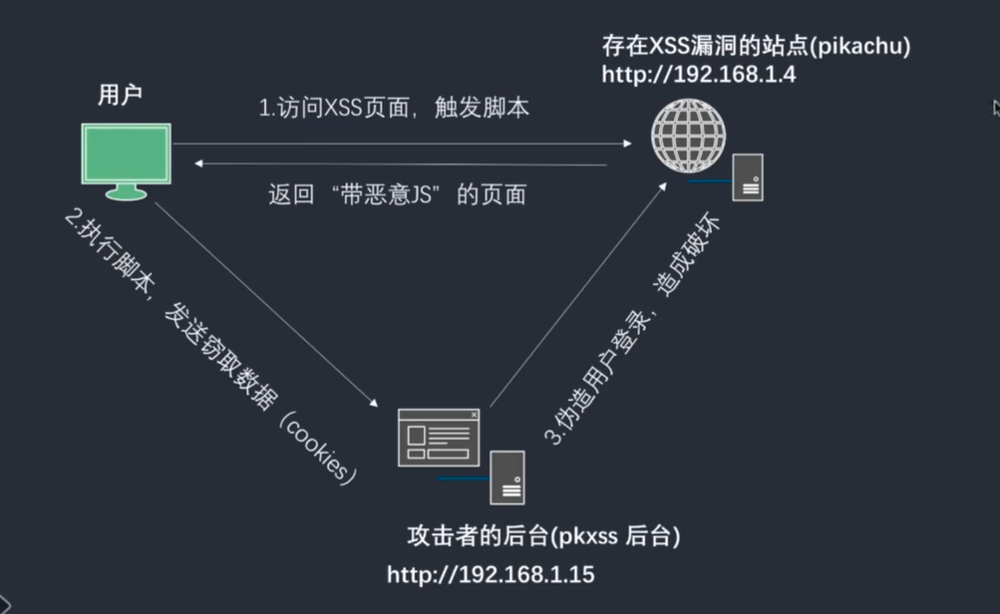
</figure>

## <font color = #1E90FF>POST形式XSS</font>
<figure class="thumbnails">
    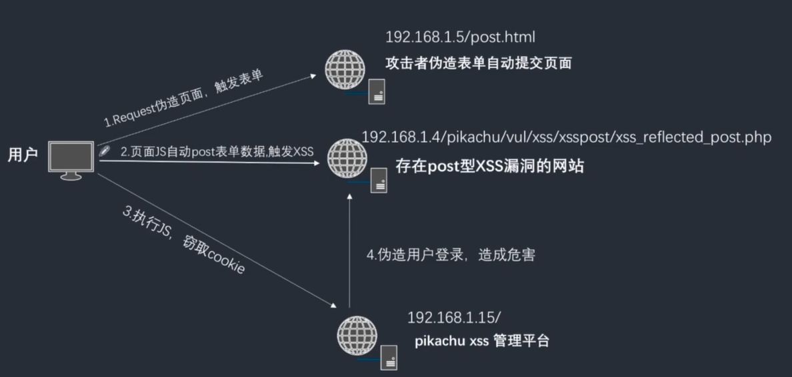
</figure>
