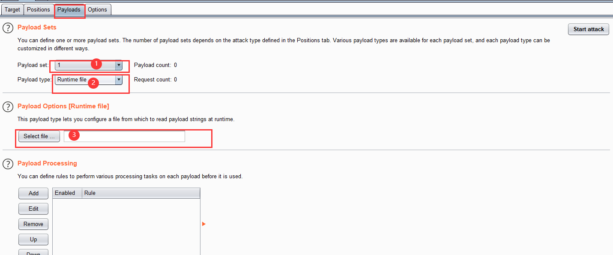

# 皮卡丘靶场
    

<a class="github-button" href="https://github.com/jhildenbiddle/docsify-themeable" data-icon="octicon-star" data-show-count="true" aria-label="Star jhildenbiddle/docsify-themeable on GitHub">Star</a>

## 暴力破解（基于表单）
### **什么是暴力破解？？**
**连续性尝试+字典+自动化**

### **暴力破解概述**
- **是否要求用户设置了复杂的密码;**
- **是否每次认证都使用安全的验证码;**
- **是否对尝试登录的行为进行判断和限制;**
- **是否在必要的情况下采用了双因素认证;**

### **暴力破解漏洞测试流程**
- **确认登录接口的脆弱性**
    - 确认目标是否存在暴力破解的漏洞。( 确认被暴力破解的"可能性”)
比如:尝试登录一抓包-- 观察 验证元素和response信息 ,判断否存在被暴力破解的可能。
- **对字典进行优化**
    - 根据实际的情况对字典进行优化,提高爆破过程的效率。
- **工具自动化操作**
    - 配置自动化工具(比如线程、超时时间、重试次数等)， 进行自动化操作。

### **暴力破解实验演示**

#### 环境：
- burpsuite
- pkq

#### 目标：
- 基于表单的暴力破解

### **BurpSuite**

<figure class="thumbnails">
    
</figure>

- **target选项卡**
        设置攻击目标，可以通过proxy发送
- **Pasitions选项卡**
        指定需要暴力破解的参数，并设置成变量，同时选择攻击模式
    - Sniper: 狙击手
            设置一个payload,先将第一个变量使用字典进行测试，然后再将第二个变量使用字典进行测试。
    - Battering ram: 冲撞车
            设置一个payload,所有的变量一起用字典内容被替换，然后一起尝试。
    - Ptichfork:草叉性
            每个变量设置一个payload，分别使用对应的字典对变量进行同时替换。
    - Cluster bomb:焦束炸弹
            需要为每个变量是在一个payload，分别使用字典内容祝贺对变量进行替换

#### **1.开启burp,并设置好浏览器代理**
#### **2.打开靶场窗口，输入任意的账号密码**
- **2.1可以看出bp已经抓到了你提交的post请求**
<figure class="thumbnails">
    
</figure>

- **2.2右键发送到intruder模块**
<figure class="thumbnails">
    
</figure>

- **2.3在上面的attacktype中可以下拉选择类型，一般选取最后一个，交叉型居多**
- **2.4可以看到箭头所指的两个，就是你输入的账号密码，这时选中账号密码，然后点击右方的add按钮，使它变成可变变量**
<figure class="thumbnails">
    
    
</figure>

- **2.5这时候切换到payloads选项，可以看到 ①的位置就是你所add变量的个数， ②的位置就是你添加密码的类型，这些选择runtime file(从文件导入密码)， ③的位置就是导入密码文件的路径**
<figure class="thumbnails">
    
</figure>

- **2.3下面是Options选项， ①代表线程数， ②代表失败重试的次数， ③代表每次重试间隔的时间**
- **2.3.1 Grep Match选项，添加条件**
<figure class="thumbnails">
    
     
</figure>

- **2.4下面点击 start attack开始暴力破解，可以看出密码被跑出来了 <mark>也可以根据数据包的长度区别来判断哪个为正确的密码,或者根据Grep Match选项，添加的条件来判断<mark>**
<figure class="thumbnails">
    
    
</figure>

## 暴力破解（验证码绕过）