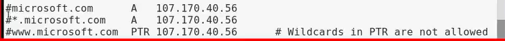

# 其他一些漏洞
## <font color = #1E90FF>权限绕过</font>
### <font color = #FF0000>水平越权</font>
#### <font color = #FFA500>案例1:</font>
__通过水平越权漏洞实现修改或删除其他用户个人信息__

#### <font color = #FFA500>测试方法:</font>
- **申请两个帐户,如test3和test4**
- **抓取test4用户的请求数据包,通过修改数据包中代表用户ID相关参数的值,判断是否通过修改test4用户的数据来实现修改或删除test3用户的信息。**

#### <font color = #FFA500>测试工具:</font>
- **burpsuite**

### <font color = #FF0000>垂直越权</font>
#### <font color = #FFA500>案例1:</font>
__通过垂直越权漏洞实现在没有任何权限的情况下添加管理员用户，获得管理员权限__

#### <font color = #FFA500>测试方法:</font>
- **在添加用户处抓取请求数据包，生成form表单，设置账户密码，越权添加管理用户**


#### <font color = #FFA500>测试工具:</font>
- **burpsuite**

## <font color = #1E90FF>支付逻辑漏洞</font>
### <font color = #FF0000>原理</font>
__支付逻辑漏洞是指系统的支付流程中存在业务逻辑层面的漏洞。支付流程通常为选择商品和数量选择支付及配送方式-生成订单订单支付完成支付最常见的支付逻辑漏洞通常是由于服务器端没有对客户端请求数据中的金额、数量等敏感信息作校验导致一般在电子商务网站上容易出现此类漏洞__

- **支付逻辑漏洞一般可以分为四类**
    - **1.支付过程中可以修改支付金额**
    - **2.可以将订单中的商品数量修改为负值**
    - **3.请求重放**
    - **4.其他问题(程序异常，其他参数修改导致的问题等)**

### <font color = #FF0000>支付逻辑漏洞的危害</font>
__任意金额购买商品，甚至可以导致购买商品后系统给自己账号充值__

### <font color = #FF0000>测试方法</font>
#### <font color = #FFA500>支付逻辑漏洞之修改订单商品数量:</font>
- **1、登录网站,选择购买-一个商品并抓取数据包**
- **2、找到其中代表商品数量的参数,将参数的值修改为负数**
- **3、发送数据包，生成订单,观察订单是否有效,是否能进入支付页面**
- **4、完成支付**

#### <font color = #FFA500>案例1:</font>
__通过支付逻辑漏洞修改订单商品数量实现0元购__
#### <font color = #FFA500>测试工具:</font>
- **burpsuite**

## <font color = #1E90FF>密码找回漏洞</font>
### <font color = #FF0000>用户凭证客户端回显</font>
__找回密码功能模块通常会将用户凭证(通常为验证码或者链接)发送到用户注册时使用的手机号或者邮箱中,只要用户不泄露自己的用户凭证就不会被攻击者利用。有些信息系统在密码找回功能的设计存在逻辑缺陷,可能会将用于用户自证身份的信息的用户凭证以各种各样的方式返回到客户端。这样攻击者只要通过在本地抓取数据包并对其内容加以分析就能获取到其他用户的用户凭证,从而达到重置任意用户密码的目的。__

#### <font color = #FFA500>测试方法:</font>
__在测试系统是否存在用户凭证客户端回显漏洞时,可以先用自己的账号进行密码找回操作,并在抓取记录每次交互操作时的response数据包。然后观察分析数据包中是否存在和手机或邮箱中收到的用户凭证相同的字符串。__

### <font color = #FF0000>案例1:</font>
#### <font color = #FFA500>用户凭证暴露在请求链接中</font>
- **1.进入某直播网站登录处，点击忘记密码，选择通过注册手机找回密码**
</figure>
     <figure class="thumbnails">
        
</figure>

- **2.输入手机号码，点击获取验证码，然后使用firebug查看请求链接，将发现验证码直接出现在请求链接中**

### <font color = #FF0000>案例2:</font>
#### <font color = #FFA500>加密验证字符串返回给客户端</font>
- **1.进入某电商官网按正常流程执行找回密码功能,填写好邮箱和图片验证码,点击下一步,然后使用抓包工具抓取请求包。分析返回的数据包,发现其中包含了一个加密字符串,将其记录下来。**
</figure>
     <figure class="thumbnails">
        
</figure>

- **2.之后，邮箱中会收到一个找回密码用的验证码，将该验证码在页面上填好，点击下一步即可进入到重置页面**

### <font color = #FF0000>案例3:</font>
#### <font color = #FFA500>网页源代码中隐藏着密保答案</font>
- **1.进入某邮箱网站官网，点击找回密码按钮，再点击网上申诉链接**
- **2. 按f12 会发现密保答案显示在源代码里，通过该方式，可以修改其他用户密码**

### <font color = #FF0000>案例4:</font>
#### <font color = #FFA500>短信验证码在客户端回显</font>
- **1.进入商城网站首页，点击忘记密码，然后通过短信的方式找回密码**
- **2.输入图片验证码，点击获取短信验证码**
- **3.此时抓取数据包,发现服务端直接将短信验证码xxx返回给了客户端,将短信验证码填写到验证码处即可成功重置其密码。同理,通过该方式,可以重置其他用户的密码。**

## <font color = #1E90FF>验证码暴力破解测试</font>
__通常是在网站的用户注册，密码找回等页面会设计有收集或邮箱验证码验证，主要是为了贯彻落实上网实名制，一级保障用户账号的安全性<BR>当这些验证码具有一定的规律性，并且没有做好对应的防护措施时，会导致攻击者通过穷举或者其他方式猜解出验证码，从而对目标系统造成危害__

### <font color = #FF0000>短信验证码流程:</font>
</figure>
     <figure class="thumbnails">
        
</figure>

### <font color = #FF0000>案例1:</font>
#### <font color = #FFA500>通过暴力破解短信验证码实现重置任意用户密码</font>
#### <font color = #FFA500>测试方法:</font>
- **1、接收验证码,观察验证码是否有规律性(如纯数字或可预测的字母)**
- **2、多次填写验证码提交,观察是否有时效性或失败次数限制。**
- **3、通过工具暴力猜解验证码**
#### <font color = #FFA500>测试工具:</font>
- **burpsuite**

## <font color = #1E90FF>验证码重复使用</font>
__如果设计不合理，将会导致验证码在验证成功一次之后，下次使用的时候就不再刷新，也就是可重复使用__
### <font color = #FF0000>验证码校验流程</font>
__当服务器端受理请求后，没有将上一次保存的session及时清空，将会导致验证码可重复使用__
</figure>
     <figure class="thumbnails">
        
</figure>

### <font color = #FF0000>案例1:</font>
__通过重复使用验证码实现登录页面暴力破解。__
#### <font color = #FFA500>测试方法:</font>
__通过重放请求,观察返回的信息提示来进行判断。如果通过重放没有提示"验证码错误”之类的信息,而只是提示“用户名密码错误”这些信息,就说明存在漏洞__
#### <font color = #FFA500>测试工具:</font>
## <font color = #1E90FF>验证码客户端回显</font>
__由于开发人员的代码逻辑问题，在调用短信平台发送短信时，没有判断验证码和手机号是否绑定，并且把验证码校验功能放到客户端来进行，从而导致验证码在客户端回显，回显一般分两种情况:__
- **1.验证码输出在客户端页面中**
- **验证码输出在返回数据包中**
### <font color = #FF0000>案例1:</font>
__通过验证码客户端回显漏洞实现帐户绑定任意手机号码__
#### <font color = #FFA500>测试方法:</font>
- **1、输入任意手机号码,点击发送短信验证码并抓取数据包**
- **2、查看返回数据包,观察验证码是否回显。**
- **3、若回显,则提交验证码。**
#### <font color = #FFA500>测试工具:</font>
- **burpsuite**

## <font color = #1E90FF>验证码绕过</font>
__由于开发人员使用了错误的逻辑判断，仅仅在客户端接收用户输入的验证码，并且在本地校验验证码是否正确，而该判断结果也可以在本地进行修改，最终导致用户端误以为我们已经输入了正确的验证码，实现验证码绕过__

</figure>
     <figure class="thumbnails">
        
</figure>

### <font color = #FF0000>案例1:</font>
__通过验证码绕过漏洞实现重置任意用户密码__
#### <font color = #FFA500>测试方法:</font>
- **1、在接收验证码后,输入任意验证码,提交并抓包**
- **2、尝试修改返回包中相关的参数值。**
- **3、转发数据包,若进入密码重置页面,则证明存在漏洞。**
#### <font color = #FFA500>测试工具:</font>
- **burpsuite**

## <font color = #1E90FF>验证码自动识别</font>
__当验证码设计不存在逻辑层面的问题时,就要涉及到与验证码机制本身的正面对抗,也就是验证码识别技术。<BR>这里的验证码主要是指图片验证码。<BR>验证码自动识别就是指通过自动化的技术对图片验证码中的字符或公式等内容进行还原,从而突破验证码的安全限制。__
### <font color = #FF0000>图片验证码识别流程</font>
- **图像二值化-->去干扰-->字符分割-->字符识别**

- __图像二值化就是将图像上像素点的灰度值设置为0或255 ,也就是将整个图像呈现出明显的黑白效果。为了防止验证码被自动识别,通常会加入- -些点、线、色彩之类的方式进行图像干扰,如下所示:__
</figure>
     <figure class="thumbnails">
        
</figure>

__所以为了达到良好的识别效果,需要对图像进行去干扰处理。__

- **字符分割主要包括从验证码图像中分割出字符区域以及把字符区域划分成单个字符。字符识别就是把处理后的图片还原回字符文本的过程**

### <font color = #FF0000>验证码自动识别流程</font>
</figure>
     <figure class="thumbnails">
        
</figure>

### <font color = #FF0000>案例1:</font>
__通过验证码自动识别漏洞实现暴力破解登录密码。__
#### <font color = #FFA500>测试方法:</font>
- **1、获取验证码链接**
- **2、将链接载入验证码识别工具进行验证码识别,配置相关工具**
- **3、如成功破解用户帐户,则证明验证码识别有效。**
#### <font color = #FFA500>测试工具:</font>
- **burpsuite. Pkav http fuzzer**

## <font color = #1E90FF>SQL Server数据库漏洞利用与提权</font>
**SQL Server是微软推出的数据库管理软件，它主要运行在Windows平台上，最新版可以在Linux、Docker' 下安装。<BR>SQL Server版本较多,最常见的有SQL Server2000、SQL Server2005、SQLServer2008、SQL Server201 4等等。**
### <font color = #FF0000>SQL Server提权基础:</font>
### <font color = #FF0000>SA口令获取方法</font>

- **1、Webshell或源码获取**
 - **一般在网站的配置文件中有存放明文账号密码， 常用配置文件名如: conn.aspx. config.aspx、 config.php.web.config等。一般格式如: server=localhost;UID=sa;PWD= ichunqiu;database= ichunqiu。**
- **2、源代码泄露**
 - **网站源码泄露情况主要以程序员上传代码到git等开源平台或更新代码时未删除备份文件(.svn、 .git. .bak), 以及运维人员打包源代码到网站服务器(www.rar等)**
- **3、嗅探**
 - **在局域网中使用cain等. I具进行arp嗅探的时候可以抓取到1433端口的数据库明文登录密码。**
- **4、口令暴力破解**
 - **利用mssq|暴力破解工具对mssq|进行暴力破解，一旦成功将获得sa相应权限。**

### <font color = #FF0000>常用的SQL Server提权语句</font>
- **1、查看数据库版本**
        select @ @version
- **2、查看数据库系统参数**
        exec master..xp_ msver;
- **3、查看用户所属角色信息**
        sp_ helpsrvrolemember
- **4、查看当前数据库**
        select db_ name()
- **5、显示机器.上的驱动器**
        xp_availablemedia
- **1、查看当前账户权限**
        select IS_ SRVROLEMEMBER('sysadmin')
        以下类似serveradmin、setupadmin、 securityadmin、 diskadmin、 bulkadminselect IS_ .MEMBER(' db_ _owner') I
- **2、添加用户**
        exec master.dbo.sp addlogin test,password #添加用户
        exec master.dbo.sp_ addsrvrolemember test,sysadmin #加权限
- **3、启动停止服务**
        exec master. .xp_ servicecontrol 'stop','test'
        exec master..xp_ servicecontrol 'start'test'
- **4、检查功能**
        SELECT count(*) FROM master.dbo.sysobjects WHERE name= 'xp_ _cmdshell'
        xp_ cmdshell. xp_ regread、 sp_ makewebtask. xp_ subdirs、 xp_ _dirtree、 sp_ addextendedproc

## <font color = #1E90FF>MySQL数据库漏洞利用与提权</font>
- **1.一般Mysql数据库经常使用php进行连接，会有较少的情况使用jsp、 python等**
- **2、Mysq|连接文件一般为 conn.php、config.php. common.inc.php.config.inc.php等**
- **3、所说的mysql权限提升一般在root权限下**

### <font color = #FF0000>密码获取与破解</font>
- **1、数据库查询**
        select Host,user,password from mysql.user #需要有root权限
- **2、配置文件中读取**
 - **网站源码泄露情况主要以程序员上传代码到git等开源平台或更新代码时未删除备份文件(.svn、 .git. .bak), 以及运维人员打包源代码到网站服务器(www.rar等) 。**
- **3、下载user文件**
        user文件在mysql的data目录下
        select @ @basedir
        select @@plugin_ dir #>5.1

## <font color = #1E90FF>图片隐写</font>
### <font color = #FF0000>Misc简介</font>
__Misc为英文miscellaneous的前四个字母,杂项、混合体、大杂烩的意思。__<BR>
__主要类型:__<br>
 - **1.数据编码/图形密码**
 - **2.图片隐写**
 - **3.音频&视频隐写**
 - **4.流量分析**
 - **5.内存取证**
 - **6.游戏隐写**

### <font color = #FF0000>010editor</font>
### <font color = #FF0000>图片隐写分类</font>
- **(1)右击属性**
- **(2)文件末尾藏有字符串**
- **(3)文件包含**
- **(4)修改文件头**

- **(5)GIF**
- **(6)png (bmp)**
- **(7)JPG**

- **(8)双图隐写**
- **(9)stegpy**
- **(10)silenteye**

### <font color = #FF0000>细讲图片隐写的分类:(2)文件 十六进制藏有字符串</font>

- **strings查找可打印的字符**
    - **kali预装**
    - **strings file**
- **grep使用正则表达式搜索，并输出匹配的行**
    - **grep flag**
- **file识别文件类型**
    - **file文件**


## <font color = #1E90FF>DNS劫持</font>
### <font color = #FF0000>原理</font>
<B>虽然计算机通信需要对方的IP,但最低层的传输是在物理层上，传输的二进制和MAC帧将IP解析成MAC地址的就是说ARP缓存表

<BR>主机A,B,C在同一个网关内，主机A要和主机B通信 ，知道主机A的IP, 但是ARP缓存表没有主机B的MAC地址<BR>于是他会在局域网广播询问主机B的MAC , 主机B会应答自己的MAC

<BR>每个设备的IP是不固定的，所以设备的ARP缓存表也要每隔一段时间都会更新，  发起广播<BR> 这时，<font color = #FF0000>如果主机A广播询问主机B的MAC时，主机C应答自己的MAC，这时主机A就会认为主机C是主机B</font>

<BR>


当你在浏览器中输入网址访问的时候，要先对该域名发给DNS 服务器进行解析， DNSD服务器的地址是外网IP,网络数据要先通过网关，如果把攻击的MAC伪装成网关的MAC

<BR>
局域网内本来要发给网关的数据发给了攻击者，攻击者就可以读这些数据进行截获，被攻击者访问域名的时候，攻击者截获请求并解析成自己的IP，配置好自己伪造的页面，被攻击者打开的就是伪造过的页面
</B>


### <font color = #FF0000>所需工具:</font>
- **Ettercap**
    - **可以进行ARP欺骗DNS劫持等等常见的中间人攻击**

### <font color = #FF0000>演示:</font>

#### <font color = #7B68EE>1.修改ettercap配置文件</font>
```ettercap
leafpad /etc/ettercap/etter.dns
```

- **1.1注释三行**
- **1.2增加两行主机记录，添加的IP地址为当前攻击机的IP地址**
</figure>
     <figure class="thumbnails">
        
        
</figure>

#### <font color = #008080>2.在终端中输入Ettecap -G打开工具</font>
```ettercap
ettercap -G
```

#### <font color = #008080>2.点击Sniff--Unified sniffing选择eth0网卡</font>
#### <font color = #008080>3.点击Hosts---Sacn for hosts去扫描其他主机</font>
#### <font color = #008080>4.扫描结束后，点击Hosts---Hosts list查看扫描结果</font>
#### <font color = #008080>5.将攻击机的Ip地址选中 ---点击Add Target 1 <BR>  将目标地址选中---点击Add Target 2 </font>

#### <font color = #008080>6.点击Mitm---ARP poisoning ---弹出的两个选项勾选上，开始ARP欺骗</font>

#### <font color = #008080>7.Plugins---Manage the plugins（管理我们的模块），在众多模块中选择 dns_spoof并双击，左侧出现*号就代表正在使用该模块了</font>
#### <font color = #008080>8.点击Start----Start sniffinf开始攻击</font>

#### <font color = #008080>9.打开目标机器会发现攻击成功了</font>