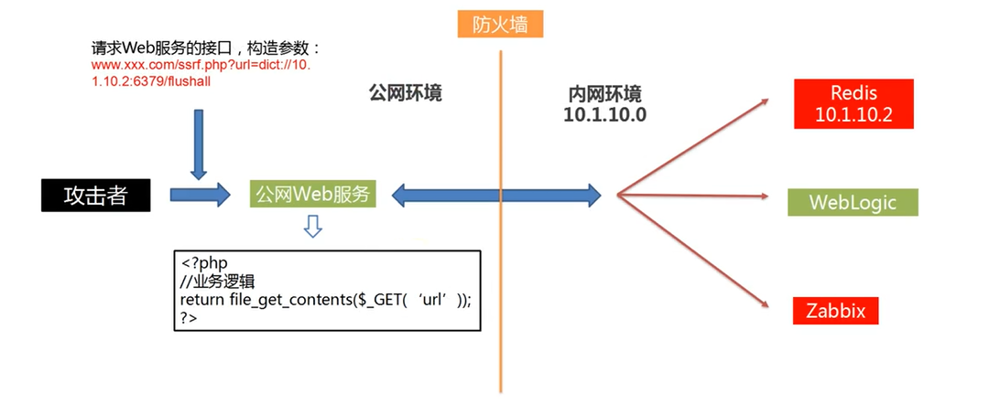

# SSRF

## SSRF原理和防御
</figure>
     <figure class="thumbnails">
        
</figure>

### SSRF高危触发点 
- **图片加载与下载:通过URL地址加载或下载图片**
- **从远程服务器请求资源**
- **数据库内置功能( Oracle，MongoDB，MSSQL, Postgres，CouchDB )**
- **WebMail收取其它邮箱邮件**
- **文件处理、编码处理、属性信息处理( FFmpeg、ImageMagick、DOCX、 PDF、 XML处理器)**

### SSRF漏洞危害 
- **内网扫描，泄露内网拓扑**
- **绕过防火墙后，内网测试环境及开发环境安全级别较低,可被进一步攻击，导致内网沦陷**
- **内网服务指纹识别与相应服务攻击**
    - **如果内网中存在Redis/Memcache等服务且存在已知的漏洞 ，可以进行识别并攻击，进而获取内网主机权限**
- **内网资源未授权访问**
    - **数据泄露(本地任意文件读取，使用file:///协议读取本地文件)**
- **DoS拒绝服务风险**

### SSRF防御 

**一、 代码防御(严格按照公司的的内部代码规范进行代码的编写)**
**检测请求URL流程**
- **a.解析目标URL，获取其Host**
- **b.解析Host，获取Host指向的IP地址**
- **c.检查IP地址是否为合法IP**
- **d.请求URL**
- **e.如果有跳转，取出跳转URL ,重新执行步骤a**
