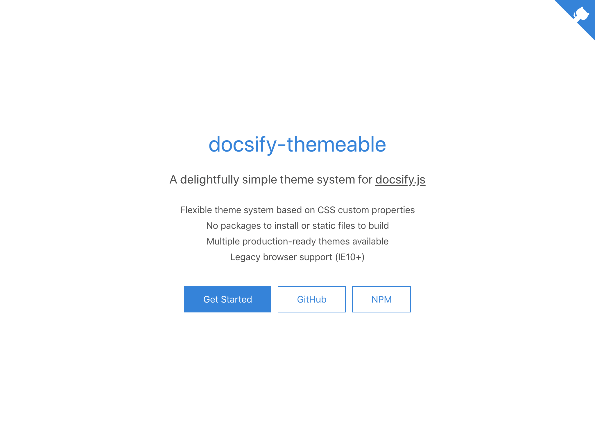
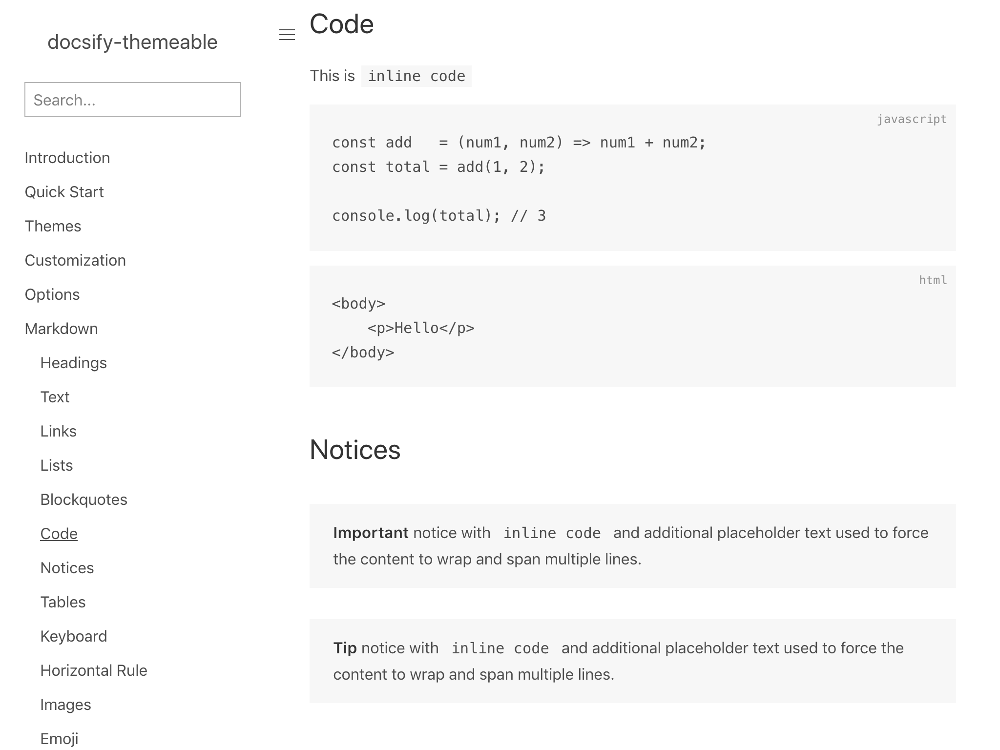
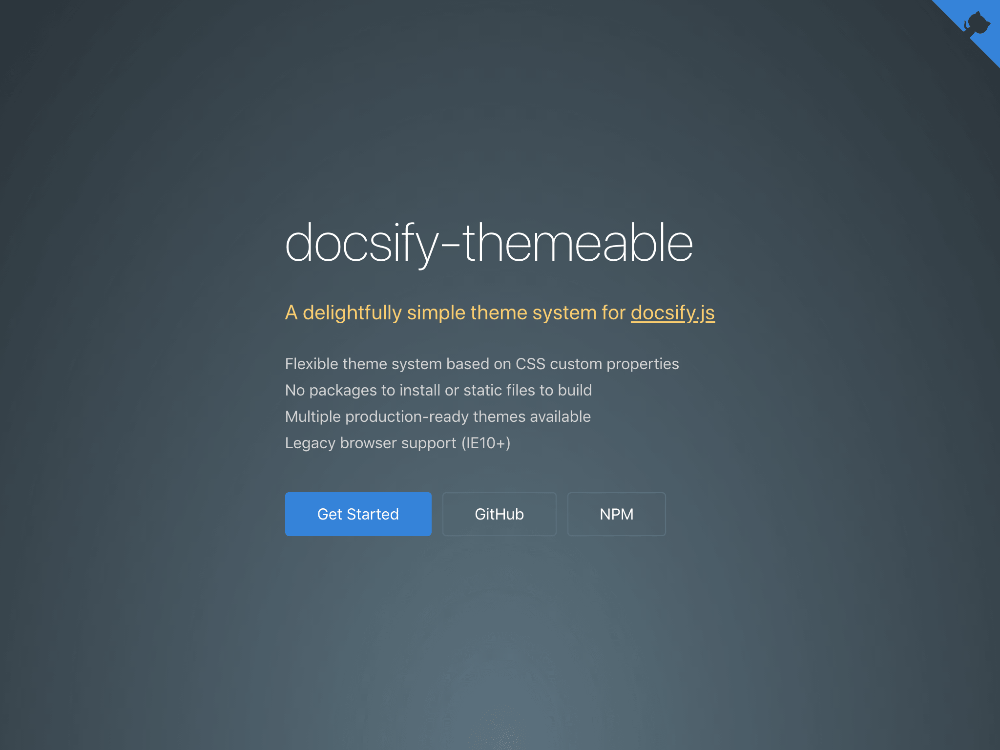
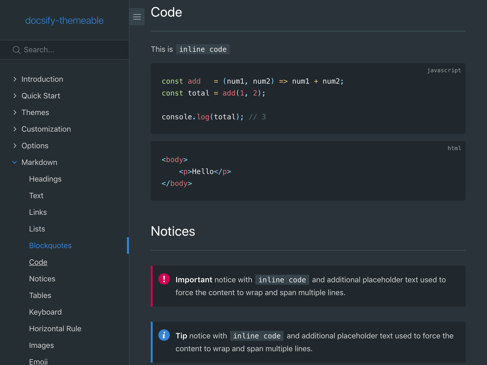

# Themes

### Defaults

A minimalist theme containing only the default values used by all other
themes. This theme is intended to serve as the most basic starting point for a
customized theme.

<a href="#" data-link-title="Defaults">Preview</a> |
[Source](https://github.com/jhildenbiddle/docsify-themeable/tree/master/src/scss/themes/defaults)

```html
<!-- Theme: Defaults -->
<link rel="stylesheet" href="https://cdn.jsdelivr.net/npm/docsify-themeable@0/dist/css/theme-defaults.css">
```

<figure class="thumbnails">
    
    
</figure>

### Simple

A clean, versatile theme featuring a light color scheme with vibrant accents, a [system font stack](https://css-tricks.com/snippets/css/system-font-stack/), a gradient
background cover page, and visual indicators for drop-menus and expand/collapse
state.

<a href="#" data-link-title="Simple">Preview</a> |
[Source](https://github.com/jhildenbiddle/docsify-themeable/tree/master/src/scss/themes/theme-simple.scss)

```html
<!-- Theme: Simple -->
<link rel="stylesheet" href="https://cdn.jsdelivr.net/npm/docsify-themeable@0/dist/css/theme-simple.css">
```

<figure class="thumbnails">
    
    
</figure>

### Simple Dark

A modified version of the Simple theme featuring a dark color scheme.

<a href="#" data-link-title="Simple Dark">Preview</a> |
[Source](https://github.com/jhildenbiddle/docsify-themeable/tree/master/src/scss/themes/theme-simple-dark.scss)

```html
<!-- Theme: Simple Dark -->
<link rel="stylesheet" href="https://cdn.jsdelivr.net/npm/docsify-themeable@0/dist/css/theme-simple-dark.css">
```

<figure class="thumbnails">
    
    
</figure>
1. Select a theme from the [Themes](themes) section and replace the `<link>` in your `index.html`.

   ```html
   <!-- Theme: Simple (latest v0.x.x) -->
   <link rel="stylesheet" href="https://cdn.jsdelivr.net/npm/docsify-themeable@0/dist/css/theme-simple.css">
   ```

1. Add the docsify-themeable plugin to your `index.html` after docsify:

   ```html
   <!-- docsify-themeable (latest v0.x.x) -->
   <script src="https://cdn.jsdelivr.net/npm/docsify-themeable@0"></script>
   ```

1. Review the [Options](options) section and configure as needed. For example:

   ```html
   <script>
     window.$docsify = {
         // ...
         themeable: {
             readyTransition : true, // default
             responsiveTables: true  // default
         }
     }
   </script>
   ```

1. Review the [Customization](customization) section and set theme properties as needed. For example:

   ```html
   <style>
     :root {
       /* Reduce the font size */
       --base-font-size: 14px;

       /* Change the theme color hue */
       --theme-hue: 325;

       /* Change the sidebar bullets */
       --sidebar-nav-link-before-content: '😀';
     }
   </style>
   ```

## Local Preview

Previewing your site locally requires serving your files from a web server.

The docsify [Quick Start](//docsify.js.org/#/quickstart) guide recommends [docsify-cli](//github.com/QingWei-Li/docsify-cli) for creating and previewing your site:

```bash
# Install docsify-cli globally
npm install -g docsify-cli

# Serve current directory
docsify serve

# Serve ./docs directory
docsify serve docs
```

A simple [Python](https://www.python.org/) web server can also be used:

```bash
# Change to site directory
cd /path/to/site/files

# Show Python version
python --version

# Launch web server (Python 2.x)
python -m SimpleHTTPServer

# Launch web server (Python 3.x)
python -m http.server
```