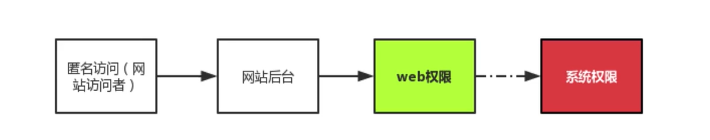
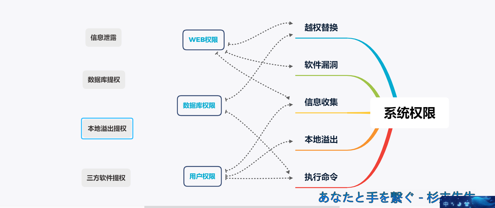
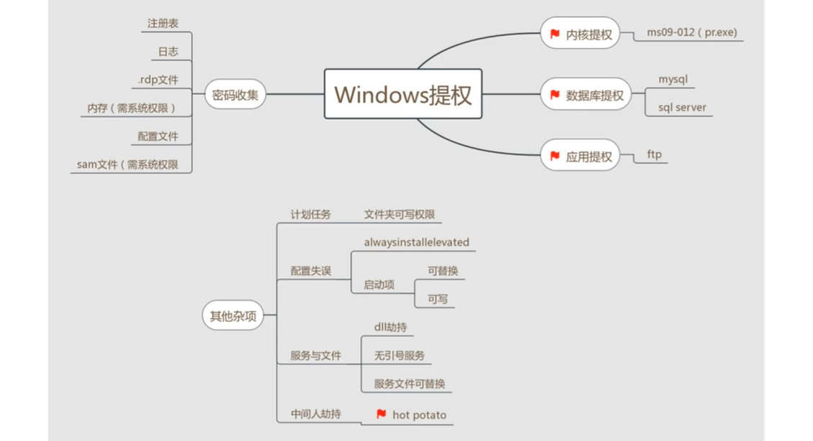
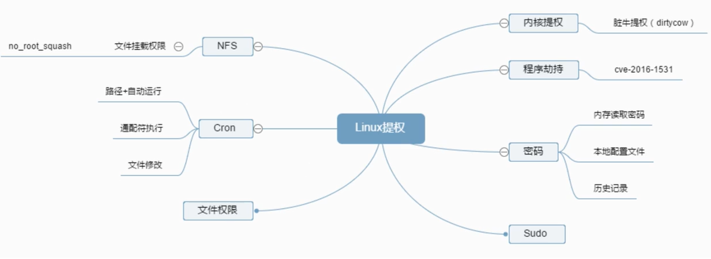

# 提权
## <font color = #1E90FF>计算机中的权限</font>
__权限在不同的应用中有着不同的分类，与安全相关的大致上我们可以分为几个权限__
- **匿名访问权限**
- **来宾权限**
- **用户权限**
- **管理员权限**
- **系统权限**

__<font color = #FF0000>不同的权限对应着的权利各不相同，电脑常用的权限为用户权限和管理员权限</font><BR>__

## <font color = #1E90FF>权限运用的情况</font>
__一般产生提权的原因都是因为当前权限无法做到某些我们需要做到的事情。<BR>例如:<BR>在普通用户权限会有很多限制，如无法执行某些程序以及服务__
</figure>
     <figure class="thumbnails">
        
</figure>

## <font color = #1E90FF>常见的提权方法</font>
</figure>
     <figure class="thumbnails">
        
</figure>

## <font color = #1E90FF>基于密码破解的提权</font>
- **1、通过中间人劫持:网络窃听**
- **2、通过用户主机窃听:键盘记录**
- **3、通过简单猜测:常用密码**
- **4、通过系统漏洞:永恒之蓝**
- **5、用户自己泄漏: git. 配置文件等泄漏方式**
- **6、通过系统后门: shift后门**

## <font color = #1E90FF>windows密码原理</font>
__Windows使用了两种方法对用户的密码进行哈希处理,分别为LAN Manager ( LM )哈希和NTLAN Manager ( NTLM )哈希。<BR>所谓哈希( hash)，就是使用-种加密函数进行计算后的结果。<BR>Windows的系统密码hash默认情况下一般由两部分组成 :<BR>第一部分是LM-hash ,第二部分是NTLM-hash。__

### <font color = #FF0000>Windows密码结构分析</font><BR>
### <font color = #FF0000>例:</font><BR>
```
Administrator:500:C8825DB10F2590EAAAD3B435B51404EE:683020925C5D8569C23
AA724774CE6C::

```
- **<font color = #FF0000>格式为:</font><BR>**
    - **用户名: RID: LM-HASH值:NT-HASH值**
- **<font color = #FF0000>因此拆分后为:</font><BR>**
    - **用户名称为: Administrator**
    - **用户名称为：管理员RID为: 500**
    - **LM-HASH值为: C8825DB10F2590EAAAD3B435B51404EE**
    - **NT-HASH值为: 683020925C5D8569C23AA724774CE6CC**

### <font color = #FF0000>密码的在线查询</font><BR>
- **<font color = #FF0000>基于上面的hash得到的结果:</font><BR>**
```
NT-HASH值为: 683020925C5D8569C23AA724774CE6CC
```
- **<font color = #FF0000>在线查询得到密码明文:</font><BR>**
```
https/www.objectif-securite.ch/en/ophcrack.php
```
### <font color = #FF0000>Windows密码hash导出</font><BR>
- **1、导出导入SAM、system**
- **2、gethashs导出**
- **3、Pwdump导出**
- **4、Wce导出**

### <font color = #FF0000>Windows密码破解</font><BR>

- **1. Saminside字典破解**
- **2. Ophcrack加载彩虹表破解**

## <font color = #1E90FF>Linux密码获取与破解</font>
### <font color = #FF0000>Linux密码的原理</font><BR>

__在Linux系统中，涉及系统登录密码的重要文件有两个:__
```linux
/etc/passwd     #用户信息
root:x:0:0:root:/root:/bin/bash
用户名
/etc/shadow     #密码信息

```

### <font color = #FF0000>Linux系统的加密算法</font><BR>
__Linux操作系统目前采用5种常用加密算法,主要通过账号后面的$x进行判断__
- **1.Md5加密算法**
- **2.Blowfish加密算法**
- **3.Sha-256加密算法**
- **4.Sha-512加密算法**
- **其他格式均为标准DES加密算法<BR>例如:**
```
root:$6$8Krl0yVz$8VXrlJBgvghRqZnSjgGgBTVOwJeX9qmSJO5f3fhkIKe.ztqnVfXjiQoANd9
X4iroyYOGx0GYmap9vjmH4xhqT:17490:0999:7::
```

### <font color = #FF0000>破解Linux密码</font><BR>

- **john破解Linux密码**
```
adduser test        #添加-个test用户密码为123456789
unshadow /etc/passwd /etc/shadow > 2.txt        #导出密码列表
john --wordlist=/usr/share/john/password.lst 2.txt      #加载字典暴力破解密码
john --show 2.xt        #显示破解成功的密码
```

## <font color = #1E90FF>Windows提权</font>
### <font color = #FF0000>整体总结</font><BR>
</figure>
     <figure class="thumbnails">
        
</figure>

### <font color = #FF0000>Windows提权基础命令</font><BR>
- **查看系统信息**
```
systemnfo | findstr /B /C:"OS名称" /C:"OS版本"
```

- **主机名**
```
Hsotname
```

- **环境变量**
```
Set
```

- **查看用户信息**
```
Net user
Net1 user
```

- **查看服务pid号**
```
Tasklist /svc|find "TermService" 
netstat -ano|find "1488"
```

### <font color = #FF0000>Windows提权实践</font><BR>
- **WinSystemHelper-master**
    - **上传bat+txt文件，运行bat查看结果**


## <font color = #1E90FF>缓冲区溢出漏洞</font>
### <font color = #FF0000>溢出原因</font>

**根据程序执行中堆栈调用原理，程序对超出边界的部分如果没有经过验证自动去掉，那么超出边界的部分就会覆盖后面的存放程序指针的数据，当执行完上面的代码，程序会自动调用指针所指向地址的命令。**
- **本地溢出:**
        向本机发起-----ms16-032   
- **远程溢出:**
        向目标主机发起-----ms17010


## <font color = #1E90FF>Linux提权</font>
</figure>
     <figure class="thumbnails">
        
</figure>

