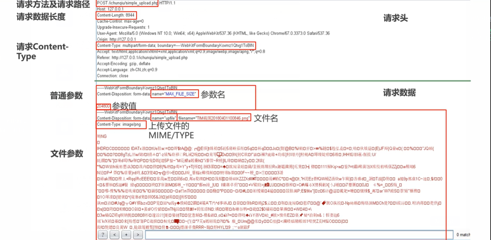
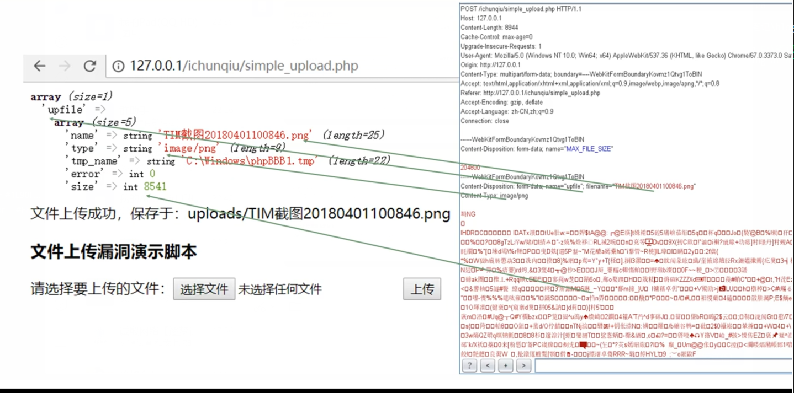
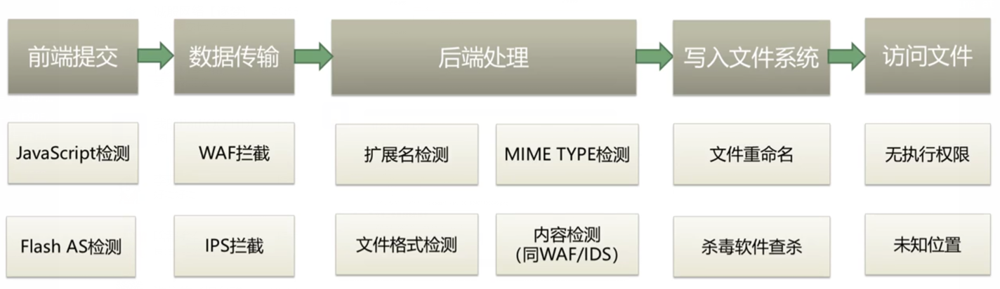
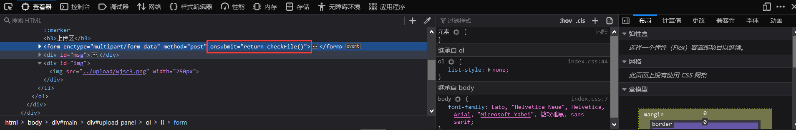
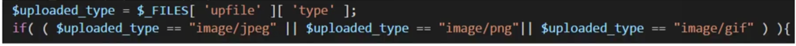
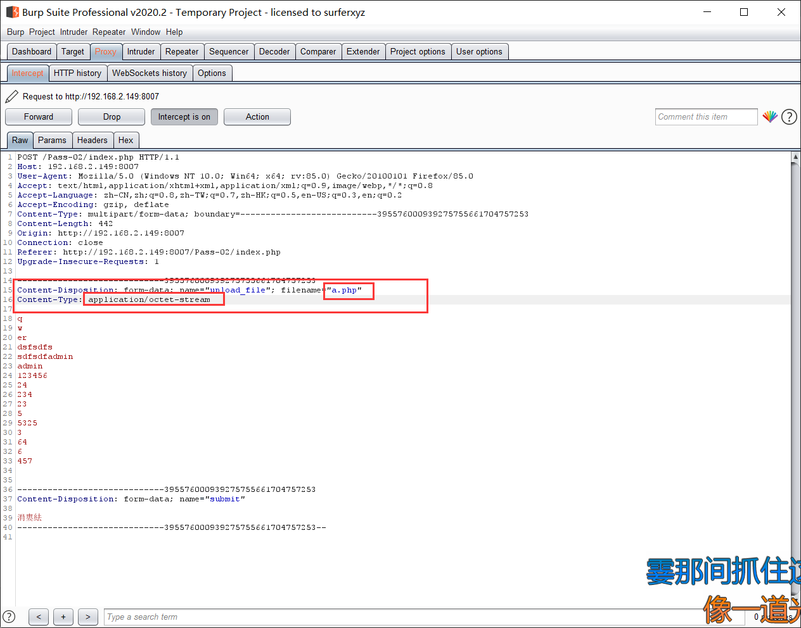
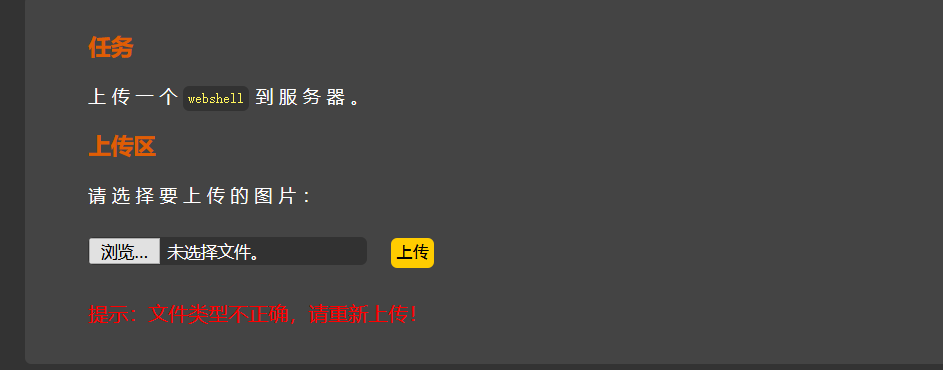
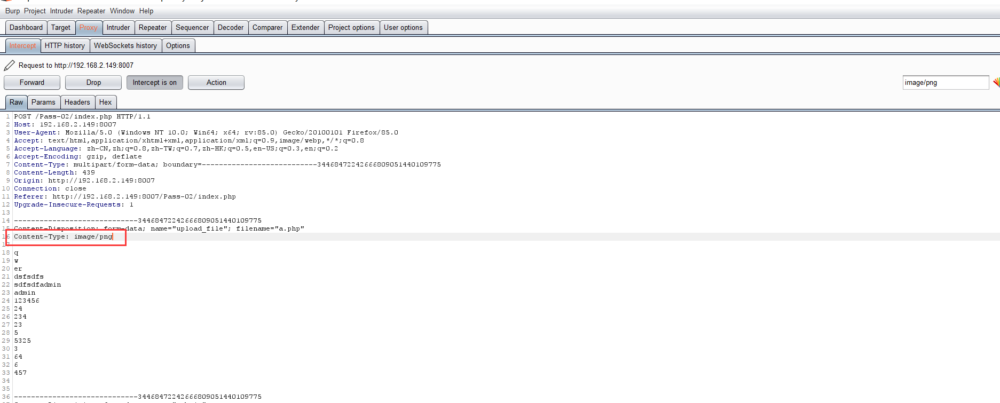
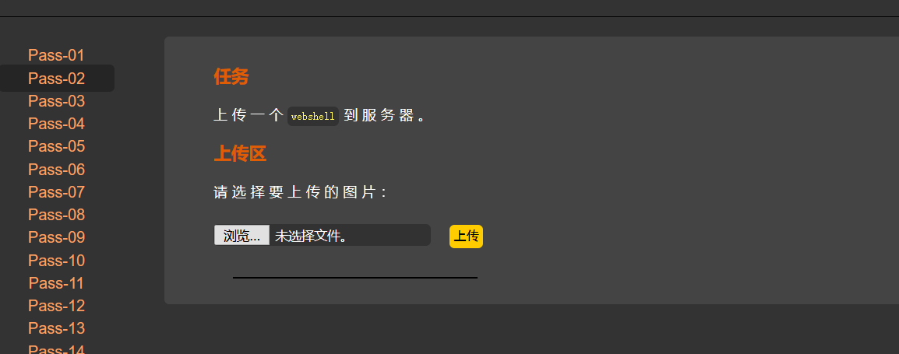

# 文件上传漏洞
## <font color = #1E90FF>什么是文件上传</font>
**文件上传是一个网站的常见功能，多用于上传照片，视频，文档等许多类型文件，<br>一般文件上传流程如下:**
- **1.前端选择文件，进行提交**
- **2.浏览器形成POST MultiPart报文发送到服务器**
- **3.服务器中间件接收报文，解析后交给相关后代码进行处理**
- **4.后端代码将上传的文件内容写入到临时文件中（PHP特有）**
- **5.写入到文件中，文件名为提交的文件名或以一定规则生成文件名**

### <font color = #FF0000>报文解析</font><BR>
</figure>
     <figure class="thumbnails">
        
        
</figure>

## <font color = #1E90FF>构成文件上传漏洞的原因</font>
**当文件上传点未对上传的文件进行严格的验证和过滤时，就容易造成任意文件上传，包括上传动态文件(asp/php/jsp等等)<BR>如果上传的目标目录没有限制执行权限，导致所上传的动态文件(比如webshell)可以正常执行并且可以访问，即造成了文件上传漏洞**

### <font color = #FF0000>存在上传漏洞的必要条件是:</font><BR>
- **1.存在上传点**
- **2.可以上传动态文件**
- **3.上传目录有执行权限，并且上传的文件可执行**
- **4.可以访问到上传的动态文件**

### <font color = #FF0000>文件上传检测流程</font>

</figure>
     <figure class="thumbnails">
        
</figure>


## <font color = #1E90FF>客户端检测绕过</font>
- **①JavaScript检测:**
    - **通过浏览器提交上蔟韩请求前，触发检测用JS脚本进行检测<BR>例: 普通的表单上传**
- **Flash AS脚本检测:**
    - **上传用Flash中，提交上传请求前，触发检测用AS脚本进行检测<BR>例: DZ的头像上传**
- **APP上传检测:**
    - **检测写在APP客户端代码中，或者所调用的HTML页面中<BR>客户端检测一般只检测文件扩展名**
    - **客户端进行的检测，可通过对客户端代码的修改或直接拦截修改报名即可绕过，所以这种上传限制等于没有**

### <font color = #FF0000>前端JavaScript检测绕过</font>
- **① 查看onchange，onsubmit等事件**
    - **onchange 事件会在域的内容改变时发生**
    - **onsubmit 事件会在表单中的确认按钮被点击时发生**
- **② 删掉相关事件的中的检测函数**
</figure>
     <figure class="thumbnails">
        
</figure>

## <font color = #1E90FF>提交报文修改检测(前端检测通用)</font>
- **① 首先选择正常的文件进行上传**
- **② 然后通过BurpSuite进行截包改包或者改包重放完成文件上传<BR>**
__<font color = #FF0000>这种方法前端绕过检测中通用，无需理会具体前端的检测代码，直接绕过前端进行上传报文的修改并提交</font>__

## <font color = #1E90FF>服务器检测绕过</font>

### <font color = #FF0000>MIME类型的绕过</font>
>MIME是描述消息内容类型的因特网标准<Br>
**MIME消息能包含文本，图像，音频，视频以及其他应用程序专用的数据<BR>浏览器会自动工具所上传的文件的扩展名，对应到相应的MIME类型上**
</figure>
     <figure class="thumbnails">
        
</figure>

### <font color = #FF0000>常见的白名单MIME TYPE</font>
| 扩展名 | MIME TYPE |
| :------ | :------ |
| .jpg |  image/jpeg |
| .png |  image/png |
| .txt |  text/plain |
| .zip |  application/zip |
| .doc |  application/nsword |

### <font color = #FF0000>演示</font>
- **① 上传一个php文件，可以看到提示文件类型不正确**
- **② 打开burp抓包，选中拦截的包，(可以右键发送到repeater模块中进行调试)**
- **③ 修改Content-Type:Content-Type: application/octet-stream 为Content-Type:Content-Type: image/png**
- **④ 发送数据包，发现成功的上传了进去**

</figure>
     <figure class="thumbnails">
        
        
        
        
</figure>

### <font color = #FF0000>文件内容检测</font>
- **① 简单的头文件检测**
    - **头文件是文娱开头的一段承担一定任务的数据，一般都在开头部分<BR>文件头的起始部分中一般开头标记文件类型。<BR>如:GIF的文件头为GIF89a或GIF87a**

### <font color = #FF0000>完整文件结构检测</font>
**通过调用图像函数(如:getimagesize/imagecreatefromgit/imagecreatefrompng)，进行检测文件是否为图像，需要文件内容保持相对完整，所以无法通过上种追加头部起始字节的方法进行绕过<BR>**
- **针对这种检测，可以将图片文件与欲上传的文件进行合并来绕过检测<BR>**
- **可通过copy命令进行文件合并**

#### <font color = #FFA500>恶意文件内容检测</font>
- **检测提交的内容中是否包含Webshell等数据**
- **推荐使用墙混淆的weevely进行尝试，kali中自带**
```
https://github.com/sunge/Weevely
```
- **尝试开源的webshell收集项目**
```
https://github.com/tennc/webshell
```

### <font color = #FF0000>一些小技巧</font>
- **1. 文件参数多finename属性**
    - **文件上传中，如果存在waf拦截一些扩展名，开源尝试多个filename属性**
- **2.目录可控时，开源尝试使用目录穿越的方法(../)**